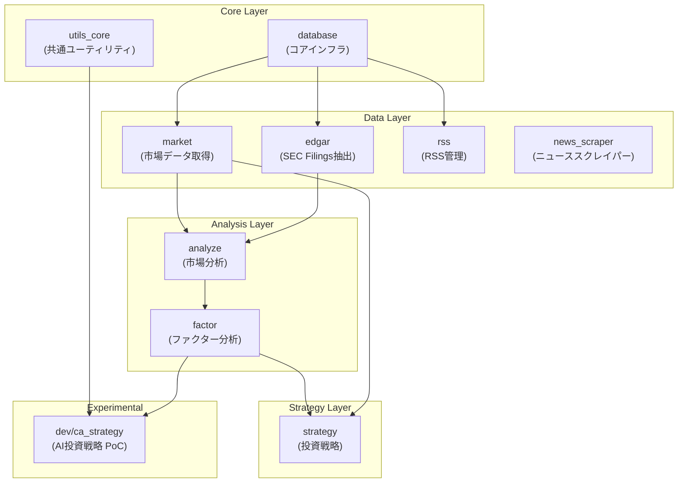
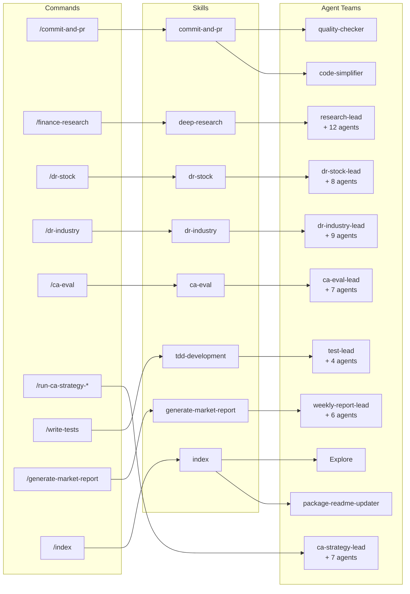
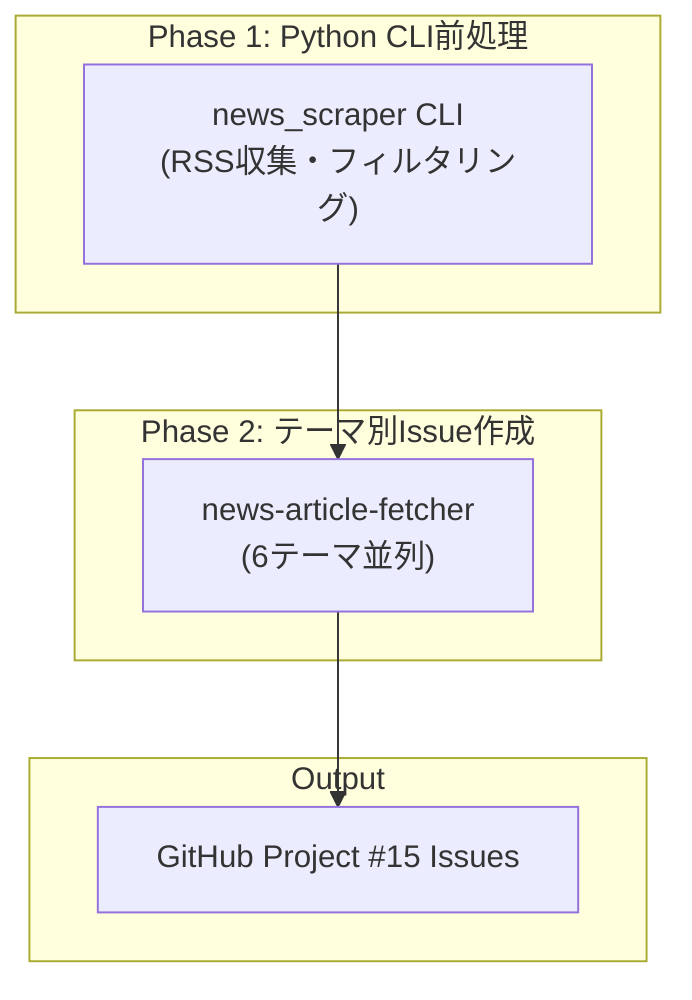
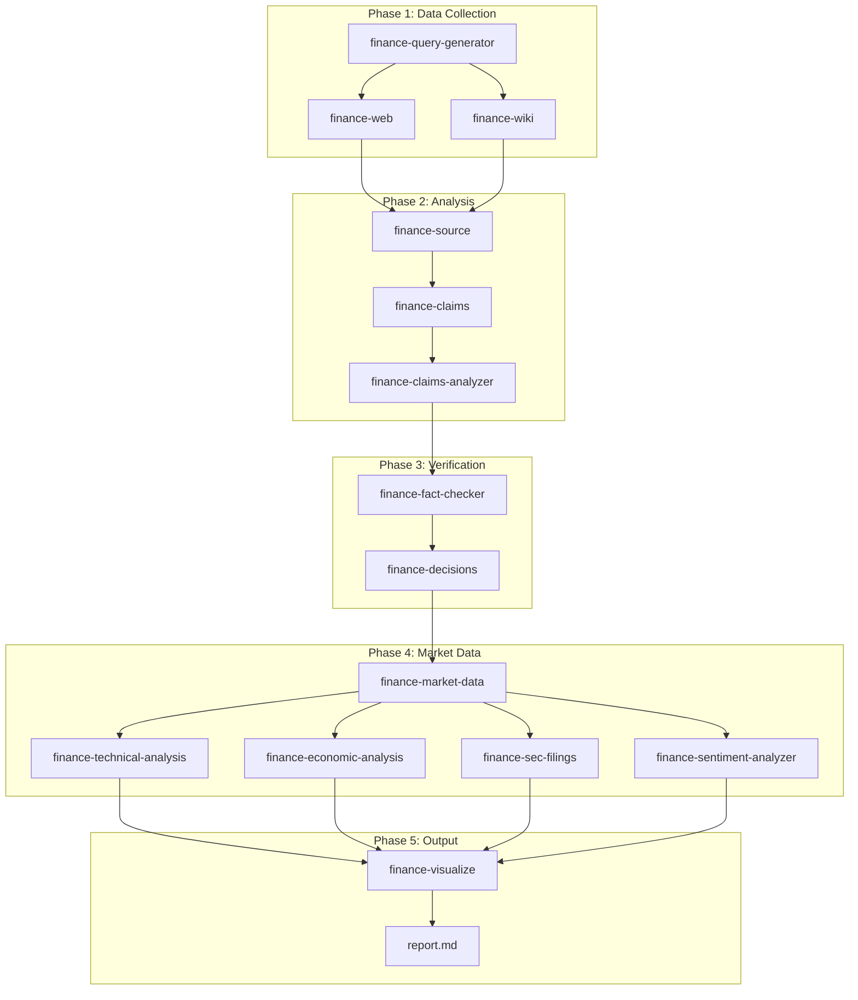
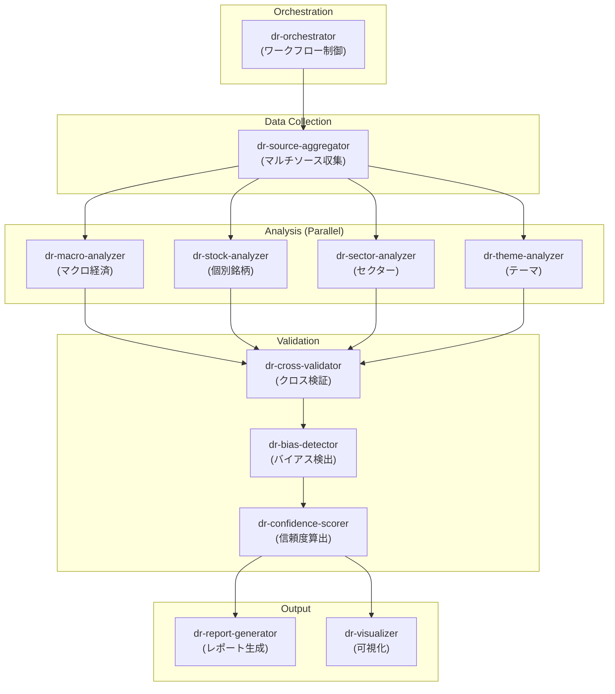
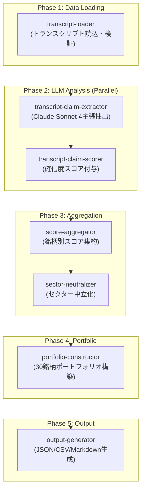

# finance - 金融市場分析ライブラリ

[](https://www.python.org/downloads/)
[](https://github.com/astral-sh/uv)
[](https://github.com/astral-sh/ruff)
[](https://github.com/YH-05/finance/actions/workflows/ci.yml)

金融市場の分析を効率化する Python ライブラリです。

## 主要機能

- **市場データ取得・分析**: Yahoo Finance (yfinance)、FRED、Bloomberg、NASDAQ、SEC EDGAR 等を使用した株価・為替・指標・財務データの取得と分析
- **金融ニュース自動収集**: RSSフィード・Webスクレイピング（CNBC/NASDAQ/yfinance）からニュースを収集し、AI要約・GitHub Issue作成まで自動化
- **AI駆動の投資戦略**: LLMベースの競争優位性評価（CA Strategy）によるポートフォリオ構築
- **チャート・グラフ生成**: 分析結果の可視化と図表作成
- **データベースインフラ**: SQLite (OLTP) + DuckDB (OLAP) のデュアルデータベース構成

## 📰 金融ニュース収集 CLI

RSSフィードから金融ニュースを収集し、GitHub Projectに自動投稿するCLIツールです。

### 基本コマンド

```bash
# 基本実行（全ステータス対象）
uv run python -m news.scripts.finance_news_workflow

# ドライラン（GitHub Issue作成をスキップ）
uv run python -m news.scripts.finance_news_workflow --dry-run

# 特定ステータスのみ収集
uv run python -m news.scripts.finance_news_workflow --status index,stock

# 記事数を制限
uv run python -m news.scripts.finance_news_workflow --max-articles 10

# 詳細ログ出力
uv run python -m news.scripts.finance_news_workflow --verbose
```

### オプション一覧

| オプション | 説明 | デフォルト |
|-----------|------|-----------|
| `--config` | 設定ファイルパス | `data/config/news-collection-config.yaml` |
| `--dry-run` | Issue作成をスキップ | False |
| `--status` | フィルタ対象ステータス（カンマ区切り） | 全て |
| `--max-articles` | 処理する最大記事数 | 無制限 |
| `--verbose`, `-v` | DEBUGレベルログ出力 | False |

### 出力

- **コンソール**: 処理結果サマリー（収集数、抽出数、要約数、公開数、重複数、経過時間）
- **ログファイル**: `logs/news-workflow-{日付}.log`
- **GitHub**: Project #15 にIssueとして投稿

## パッケージ構成

| パッケージ | 説明 |
|-----------|------|
| `database` | 共通データベースインフラ（SQLite/DuckDB）、ユーティリティ、ロギング |
| `market` | 市場データ取得機能（yfinance, FRED, Bloomberg, NASDAQ, ETF.com, FactSet, 業界データ）、キャッシュ、エクスポート |
| `edgar` | SEC Filings抽出パッケージ（edgartoolsラッパー、テキスト・セクション抽出、並列処理、キャッシュ） |
| `analyze` | 市場データ分析機能（テクニカル、統計、セクター分析、決算カレンダー、可視化、レポート生成） |
| `rss` | RSSフィード管理・監視・記事抽出・MCP統合 |
| `factor` | ファクター投資・分析（バリュー、モメンタム、クオリティ、サイズ、マクロ） |
| `strategy` | 投資戦略構築・リスク管理・ポートフォリオ分析・リバランス |
| `news` | ニュース処理パイプライン（収集・フィルタリング・GitHub投稿） |
| `news_scraper` | 金融ニューススクレイパー（CNBC/NASDAQ/yfinance RSS・API、curl_cffi、sync/async対応） |
| `embedding` | テキスト埋め込み・ベクトル化 |
| `notebooklm` | NotebookLM連携（ブラウザ自動化・MCP統合） |
| `automation` | 自動化・オーケストレーション |
| `utils_core` | 共通ユーティリティ・ロギング |
| `dev/ca_strategy` | AI駆動の競争優位性ベース投資戦略（PoC）：トランスクリプト解析、LLM主張抽出・スコアリング、セクター中立化、ポートフォリオ構築 |

## 🚀 セットアップ

### 基本セットアップ

```bash
# 依存関係のインストール
uv sync --all-extras

# Pythonバージョンの固定（推奨）
uv python pin 3.12  # または 3.13
```

### MCP Server Setup

このプロジェクトは複数のMCPサーバーを使用して外部サービスと連携します。

#### 1. 設定ファイルの作成

```bash
cp .mcp.json.template .mcp.json
```

#### 2. APIキーの設定

`.mcp.json` を編集し、以下のAPIキーを設定してください：

- **Notion API Key** - Notion統合用（任意）
- **Slack Bot Token** - Slackワークスペース連携用（任意）
- **Tavily API Key** - Web検索API用（任意）
- **SEC EDGAR User-Agent** - SEC EDGAR API用（必須：名前とメールアドレス）

詳細な設定手順は [docs/mcp-setup.md](docs/mcp-setup.md) を参照してください。

**セキュリティ注意:**
- `.mcp.json` は機密情報を含むため、Gitで追跡されません
- APIキーは安全に管理し、定期的にローテーションしてください

## ⚠️ よくある問題とトラブルシューティング

### Python バージョンの問題

このプロジェクトは**Python 3.12以上**をサポートしています。3.12未満のバージョンを使用すると、型チェックや CI/CD で問題が発生する場合があります。

**問題の症状：**

-   pyright が「Template string literals (t-strings) require Python 3.14 or newer」などのエラーを報告
-   GitHub CI の lint ジョブが失敗
-   ローカルでは問題ないのに CI で失敗する

**原因：**

-   システムに複数の Python バージョンがインストールされている場合、意図しないバージョン（例: Python 3.14）が使用される可能性があります
-   pyright がプロジェクトのターゲットバージョンと異なる標準ライブラリをチェックしようとしてエラーが発生

**解決方法：**

1. **Python バージョンを明示的に指定：**

    ```bash
    uv python pin 3.12  # または 3.13 など
    ```

    これにより`.python-version`ファイルが作成され、uv が指定したバージョンを使用するようになります。

2. **仮想環境を再構築：**

    ```bash
    uv sync --all-extras
    ```

3. **pre-commit フックを確認：**
    ```bash
    uv run pre-commit run --all-files
    ```

**予防策：**

-   プロジェクトのセットアップ時に`uv python pin 3.12`（または `3.13` 等）を実行
-   `.python-version`ファイルを gitignore から除外することを検討（チームで統一するため）
-   CI/CD ワークフローでは Python 3.12 と 3.13 の両方でテストを実行（すでに`.github/workflows/ci.yml`で設定済み）

### その他のトラブルシューティング

**依存関係のエラー：**

```bash
# 依存関係をクリーンインストール
uv sync --reinstall
```

**pre-commit フックのエラー：**

```bash
# pre-commitキャッシュをクリア
uv run pre-commit clean
uv run pre-commit install --install-hooks
```

**型チェックエラー：**

```bash
# pyright設定の確認
uv run pyright --version
# pyproject.tomlのpyright設定を確認
```

## 📁 プロジェクト構造

<!-- AUTO-GENERATED: DIRECTORY -->

```
finance/                                     # Project root
├── .claude/                                 # Claude Code configuration (119 agents + 26 commands + 59 skills)
│   ├── agents/                              # (119) Specialized agents
│   │   ├── deep-research/                   # ディープリサーチエージェント群（15個）
│   │   └── ca-strategy/                     # CA Strategyエージェント群（8個）
│   ├── commands/                            # (26) Slash commands
│   ├── rules/                               # Shared rule definitions
│   ├── skills/                              # (59) Skill modules
│   └── agents.md
├── .github/                                 # GitHub configuration
│   ├── ISSUE_TEMPLATE/                      # Issue templates
│   └── workflows/                           # GitHub Actions workflows
├── data/                                    # Data storage layer
│   ├── config/                              # Configuration files
│   ├── duckdb/                              # DuckDB OLAP database
│   ├── sqlite/                              # SQLite OLTP database
│   ├── raw/                                 # Raw data (Parquet format)
│   │   ├── fred/indicators/                 # FRED経済指標
│   │   ├── rss/                             # RSS feed subscriptions
│   │   ├── yfinance/                        # stocks, forex, indices
│   │   ├── bloomberg/stocks/                # Bloomberg株価データ
│   │   ├── etfcom/                          # ETF.comデータ
│   │   └── Transcript/                      # 投資トランスクリプト
│   ├── processed/                           # Processed data (daily/aggregated/evaluation)
│   ├── exports/                             # Exported data (csv/json/news-workflow)
│   └── schemas/                             # JSON schemas
├── docs/                                    # Repository documentation
│   ├── code-analysis-report/                # Code analysis reports
│   ├── plan/                                # Project plans
│   ├── pr-review/                           # PR review reports
│   └── project/                             # Project documentation (40+ projects)
├── src/                                     # Source code
│   ├── database/                            # Core infrastructure
│   │   ├── db/                              # Database layer (SQLite + DuckDB)
│   │   │   └── migrations/                  # Database schema migrations
│   │   ├── utils/                           # Utilities (logging, date utils)
│   │   ├── types.py
│   │   └── py.typed
│   ├── market/                              # Market data fetching
│   │   ├── yfinance/                        # Yahoo Finance fetcher
│   │   ├── fred/                            # FRED fetcher
│   │   ├── bloomberg/                       # Bloomberg fetcher
│   │   ├── nasdaq/                          # NASDAQ API統合
│   │   ├── etfcom/                          # ETF.com統合
│   │   ├── factset/                         # FactSet統合
│   │   ├── edinet/                          # EDINET日本企業データ
│   │   ├── industry/                        # 業界データ収集（BLS/Census API、スクレイパー）
│   │   ├── alternative/                     # 代替データ（TSA等）
│   │   ├── cache/                           # Data caching
│   │   ├── export/                          # Data export
│   │   ├── utils/                           # Utilities
│   │   └── py.typed
│   ├── edgar/                               # SEC Filings extraction
│   │   ├── extractors/                      # Text & section extraction
│   │   ├── cache/                           # Filing cache
│   │   └── README.md
│   ├── analyze/                             # Market analysis
│   │   ├── returns/                         # Returns calculation
│   │   ├── sector/                          # Sector analysis
│   │   ├── technical/                       # Technical indicators
│   │   ├── statistics/                      # Statistical analysis
│   │   ├── earnings/                        # Earnings calendar
│   │   ├── visualization/                   # Chart generation
│   │   ├── reporting/                       # Report generation
│   │   ├── integration/                     # Cross-package integration
│   │   ├── config/                          # Analysis configuration
│   │   └── py.typed
│   ├── rss/                                 # RSS feed monitoring package
│   │   ├── cli/                             # CLI interface
│   │   ├── core/                            # Parser, HTTP client, diff detector
│   │   ├── mcp/                             # MCP server integration
│   │   ├── services/                        # Service layer (ArticleExtractor)
│   │   ├── storage/                         # JSON persistence
│   │   ├── validators/                      # URL validation
│   │   ├── utils/                           # Logging
│   │   └── py.typed
│   ├── factor/                              # Factor analysis library
│   │   ├── core/                            # Core algorithms
│   │   ├── factors/                         # Factor implementations
│   │   │   ├── macro/                       # Macro factors
│   │   │   ├── price/                       # Momentum factors
│   │   │   ├── quality/                     # Quality factors
│   │   │   ├── size/                        # Size factors
│   │   │   └── value/                       # Value factors
│   │   ├── providers/                       # Data providers
│   │   ├── integration/                     # Cross-package integration
│   │   ├── validation/                      # Factor validation
│   │   └── py.typed
│   ├── strategy/                            # Strategy library
│   │   ├── core/                            # Core strategy
│   │   ├── output/                          # Output formatter
│   │   ├── rebalance/                       # Rebalancing
│   │   ├── risk/                            # Risk management
│   │   ├── integration/                     # market/analyze/factor integration
│   │   ├── providers/                       # Data providers
│   │   ├── visualization/                   # Portfolio charts
│   │   └── py.typed
│   ├── news/                                # News processing pipeline
│   │   ├── collectors/                      # News collectors
│   │   ├── config/                          # Configuration
│   │   ├── core/                            # Core processors
│   │   ├── extractors/                      # Content extractors
│   │   ├── processors/                      # News processors
│   │   ├── scripts/                         # CLI scripts
│   │   ├── sinks/                           # Output sinks
│   │   ├── sources/                         # Data sources
│   │   └── utils/                           # Utilities
│   ├── news_scraper/                        # Financial news scraper (standalone)
│   │   ├── cnbc.py                          # CNBC scraper
│   │   ├── nasdaq.py                        # NASDAQ scraper
│   │   ├── yfinance.py                      # yfinance RSS scraper
│   │   ├── unified.py                       # Unified sync API
│   │   ├── async_unified.py                 # Unified async API
│   │   └── py.typed
│   ├── embedding/                           # Text embedding & vectorization
│   │   └── py.typed
│   ├── notebooklm/                          # NotebookLM integration
│   │   ├── browser/                         # Browser automation
│   │   ├── mcp/                             # MCP integration
│   │   └── services/                        # Service layer
│   ├── automation/                          # Automation & orchestration
│   ├── utils_core/                          # Shared utilities
│   │   └── logging/                         # Logging configuration
│   └── dev/                                 # Experimental packages
│       └── ca_strategy/                     # AI-driven CA-based investment strategy (PoC)
│           ├── orchestrator.py              # 5-phase pipeline control
│           ├── extractor.py                 # LLM claim extraction (Claude)
│           ├── scorer.py                    # Confidence scoring engine
│           ├── aggregator.py               # Score aggregation
│           ├── neutralizer.py              # Sector neutralization
│           ├── portfolio_builder.py         # Portfolio construction
│           ├── output.py                    # JSON/CSV/Markdown output
│           ├── evaluator.py                # Performance evaluation
│           ├── agent_io.py                 # Agent I/O interface
│           ├── types.py                    # Pydantic type definitions
│           └── py.typed
├── tests/                                   # Test suite
│   ├── database/                            # Database package tests
│   │   ├── unit/                            # Unit tests
│   │   └── property/                        # Property tests
│   ├── market/                              # Market package tests
│   │   ├── unit/                            # Unit tests
│   │   ├── property/                        # Property tests
│   │   ├── integration/                     # Integration tests
│   │   ├── nasdaq/                          # NASDAQ sub-package tests
│   │   ├── industry/                        # Industry sub-package tests
│   │   └── etfcom/                          # ETF.com sub-package tests
│   ├── edgar/                               # Edgar package tests
│   │   ├── unit/                            # Unit tests
│   │   ├── property/                        # Property tests
│   │   └── integration/                     # Integration tests
│   ├── analyze/                             # Analyze package tests
│   │   ├── unit/                            # Unit tests
│   │   └── integration/                     # Integration tests
│   ├── rss/                                 # RSS package tests
│   │   ├── unit/                            # Unit tests
│   │   ├── property/                        # Property tests
│   │   └── integration/                     # Integration tests
│   ├── factor/                              # Factor analysis tests
│   │   ├── unit/                            # Unit tests
│   │   ├── property/                        # Property tests
│   │   └── integration/                     # Integration tests
│   ├── strategy/                            # Strategy tests
│   │   ├── unit/                            # Unit tests
│   │   ├── property/                        # Property tests
│   │   └── integration/                     # Integration tests
│   ├── news/                                # News package tests
│   ├── news_scraper/                        # News scraper tests
│   │   ├── unit/                            # Unit tests
│   │   ├── property/                        # Property tests
│   │   └── integration/                     # Integration tests
│   └── dev/ca_strategy/                     # CA Strategy tests
│       ├── unit/                            # Unit tests
│       └── integration/                     # Integration tests
├── template/                                # Reference templates (read-only)
│   ├── src/template_package/                # Package structure template
│   ├── tests/                               # Test structure template
│   └── {article_id}-theme-name-en/          # Article template
├── research/                                # ディープリサーチワークスペース
├── scripts/                                 # Utility scripts
├── CLAUDE.md                                # Project instructions
├── README.md                                # Project overview
├── Makefile                                 # Build automation
├── pyproject.toml                           # Python project config
└── uv.lock                                  # Dependency lock file
```

<!-- END: DIRECTORY -->

## 📚 ドキュメント階層

### 🎯 主要ドキュメント

-   **[CLAUDE.md](CLAUDE.md)** - プロジェクト全体の包括的なガイド
    -   プロジェクト概要とコーディング規約
    -   よく使うコマンドと GitHub 操作
    -   型ヒント、テスト戦略、セキュリティ

## 🔗 依存関係図

<!-- AUTO-GENERATED: DEPENDENCY -->

### Pythonパッケージ依存関係



### コマンド → スキル → エージェント 依存関係



### 金融ニュース収集ワークフロー



### 金融リサーチパイプライン



### Deep Research パイプライン



### CA Strategy パイプライン（AI駆動の競争優位性ベース投資戦略）



<!-- END: DEPENDENCY -->

## 🤖 Claude Code 開発フロー

このプロジェクトでは、スラッシュコマンド、スキル、サブエージェントを組み合わせて開発を進めます。

### コマンド・スキル・エージェントの違い

| 種類               | 説明                                                       | 定義場所           |
| ------------------ | ---------------------------------------------------------- | ------------------ |
| スラッシュコマンド | `/xxx` で直接呼び出す開発タスク                            | `.claude/commands/` |
| スキル             | コマンドから自動的に呼び出されるドキュメント生成・管理機能 | `.claude/skills/`   |
| サブエージェント   | 品質検証・レビューを行う自律エージェント                   | `.claude/agents/`   |

### 開発フェーズと使用するコマンド

#### フェーズ 1: 初期化

| コマンド              | 用途                                   |
| --------------------- | -------------------------------------- |
| `/setup-repository` | テンプレートリポジトリの初期化（初回のみ） |

#### フェーズ 2: 企画・設計

| コマンド       | 用途                                   | 関連スキル/エージェント                              |
| -------------- | -------------------------------------- | ---------------------------------------------------- |
| `/new-package <package_name>` | 新規Pythonパッケージ作成（project.md含む） | -                                                    |
| `/plan-project @src/<package_name>/docs/project.md` | リサーチベースのプロジェクト計画（推奨） | project-researcher, project-planner, project-decomposer |
| `/review-docs` | ドキュメントの品質レビュー             | doc-reviewer エージェント                            |

#### フェーズ 3: 実装

| コマンド                          | 用途                               | 関連スキル/エージェント                |
| --------------------------------- | ---------------------------------- | -------------------------------------- |
| `/issue @src/<package_name>/docs/project.md` | Issue管理・タスク分解・GitHub同期 | task-decomposer, feature-implementer |
| `/issue-implement <番号>`         | GitHub Issueの自動実装             | issue-implement-single                 |
| `/write-tests`                    | TDDによるテスト作成                | test-lead (Agent Teams)                |

#### フェーズ 4: 品質管理

| コマンド          | 用途                                   |
| ----------------- | -------------------------------------- |
| `/ensure-quality` | format→lint→typecheck→testの自動修正   |
| `/safe-refactor`  | テストカバレッジを維持したリファクタリング |
| `/analyze`        | コード分析レポート出力（改善は行わない） |
| `/improve`        | エビデンスベースの改善実装             |
| `/scan`           | セキュリティ・品質の包括的検証         |

#### フェーズ 5: デバッグ・完了

| コマンド          | 用途                   |
| ----------------- | ---------------------- |
| `/troubleshoot`   | 体系的なデバッグ       |
| `/task`           | 複雑なタスクの分解・管理 |
| `/commit-and-pr`  | コミットとPR作成       |

### 典型的なワークフロー例

#### 新機能開発

1. `/new-package <package_name>` - 新規パッケージを作成
2. `/plan-project @src/<package_name>/docs/project.md` - リサーチ→設計→タスク分解→GitHub登録
3. `/review-docs` - 設計ドキュメントをレビュー
4. `/issue @src/<package_name>/docs/project.md` - Issueを作成・管理
5. `/issue-implement <番号>` - Issueを自動実装
6. `/ensure-quality` - 品質チェック・自動修正
7. `/commit-and-pr` - PRを作成

#### バグ修正

1. `/troubleshoot --fix` - 原因特定と修正
2. `/ensure-quality` - 品質チェック
3. `/commit-and-pr` - PRを作成

#### 個別銘柄・セクター分析

1. `/dr-stock` - 個別銘柄の包括的分析（株価・財務・SEC Filings→レポート生成）
2. `/dr-industry` - セクター・業界分析（5並列データ収集→クロス検証→レポート生成）
3. `/ca-eval` - 競争優位性評価（主張抽出→ルール適用→検証→レポート生成）

### 詳細情報

すべてのコマンドの詳細は `/index` コマンドで確認できます。
