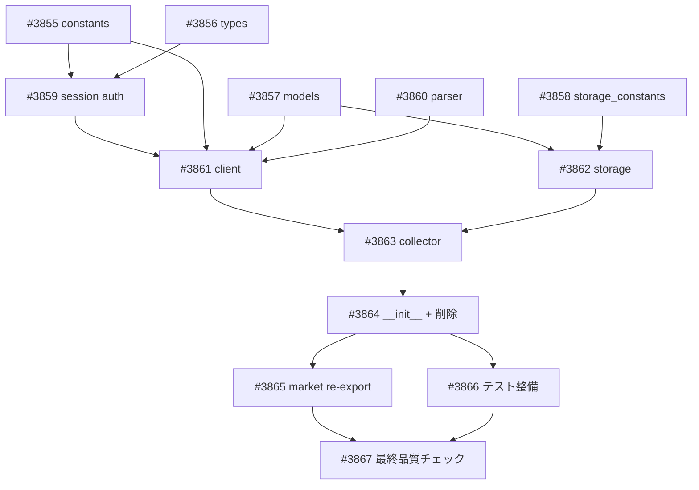

# Project #101: market.etfcom パッケージ書き直し — APIクライアントベース

## 概要

既存の market.etfcom パッケージ（HTML スクレイピング + Playwright ベースの 4 コレクター）を廃止し、ETF.com の REST API（`/v2/fund/fund-details` POST 18クエリ + 4 GET エンドポイント）をベースとした新しい API クライアントで全面書き直し。

## 背景

- site-investigator 調査で `/v2/fund/fund-details` POST API が 18 種類のクエリで動作中と判明
- 既存コードは旧 API パス（`/private/apps/fundflows/*`、全て 404）に依存
- curl_cffi (impersonate='chrome') で Cloudflare バイパス成功を確認済み

## アーキテクチャ

alphavantage パッケージの 5 層パターンを採用:

```
session.py → client.py → collector.py → storage.py + models.py
```

## ファイルマップ

| 操作 | ファイル | 内容 |
|------|---------|------|
| modify | session.py | 認証フロー追加（Cloudflare + fundApiKey） |
| modify | constants.py | 新 API URL + 18 query 名定義 |
| modify | types.py | 旧レコード削除 + AuthConfig 追加 |
| create | client.py | ETFComClient（22 メソッド + DRY ヘルパー） |
| create | collector.py | ETFComCollector（日次/週次/月次） |
| create | storage.py | ETFComStorage（9 テーブル） |
| create | storage_constants.py | テーブル名 + DB パス定数 |
| create | models.py | 11 frozen dataclass |
| create | parser.py | 22 パーサー関数 |
| delete | browser.py | Playwright 依存除去 |
| delete | collectors.py | 旧 4 コレクター |

## SQLite テーブル（9 テーブル）

| テーブル | 更新頻度 | 対応クエリ |
|---------|---------|-----------|
| etfcom_tickers | 週次 | /v2/fund/tickers |
| etfcom_fund_flows | 日次 | fundFlowsData |
| etfcom_holdings | 週次 | topHoldings |
| etfcom_portfolio | 週次+月次 | fundPortfolioData + fundPortfolioManData |
| etfcom_allocations | 週次+月次 | sector/region/country/econ_dev |
| etfcom_tradability | 週次+月次 | fundTradabilityData + Summary |
| etfcom_structure | 月次 | fundStructureData + Tax + Rankings |
| etfcom_performance | 月次 | performance + fundPerformanceStatsData |
| etfcom_quotes | 日次 | delayedquotes + fundIntraData |

## Issue 一覧

| Wave | Issue | タイトル |
|------|-------|---------|
| 1 | #3855 | constants.py API パス更新 |
| 1 | #3856 | types.py 旧レコード削除 + AuthConfig |
| 1 | #3857 | models.py 新規（11 dataclass） |
| 1 | #3858 | storage_constants.py 新規 |
| 1 | #3859 | session.py 認証フロー |
| 1 | #3860 | parser.py 新規（22 パーサー） |
| 2 | #3861 | client.py 新規（22 メソッド） |
| 2 | #3862 | storage.py 新規（9 テーブル） |
| 3 | #3863 | collector.py 新規（日次/週次/月次） |
| 3 | #3864 | __init__.py 更新 + 旧ファイル削除 |
| 4 | #3865 | market re-export 更新 |
| 4 | #3866 | テスト整備 |
| 4 | #3867 | 最終品質チェック |

## 依存関係



## 関連ドキュメント

- 議論メモ: `docs/plan/2026-03-24_etfcom-site-investigation.md`
- サイト調査: `.tmp/site-reports/etf.com/report.json`
- 実装計画: `.tmp/plan-project-etfcom-rewrite-1774316940/implementation-plan.json`

## GitHub Project

https://github.com/users/YH-05/projects/101
