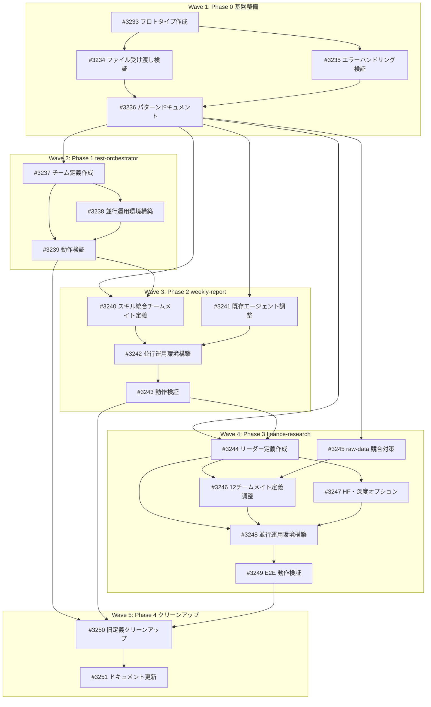

# Agent Teams 移行計画

**作成日**: 2026-02-08
**ステータス**: 計画中
**タイプ**: workflow
**GitHub Project**: [#35](https://github.com/users/YH-05/projects/35)

## 1. コンテキスト

### 背景

本プロジェクトには5つの主要ワークフローが存在し、それぞれ異なるオーケストレーション手法（Python asyncio、Claude Task サブエージェント、スキル順序実行、コマンドベース）で実装されている。Agent Teams API の導入により、これらを統一的な協調モデルに移行する機会が生まれた。

### 目的

1. **統一的なオーケストレーション**: ワークフロー間で一貫した協調パターンを確立
2. **可観測性の向上**: TaskList/TaskGet/TaskUpdate による進捗追跡の標準化
3. **障害耐性の改善**: チームメイト間メッセージングによるエラー伝播と回復
4. **開発速度の向上**: 新規ワークフロー追加時のボイラープレート削減

### 対象外

- Python ライブラリコード（src/ 以下のコアロジック）の変更
- 外部 API（GitHub CLI、yfinance、FRED）とのインターフェース変更
- テストフレームワークの変更

---

## 2. 既存ワークフローの分類と評価

### 2.1 ワークフロー一覧

| # | ワークフロー | 実装方式 | 行数 | エージェント数 | 並列度 | データサイズ |
|---|-------------|---------|------|--------------|--------|------------|
| W1 | NewsWorkflowOrchestrator | Python asyncio | 654行 | 0（Python内完結） | asyncio.Semaphore | 中（数十記事） |
| W2 | finance-news-workflow | スキル + Task | ~280行 | 11（news-article-fetcher） | run_in_background × 11 | 大（289KB RSS） |
| W3 | weekly-report-writer | エージェント + 4スキル | ~430行 | 3（aggregator, writer, publisher） | 順序実行 | 中（JSON 50-100KB） |
| W4 | finance-research | コマンド + Task | ~307行 | 12（各分析エージェント） | Phase 2/4 並列 | 中～大 |
| W5 | test-orchestrator | エージェント + Task | ~277行 | 4（planner, unit, property, integration） | Phase 2 並列 | 小 |

### 2.2 評価マトリクス

| 基準 | W1 | W2 | W3 | W4 | W5 |
|------|----|----|----|----|-----|
| 移行効果（高=大） | 中 | 高 | 高 | 高 | 中 |
| 移行リスク（高=危険） | 高 | 中 | 低 | 中 | 低 |
| 移行複雑度（高=難） | 高 | 中 | 低 | 中 | 低 |
| 現状の問題点 | なし | 結果集約が手動的 | スキルロード制約 | 長大なコマンド定義 | 特になし |
| 使用頻度 | 日次 | 日次 | 週次 | 不定期 | 不定期 |

### 2.3 各ワークフローの特性分析

#### W1: NewsWorkflowOrchestrator（Python asyncio）

**現状**: `src/news/orchestrator.py` に654行の Python コードとして実装。4段階パイプライン（collect → extract → summarize → publish）を asyncio で制御。型安全（`CollectedArticle → ExtractedArticle → SummarizedArticle → PublishedArticle`）。

**Agent Teams 適合度: 低**
- Python asyncio による細粒度の並行制御（Semaphore）を Agent Teams で再現するのは非効率
- Pydantic モデルによる型安全なデータ変換はテキストベースの SendMessage では劣化
- 現状で十分に機能しており、移行の投資対効果が低い

#### W2: finance-news-workflow（スキル + Task）

**現状**: Python CLI 前処理でテーマ別 JSON を生成し、11個の news-article-fetcher を `run_in_background` で並列起動。TaskOutput で結果を手動集約。

**Agent Teams 適合度: 高**
- 既に11並列の独立タスクという構造が Agent Teams のタスクモデルと一致
- 結果集約が現状手動的（TaskOutput の逐次チェック）→ TaskUpdate/TaskList で自動化可能
- テーマ間の依存関係がなく、並列実行の恩恵が大きい

#### W3: weekly-report-writer（エージェント + 4スキル）

**現状**: 4つのスキル（data-aggregation → comment-generation → template-rendering → validation）を順序実行。前後に aggregator と publisher エージェントが存在。

**Agent Teams 適合度: 高**
- 3エージェント（aggregator → writer → publisher）の順序依存が Agent Teams の addBlockedBy で自然に表現可能
- スキルロード制約（チームメイトではスキル非対応）の回避策が必要だが、スキル内容をエージェント定義に統合すれば解決
- ファイル I/O ベースの中間データ受け渡しは維持可能

#### W4: finance-research（コマンド + Task）

**現状**: 5フェーズ、12エージェントによる深掘りリサーチ。Phase 2（4並列）と Phase 4（2並列）に並列実行あり。Phase 間は順序依存。

**Agent Teams 適合度: 高**
- 複雑な依存関係グラフが addBlocks/addBlockedBy で宣言的に表現可能
- 現状のコマンドファイルは307行の手続き的記述 → タスクリストに変換すると簡潔に
- 中間結果のファイル出力は維持し、タスク完了通知で次フェーズをトリガー

#### W5: test-orchestrator（エージェント + Task）

**現状**: 3フェーズ（planner → unit & property 並列 → integration）。シンプルな依存構造。

**Agent Teams 適合度: 中**
- 構造は Agent Teams に適合するが、既に十分シンプルで移行メリットが限定的
- テスト作成という性質上、失敗時のリトライロジックが重要 → Agent Teams の再試行機能との親和性は高い

---

## 3. 移行優先順位と判断根拠

### 優先順位

| 順位 | ワークフロー | 理由 |
|------|-------------|------|
| **1** | W5: test-orchestrator | 最もシンプル。移行パターンの検証・学習に最適。リスク最小。 |
| **2** | W3: weekly-report-writer | 順序実行が主体で依存関係が明確。週次実行なので移行検証の時間的余裕あり。 |
| **3** | W2: finance-news-workflow | 最大の移行効果。11並列タスクの可観測性が劇的に向上。 |
| **4** | W4: finance-research | 複雑な依存グラフの移行。W2/W3 の経験を活かせる。 |
| **5（保留）** | W1: NewsWorkflowOrchestrator | Python asyncio のまま維持。移行の投資対効果が低い。 |

### 判断根拠

**W5 を最初にする理由**:
- エージェント数が最少（4）で失敗時の影響範囲が限定的
- 並列＋順序の混合パターンを小規模で検証可能
- テスト作成ワークフローなので、移行中のリグレッションを即座に検出可能

**W1 を保留にする理由**:
- Python asyncio による型安全なパイプラインを Agent Teams のテキストベース通信に置き換えると、型安全性と粒度が劣化する
- asyncio.Semaphore による細かい並行制御は Agent Teams では再現困難
- 現状で安定稼働しており、移行リスクに見合う効果がない

---

## 4. 各ワークフローの Agent Teams 実装設計

### 4.1 W5: test-orchestrator

#### チーム構成

```
Team: test-team
├── test-lead (team-lead) ─── オーケストレーション
├── test-planner ────────── テスト設計
├── test-unit-writer ────── 単体テスト作成
├── test-property-writer ── プロパティテスト作成
└── test-integration-writer  統合テスト作成
```

#### タスク定義

```python
# チーム作成時のタスクリスト
tasks = [
    {
        "subject": "テスト設計を作成",
        "description": "対象機能のテストTODOリスト、ファイル配置、優先度を決定",
        "owner": "test-planner",
    },
    {
        "subject": "単体テストを作成",
        "description": "テスト設計に基づき単体テストファイルを作成",
        "owner": "test-unit-writer",
        "addBlockedBy": ["テスト設計を作成"],  # Phase 1 完了待ち
    },
    {
        "subject": "プロパティテストを作成",
        "description": "テスト設計に基づきHypothesisプロパティテストを作成",
        "owner": "test-property-writer",
        "addBlockedBy": ["テスト設計を作成"],  # Phase 1 完了待ち
    },
    {
        "subject": "統合テストを作成",
        "description": "単体・プロパティテストの結果を踏まえ統合テストを作成",
        "owner": "test-integration-writer",
        "addBlockedBy": ["単体テストを作成", "プロパティテストを作成"],  # Phase 2 完了待ち
    },
]
```

#### データフロー

```
test-planner ──(ファイル: test-plan.json)──→ test-unit-writer
                                           ├→ test-property-writer
test-unit-writer ──(ファイル: tests/unit/)─────→ test-integration-writer
test-property-writer ──(ファイル: tests/property/)─→ test-integration-writer
```

- **中間データ**: ファイルシステム経由（既存パターン維持）
- **完了通知**: TaskUpdate(status="completed") → 依存タスクが自動アンブロック
- **設計情報の伝達**: test-planner が test-plan.json を出力し、他のチームメイトが Read で読み込み

#### 移行手順

1. `.claude/agents/test-orchestrator.md` を Agent Teams 定義に変換
2. 各サブエージェント定義はそのまま維持（チームメイトとして再利用）
3. `tdd-development` スキルの内容をリーダーエージェントの指示に統合
4. 動作検証: 既存テストに対して新旧両方のオーケストレーターを実行し結果を比較

### 4.2 W3: weekly-report-writer

#### チーム構成

```
Team: weekly-report-team
├── report-lead (team-lead) ─── オーケストレーション
├── news-aggregator ─────────── GitHub Project からニュース集約
├── report-writer ───────────── 4フェーズでレポート生成
└── report-publisher ────────── GitHub Issue 投稿
```

#### タスク定義

```python
tasks = [
    {
        "subject": "ニュースデータを集約",
        "description": "GitHub Project #15 からニュースを取得し data/ に出力",
        "owner": "news-aggregator",
    },
    {
        "subject": "週次レポートを生成",
        "description": (
            "4フェーズ順序実行: "
            "data-aggregation → comment-generation → template-rendering → validation. "
            "出力: 02_edit/weekly_report.md (3200字以上)"
        ),
        "owner": "report-writer",
        "addBlockedBy": ["ニュースデータを集約"],
    },
    {
        "subject": "GitHub Issue に投稿",
        "description": "weekly_report.md を GitHub Issue として作成し Project #15 に追加",
        "owner": "report-publisher",
        "addBlockedBy": ["週次レポートを生成"],
    },
]
```

#### スキルロード制約の回避

**問題**: チームメイトではスキルロード機能が非対応。report-writer は4つのスキルに依存。

**解決策**: スキルの核心ロジックをエージェント定義に直接記述する。

```
# 現状
weekly-report-writer.md
  ├── skills: weekly-data-aggregation
  ├── skills: weekly-comment-generation
  ├── skills: weekly-template-rendering
  └── skills: weekly-report-validation

# 移行後
weekly-report-writer.md
  └── (4スキルの処理手順をエージェント定義に統合)
      ├── Phase 1: データ集約ロジック（インライン）
      ├── Phase 2: コメント生成ロジック（インライン）
      ├── Phase 3: テンプレート埋め込みロジック（インライン）
      └── Phase 4: 品質検証ロジック（インライン）
```

または、4フェーズをそれぞれ別チームメイトに分割:

```
Team: weekly-report-team (拡張版)
├── report-lead
├── news-aggregator
├── data-aggregator ──────── Phase 1
├── comment-generator ────── Phase 2 (blockedBy: data-aggregator)
├── template-renderer ────── Phase 3 (blockedBy: comment-generator)
├── report-validator ─────── Phase 4 (blockedBy: template-renderer)
└── report-publisher ─────── (blockedBy: report-validator)
```

**推奨**: 後者（拡張版）。各フェーズが独立したチームメイトになることで、障害箇所の特定とリトライが容易になる。

#### データフロー

```
news-aggregator
  └── data/news_from_project.json (ファイル出力)
        ↓
data-aggregator
  └── data/aggregated_data.json
        ↓
comment-generator
  └── data/comments.json
        ↓
template-renderer
  └── 02_edit/weekly_report.md + weekly_report.json
        ↓
report-validator
  └── validation_result.json
        ↓
report-publisher
  └── GitHub Issue 作成
```

- 全中間データはファイルシステム経由
- 各チームメイトはファイルパスを知っている（エージェント定義に記載）
- 完了通知は TaskUpdate のみ（データはファイルから読み取り）

### 4.3 W2: finance-news-workflow

#### チーム構成

```
Team: news-collection-team
├── news-lead (team-lead) ────── Python CLI 前処理 + 結果集約
├── fetcher-index ─────────────── テーマ: index
├── fetcher-stock ─────────────── テーマ: stock
├── fetcher-sector ────────────── テーマ: sector
├── fetcher-macro-cnbc ────────── テーマ: macro_cnbc
├── fetcher-macro-other ───────── テーマ: macro_other
├── fetcher-ai-cnbc ───────────── テーマ: ai_cnbc
├── fetcher-ai-nasdaq ─────────── テーマ: ai_nasdaq
├── fetcher-ai-tech ───────────── テーマ: ai_tech
├── fetcher-finance-cnbc ──────── テーマ: finance_cnbc
├── fetcher-finance-nasdaq ────── テーマ: finance_nasdaq
└── fetcher-finance-other ─────── テーマ: finance_other
```

#### タスク定義

```python
# Phase 1: リーダーが Python CLI を実行（タスクではなくリーダーの初期処理）
# → .tmp/news-batches/{theme}.json を生成

# Phase 2: 11テーマを並列タスクとして登録
themes = [
    "index", "stock", "sector",
    "macro_cnbc", "macro_other",
    "ai_cnbc", "ai_nasdaq", "ai_tech",
    "finance_cnbc", "finance_nasdaq", "finance_other",
]

tasks = []
for theme in themes:
    tasks.append({
        "subject": f"{theme} テーマの記事を処理",
        "description": (
            f".tmp/news-batches/{theme}.json を読み込み、各記事に対して "
            "3段階フォールバックで本文取得→日本語要約生成→Issue作成→Project追加を実行"
        ),
        "owner": f"fetcher-{theme.replace('_', '-')}",
        # addBlockedBy なし → リーダーの前処理完了後に全テーマ同時開始
    })
```

#### 前処理の実行タイミング

**問題**: Phase 1（Python CLI 前処理）はリーダーが直接実行する必要がある。Agent Teams のタスク登録時にはまだ JSON ファイルが存在しない。

**解決策**: リーダーが Phase 1 を実行してから TaskCreate で11タスクを動的に登録。

```
news-lead の処理フロー:
1. Bash で prepare_news_session.py を実行
2. テーマ別 JSON 分割スクリプトを実行
3. 記事数が0のテーマをスキップ
4. 記事があるテーマのみ TaskCreate で登録
5. 各 fetcher チームメイトにメッセージで開始通知
6. TaskList で全タスク完了を待機
7. 結果集約レポートを出力
```

#### データフロー

```
news-lead (Phase 1)
  └── .tmp/news-batches/{theme}.json (11ファイル)
        ↓ (各 fetcher が独立して読み込み)
fetcher-{theme} (Phase 2, 11並列)
  ├── 記事本文取得（3段階フォールバック）
  ├── 日本語要約生成
  ├── Issue 作成 + close + Project 追加
  └── TaskUpdate(status="completed") + 結果を SendMessage でリーダーに報告
        ↓
news-lead (Phase 3)
  └── 全 fetcher の結果を集約してサマリー出力
```

#### 重複チェックの同期

**リスク**: 11並列の fetcher が同時に Issue を作成すると、重複チェックの同期遅延が発生。

**対策**:
1. Phase 1（Python CLI）で事前に重複チェック済み → 大部分の重複は排除済み
2. GitHub Issue 作成前に `gh issue list` で再チェック → レース条件の窓を縮小
3. 万が一の重複は手動クリーンアップ（低頻度のため許容）

### 4.4 W4: finance-research

#### チーム構成

```
Team: research-team
├── research-lead (team-lead) ── オーケストレーション
├── query-generator ──────────── Phase 1: 検索クエリ生成
├── market-data-collector ────── Phase 2: 市場データ収集
├── web-researcher ───────────── Phase 2: Web 検索
├── wiki-researcher ──────────── Phase 2: Wikipedia 検索
├── sec-filings-analyzer ─────── Phase 2: SEC 開示情報取得
├── source-extractor ─────────── Phase 3: ソース抽出
├── claims-extractor ─────────── Phase 3: 主張抽出
├── sentiment-analyzer ───────── Phase 3.5: センチメント分析
├── claims-analyzer ──────────── Phase 4: 主張分析
├── fact-checker ─────────────── Phase 4: ファクトチェック
├── decision-maker ───────────── Phase 4: 採用判定
└── visualizer ───────────────── Phase 5: 可視化
```

#### タスク依存関係グラフ

```
query-generator
  ├→ market-data-collector  ─┐
  ├→ web-researcher         ─┤ Phase 2 (並列)
  ├→ wiki-researcher        ─┤
  └→ sec-filings-analyzer   ─┘
        ↓ (全 Phase 2 完了)
source-extractor
  ↓
claims-extractor ──→ sentiment-analyzer (Phase 3.5, 並列可)
  ↓
claims-analyzer ───┐
fact-checker ──────┤ Phase 4 (並列)
                   ↓ (両方完了)
decision-maker
  ↓
visualizer
```

```python
tasks = [
    {"subject": "検索クエリ生成", "owner": "query-generator"},
    {"subject": "市場データ収集", "owner": "market-data-collector",
     "addBlockedBy": ["検索クエリ生成"]},
    {"subject": "Web検索", "owner": "web-researcher",
     "addBlockedBy": ["検索クエリ生成"]},
    {"subject": "Wikipedia検索", "owner": "wiki-researcher",
     "addBlockedBy": ["検索クエリ生成"]},
    {"subject": "SEC開示情報取得", "owner": "sec-filings-analyzer",
     "addBlockedBy": ["検索クエリ生成"]},
    {"subject": "ソース抽出", "owner": "source-extractor",
     "addBlockedBy": ["市場データ収集", "Web検索", "Wikipedia検索", "SEC開示情報取得"]},
    {"subject": "主張抽出", "owner": "claims-extractor",
     "addBlockedBy": ["ソース抽出"]},
    {"subject": "センチメント分析", "owner": "sentiment-analyzer",
     "addBlockedBy": ["主張抽出"]},
    {"subject": "主張分析", "owner": "claims-analyzer",
     "addBlockedBy": ["主張抽出"]},
    {"subject": "ファクトチェック", "owner": "fact-checker",
     "addBlockedBy": ["主張抽出"]},
    {"subject": "採用判定", "owner": "decision-maker",
     "addBlockedBy": ["主張分析", "ファクトチェック"]},
    {"subject": "可視化", "owner": "visualizer",
     "addBlockedBy": ["採用判定", "センチメント分析"]},
]
```

#### データフロー

全中間データはファイルシステム経由（既存パターン維持）:

```
articles/{article_id}/01_research/
├── queries.json          (query-generator 出力)
├── market_data/data.json (market-data-collector 出力)
├── raw-data.json         (web/wiki/sec 出力 → 同一ファイルに追記)
├── sources.json          (source-extractor 出力)
├── claims.json           (claims-extractor 出力)
├── sentiment_analysis.json (sentiment-analyzer 出力)
├── analysis.json         (claims-analyzer 出力)
├── fact-checks.json      (fact-checker 出力)
├── decisions.json        (decision-maker 出力)
└── visualize/            (visualizer 出力)
```

**raw-data.json の書き込み競合問題**:

現状、web/wiki/sec の3エージェントが同一ファイルに書き込む設計。Agent Teams では並列実行されるため競合が発生する。

**対策**: 各エージェントが個別ファイルに出力し、source-extractor が統合:

```
articles/{article_id}/01_research/
├── raw-data-web.json     (web-researcher 出力)
├── raw-data-wiki.json    (wiki-researcher 出力)
├── raw-data-sec.json     (sec-filings-analyzer 出力)
└── raw-data.json         (source-extractor が統合生成)
```

---

## 5. 問題点・リスクと対策

### 5.1 スキルロード制約

| 影響 | 対象 | 対策 |
|------|------|------|
| 高 | W3 (weekly-report-writer) | スキル内容をエージェント定義に統合、または4フェーズを個別チームメイトに分割 |
| 中 | W5 (test-orchestrator) | tdd-development スキルをリーダーの指示に統合 |
| 低 | W2, W4 | スキル依存が少ないため影響軽微 |

### 5.2 大型データの SendMessage 制約

**問題**: SendMessage はテキストベースで、50KB 超のデータ転送に不適。

**対策**: ファイルシステム経由のデータ受け渡しを維持。SendMessage は完了通知とメタデータ（ファイルパス、統計情報）のみに使用。

```python
# 良い例: ファイルパスと統計のみを送信
SendMessage(
    type="message",
    recipient="research-lead",
    content=json.dumps({
        "status": "completed",
        "output_file": "01_research/sources.json",
        "stats": {"source_count": 24, "unique_domains": 8}
    }),
    summary="ソース抽出完了: 24件"
)

# 悪い例: データ本体を送信（禁止）
SendMessage(
    type="message",
    recipient="research-lead",
    content=json.dumps(full_sources_data),  # 50KB超の可能性
    summary="ソース抽出結果"
)
```

### 5.3 GitHub Issue 重複チェック同期遅延

**対象**: W2 (finance-news-workflow)

**リスク**: 11並列 fetcher が同時に Issue を作成する際、Issue リスト取得のタイミング差で重複が発生する可能性。

**対策（3層防御）**:
1. **事前排除**: Python CLI 前処理で既存 Issue URL と照合（現行通り）
2. **実行時チェック**: 各 fetcher が Issue 作成直前に `gh issue list` で再確認
3. **事後検出**: リーダーが集約時に重複を検出し報告（手動クリーンアップ）

**定量評価**: 現行の Python CLI 前処理で98%以上の重複を排除済み。残り2%のレース条件は日次1-2件程度で、手動対応で許容可能。

### 5.4 raw-data.json 書き込み競合

**対象**: W4 (finance-research)

**リスク**: web/wiki/sec の3エージェントが同一ファイルに並列書き込みするとデータ破損。

**対策**: セクション4.4に記載の通り、個別ファイル出力 → source-extractor で統合。

### 5.5 エラー伝播と部分障害

**問題**: Agent Teams では1つのチームメイトの失敗がチーム全体に波及する可能性がある。

**対策**:

```python
# リーダーがエラーを検知した場合の処理
# 1. 失敗タスクを completed (エラー付き) にマーク
TaskUpdate(taskId="failed-task", status="completed",
           description="失敗: {error_message}")

# 2. 依存タスクへの影響を評価
# - 必須依存: 依存タスクもキャンセル
# - 任意依存: 依存タスクはフォールバックデータで続行

# 3. 部分結果の保存
# 完了済みフェーズの結果はファイルに保存されているため、
# 再実行時に --force フラグなしではスキップ可能
```

**ワークフロー別の耐障害設計**:

| ワークフロー | 部分障害の許容度 | 対策 |
|-------------|----------------|------|
| W2 | 高（テーマ独立） | 失敗テーマのみ再実行 |
| W3 | 低（順序依存） | 失敗フェーズから再開 |
| W4 | 中（Phase内は独立） | Phase 2: 失敗エージェントのみ再実行。Phase 4: 同様 |
| W5 | 中 | Phase 2: 失敗テストのみ再実行 |

### 5.6 チームメイト数の上限

**問題**: W2 では11チームメイト + リーダー = 12エージェントが同時起動。Agent Teams のチームメイト数上限（未公表だが実用上10-15程度と推定）に接近する。

**対策**:
- 11フェッチャーを同一エージェント定義（news-article-fetcher）で統一し、テーマ情報はタスク description で渡す
- 必要に応じてテーマをバッチ化（例: 3-4テーマずつ処理）して同時チームメイト数を削減

---

## 6. 段階的移行ロードマップ

### Phase 0: 基盤整備（1-2日）

**目的**: Agent Teams の動作確認と共通パターンの確立

**作業内容**:
1. Agent Teams API のプロトタイプ作成（最小チーム: リーダー + 2チームメイト）
2. ファイルベースデータ受け渡しパターンの検証
3. TaskUpdate/TaskList による進捗追跡パターンの確認
4. エラーハンドリングパターンの確立

**成果物**:
- `docs/agent-teams-patterns.md`: 共通実装パターンのドキュメント
- プロトタイプコード

### Phase 1: W5 test-orchestrator 移行（2-3日）

**目的**: 最もシンプルなワークフローで移行パターンを実証

**作業内容**:
1. Agent Teams チーム定義の作成
2. 4チームメイトのエージェント定義を調整
3. タスク依存関係の設定
4. 既存オーケストレーターとの並行動作テスト
5. 結果比較と品質確認

**並行運用**:
- 旧: `.claude/agents/test-orchestrator.md` を `test-orchestrator-legacy.md` にリネーム
- 新: Agent Teams ベースの test-orchestrator を導入
- 切り替え: 1週間の並行運用後、旧を `trash/` に移動

**検証基準**:
- [ ] 同一入力に対して同等の出力を生成
- [ ] Phase 2 の並列実行が正常に動作
- [ ] エラー時のリトライが機能
- [ ] 処理時間が旧と同等以下

### Phase 2: W3 weekly-report-writer 移行（3-4日）

**目的**: 順序実行ワークフローの移行と、スキルロード制約の解決パターン確立

**作業内容**:
1. 4スキルの内容をチームメイト定義に統合
2. 6チームメイト（aggregator → 4フェーズ → publisher）のチーム定義作成
3. ファイル I/O ベースのデータフロー検証
4. 品質検証フェーズの動作確認
5. GitHub Issue 投稿の E2E テスト

**並行運用**:
- 旧: `/generate-market-report` コマンドは旧実装を維持
- 新: `/generate-market-report --use-teams` フラグで新実装を選択可能
- 切り替え: 2週間の並行運用後（2回の週次レポート生成で検証）

### Phase 3: W2 finance-news-workflow 移行（4-5日）

**目的**: 大規模並列ワークフローの移行

**作業内容**:
1. Python CLI 前処理の維持（Phase 1 はリーダーが実行）
2. 11テーマ fetcher のチームメイト定義
3. 動的タスク登録パターンの実装
4. 重複チェック同期の検証
5. 結果集約レポートの品質確認
6. 大規模 RSS データ（289KB）のファイルベース受け渡し検証

**並行運用**:
- 旧: `/finance-news-workflow` は旧実装を維持
- 新: `/finance-news-workflow --use-teams` で新実装を選択
- 切り替え: 1週間の並行運用（日次実行で検証）

### Phase 4: W4 finance-research 移行（5-7日）

**目的**: 複雑な依存グラフの移行

**作業内容**:
1. 12チームメイトのチーム定義作成
2. 5フェーズの依存関係グラフ設定
3. raw-data.json の個別ファイル分割対応
4. HF（Human Feedback）ポイントの Agent Teams 対応
5. 深度オプション（shallow/deep/auto）の動的タスク追加
6. E2E テスト

**並行運用**:
- 旧: `/finance-research` コマンドは旧実装を維持
- 新: `/finance-research --use-teams` で新実装を選択
- 切り替え: 3-4回のリサーチ実行で検証後

### Phase 5: 旧実装のクリーンアップ（1-2日）

**作業内容**:
1. 旧オーケストレーター定義を `trash/agents/` に移動
2. `--use-teams` フラグを削除（デフォルト化）
3. CLAUDE.md のエージェント一覧を更新
4. 関連ドキュメントの更新

---

## 7. 検証計画

### 7.1 単体検証（各フェーズ内）

| 検証項目 | 方法 | 合格基準 |
|---------|------|---------|
| タスク依存関係 | 依存タスク未完了時にブロックされることを確認 | ブロックが正常に機能 |
| 並列実行 | 独立タスクが同時に開始されることを確認 | 並列数が期待値と一致 |
| エラーハンドリング | チームメイトを意図的に失敗させ、リーダーの反応を確認 | エラーが適切に報告される |
| データ受け渡し | 中間ファイルが正しく生成・読み取りされることを確認 | データ完全性が維持 |

### 7.2 統合検証（フェーズ間）

| 検証項目 | 方法 | 合格基準 |
|---------|------|---------|
| 出力同等性 | 旧新両方で同一入力を処理し出力を比較 | 実質的に同等の出力 |
| 性能比較 | 処理時間を計測 | 旧と同等以下 |
| リソース使用量 | チームメイト数と同時実行数を監視 | 上限に達しない |

### 7.3 ロールバック検証

| 検証項目 | 方法 |
|---------|------|
| 即時ロールバック | `--use-teams` フラグを外すだけで旧実装に戻ることを確認 |
| データ整合性 | ロールバック後に旧実装で中間ファイルが読み取り可能 |
| GitHub 状態 | 移行中に作成された Issue/Project が正常な状態 |

### 7.4 ロールバック手順

```bash
# 1. フラグを外して旧実装に戻す
/finance-news-workflow  # --use-teams なしで旧実装を使用

# 2. 新実装のチーム定義を無効化（必要に応じて）
mv .claude/teams/news-collection-team.md .claude/teams/news-collection-team.md.disabled

# 3. 旧エージェント定義を復元（trash/ から戻す）
mv trash/agents/test-orchestrator-legacy.md .claude/agents/test-orchestrator.md
```

---

## 8. W1 (NewsWorkflowOrchestrator) の保留判断

### 移行しない理由

1. **型安全性**: Pydantic モデルチェーン（CollectedArticle → ExtractedArticle → SummarizedArticle → PublishedArticle）が Agent Teams のテキストベース通信では再現困難
2. **粒度**: asyncio.Semaphore による記事単位の並行制御（抽出: concurrency=N, 要約: batch処理）は Agent Teams のタスク粒度と不一致
3. **安定性**: 654行の成熟したコードで、日次運用に問題なし
4. **投資対効果**: 移行コスト（高） vs 改善効果（低）

### 将来の再評価条件

以下の条件が満たされた場合に再評価:
- Agent Teams API が構造化データ（JSON/Pydantic）の直接受け渡しをサポート
- Agent Teams にSemaphore 相当の並行制御機能が追加
- NewsWorkflowOrchestrator に大幅な機能拡張が必要になった場合

---

## 9. タスク一覧

**GitHub Project**: [#35](https://github.com/users/YH-05/projects/35)
**ステータス**: 計画中
**合計**: 19 タスク / 5 Wave
**除外**: W1（asyncio維持）、W2（Pythonスクリプト `src/news/scripts/finance_news_workflow.py` 維持）

### Wave 1: Phase 0 基盤整備（4タスク）

- [ ] Agent Teams 共通実装パターンのプロトタイプ作成
  - Issue: [#3233](https://github.com/YH-05/quants/issues/3233)
  - ステータス: todo
- [ ] ファイルベースデータ受け渡しパターンの検証
  - Issue: [#3234](https://github.com/YH-05/quants/issues/3234)
  - ステータス: todo
  - 依存: #3233
- [ ] エラーハンドリング・部分障害パターンの確立
  - Issue: [#3235](https://github.com/YH-05/quants/issues/3235)
  - ステータス: todo
  - 依存: #3233
- [ ] Agent Teams 共通実装パターンドキュメントの作成
  - Issue: [#3236](https://github.com/YH-05/quants/issues/3236)
  - ステータス: todo
  - 依存: #3233, #3234, #3235

### Wave 2: Phase 1 W5 test-orchestrator 移行（3タスク）

- [ ] test-orchestrator の Agent Teams チーム定義作成
  - Issue: [#3237](https://github.com/YH-05/quants/issues/3237)
  - ステータス: todo
  - 依存: #3236
- [ ] test-orchestrator の並行運用環境構築
  - Issue: [#3238](https://github.com/YH-05/quants/issues/3238)
  - ステータス: todo
  - 依存: #3237
- [ ] test-orchestrator 移行の動作検証と結果比較
  - Issue: [#3239](https://github.com/YH-05/quants/issues/3239)
  - ステータス: todo
  - 依存: #3237, #3238

### Wave 3: Phase 2 W3 weekly-report-writer 移行（4タスク）

- [ ] weekly-report-writer の4スキル統合チームメイト定義作成
  - Issue: [#3240](https://github.com/YH-05/quants/issues/3240)
  - ステータス: todo
  - 依存: #3236, #3239
- [ ] weekly-report-writer 既存エージェント定義の Agent Teams 対応調整
  - Issue: [#3241](https://github.com/YH-05/quants/issues/3241)
  - ステータス: todo
  - 依存: #3236
- [ ] weekly-report-writer の並行運用環境構築
  - Issue: [#3242](https://github.com/YH-05/quants/issues/3242)
  - ステータス: todo
  - 依存: #3240, #3241
- [ ] weekly-report-writer 移行の動作検証と品質確認
  - Issue: [#3243](https://github.com/YH-05/quants/issues/3243)
  - ステータス: todo
  - 依存: #3242

### Wave 4: Phase 3 W4 finance-research 移行（6タスク）

- [ ] finance-research のリーダーエージェント定義作成
  - Issue: [#3244](https://github.com/YH-05/quants/issues/3244)
  - ステータス: todo
  - 依存: #3236, #3243
- [ ] finance-research の raw-data.json 書き込み競合対策
  - Issue: [#3245](https://github.com/YH-05/quants/issues/3245)
  - ステータス: todo
  - 依存: #3236
- [ ] finance-research の12チームメイト定義調整
  - Issue: [#3246](https://github.com/YH-05/quants/issues/3246)
  - ステータス: todo
  - 依存: #3244, #3245
- [ ] finance-research の HF ポイントと深度オプション対応
  - Issue: [#3247](https://github.com/YH-05/quants/issues/3247)
  - ステータス: todo
  - 依存: #3244
- [ ] finance-research の並行運用環境構築
  - Issue: [#3248](https://github.com/YH-05/quants/issues/3248)
  - ステータス: todo
  - 依存: #3244, #3246, #3247
- [ ] finance-research 移行の E2E 動作検証
  - Issue: [#3249](https://github.com/YH-05/quants/issues/3249)
  - ステータス: todo
  - 依存: #3248

### Wave 5: Phase 4 旧実装のクリーンアップ（2タスク）

- [ ] 旧オーケストレーター定義のクリーンアップ
  - Issue: [#3250](https://github.com/YH-05/quants/issues/3250)
  - ステータス: todo
  - 依存: #3239, #3243, #3249
- [ ] CLAUDE.md・関連ドキュメントの更新
  - Issue: [#3251](https://github.com/YH-05/quants/issues/3251)
  - ステータス: todo
  - 依存: #3250

### 依存関係図



---

## 10. 移行前後の比較サマリー

| 観点 | 移行前 | 移行後 |
|------|--------|--------|
| オーケストレーション | 4種混在（asyncio, Task, スキル, コマンド） | Agent Teams + asyncio（W1）+ Python CLI（W2） |
| 進捗追跡 | TaskOutput手動チェック / ログ出力 | TaskList/TaskGet で統一 |
| エラーハンドリング | 各ワークフロー個別実装 | SendMessage + TaskUpdate で統一 |
| 依存関係管理 | コード内の暗黙的順序 | addBlocks/addBlockedBy で宣言的 |
| 並列実行 | run_in_background / asyncio | Agent Teams のタスクスケジューリング |
| データ受け渡し | ファイル + プロンプト | ファイル（維持）+ SendMessage（通知） |
| 新規ワークフロー追加 | エージェント+スキル+コマンド定義 | チーム定義 + タスクリスト |
