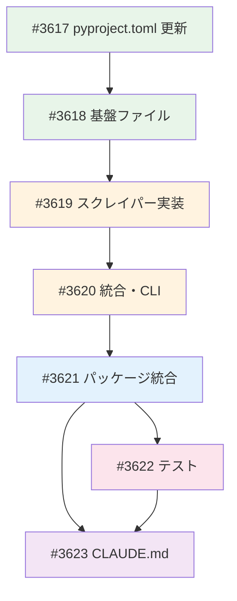

# news_scraper パッケージ移植

**作成日**: 2026-02-23
**ステータス**: 計画中
**タイプ**: package
**GitHub Project**: [#53](https://github.com/users/YH-05/projects/53)

## 背景と目的

### 背景

Quants プロジェクト（`/Users/yukihata/Desktop/Quants/src/news_scraper/`）に CNBC・NASDAQ・yfinance からニュース記事を直接スクレイピングする `news_scraper` パッケージがある。Quants は finance に git 依存しているため、finance 側にこのパッケージを移植すれば Quants からも `from news_scraper import ...` で利用可能になる。

### 目的

- Quants の news_scraper パッケージ（14ファイル、約4,200行）を finance の `src/news_scraper/` にコピー＋アダプトで移植
- 既存の news/rss パッケージとは統合しない（スタンドアロン）
- logging を stdlib から structlog（utils_core.logging）に変換
- 45 個の public export を維持

### 成功基準

- [ ] `python -c "from news_scraper import Article, ScraperConfig, collect_financial_news; print('OK')"` が動作
- [ ] `uv run pytest tests/news_scraper/ -v` が全 PASS
- [ ] `make check-all` が成功
- [ ] `news-scraper --help` が動作

## リサーチ結果

### 既存パターン

- **logging**: `from utils_core.logging import get_logger` / keyword-argument 形式（全パッケージ共通）
- **py.typed**: 全既存パッケージに PEP 561 マーカーが存在
- **テスト**: `tests/{pkg}/` + conftest.py（4フィクスチャ）+ unit/ + property/ + integration/
- **Article 名前衝突**: `news.Article`（Pydantic）と `news_scraper.Article`（dataclass）は独立、リスク低

### 参考実装

| ファイル | 参考にすべき点 |
|---------|---------------|
| `src/utils_core/logging/config.py` | get_logger の使い方、structlog 形式 |
| `tests/news/conftest.py` | テストフィクスチャのテンプレート |
| `tests/news/unit/test_article.py` | 日本語テスト命名規則 |

### 技術的考慮事項

- **async_core.py**: gather_with_errors の logger 型を `logging.Logger` → `Any` に変更（structlog 互換）
- **finance_news_collect.py**: `logging.basicConfig()` → `setup_logging()` + `set_log_level()` に変換
- **cnbc.py/nasdaq.py**: 各 20 箇所以上の f-string ログを keyword-argument 形式に変換（最大ボリューム）
- **新規依存**: curl_cffi>=0.13.0, beautifulsoup4>=4.12.0, pyyaml>=6.0

## 実装計画

### アーキテクチャ概要

Quants の news_scraper パッケージを finance の `src/news_scraper/` にコピー＋アダプト。CLI/API → unified/async_unified → cnbc/nasdaq/yfinance → session + async_core + retry → types.Article → pd.DataFrame 出力。

### ファイルマップ

| 操作 | ファイルパス | 説明 |
|------|------------|------|
| 変更 | `pyproject.toml` | 依存3個 + wheel + scripts |
| 新規 | `src/news_scraper/types.py` | Article/ScraperConfig dataclass |
| 新規 | `src/news_scraper/exceptions.py` | 例外階層 |
| 新規 | `src/news_scraper/session.py` | curl_cffi セッション |
| 新規 | `src/news_scraper/async_core.py` | RateLimiter + gather_with_errors |
| 新規 | `src/news_scraper/py.typed` | PEP 561 マーカー |
| 新規 | `src/news_scraper/README.md` | API リファレンス |
| 新規 | `src/news_scraper/retry.py` | リトライ機構 |
| 新規 | `src/news_scraper/cnbc.py` | CNBC スクレイパー（899行） |
| 新規 | `src/news_scraper/nasdaq.py` | NASDAQ スクレイパー（900行） |
| 新規 | `src/news_scraper/yfinance.py` | yfinance スクレイパー（584行） |
| 新規 | `src/news_scraper/unified.py` | 統合スクレイパー同期版 |
| 新規 | `src/news_scraper/async_unified.py` | 統合スクレイパー非同期版 |
| 新規 | `src/news_scraper/finance_news_collect.py` | CLI スクリプト |
| 新規 | `src/news_scraper/__init__.py` | 45 export + AIDEV-NOTE |
| 新規 | `src/news_scraper/__main__.py` | CLI エントリポイント |
| 新規 | `tests/news_scraper/` (11ファイル) | テストスイート |
| 変更 | `CLAUDE.md` | パッケージ一覧更新 |

### リスク評価

| リスク | 影響度 | 対策 |
|--------|--------|------|
| cnbc.py/nasdaq.py の logging 変換量 | 中 | チェックリスト + grep 残存検出 |
| curl_cffi のネイティブ依存 | 中 | uv sync テスト |
| 統合テストの外部 API 依存 | 中 | @pytest.mark.integration + モック |
| async_core.py の logger 型互換性 | 低 | Any 型 + AIDEV-NOTE |

## タスク一覧

### Wave 1

- [ ] pyproject.toml に news_scraper 設定を追加
  - Issue: [#3617](https://github.com/YH-05/finance/issues/3617)
  - ステータス: todo
  - 見積もり: 0.25h

### Wave 2（Wave 1 完了後）

- [ ] 基盤ファイル作成（types, exceptions, session, async_core, py.typed, README）
  - Issue: [#3618](https://github.com/YH-05/finance/issues/3618)
  - ステータス: todo
  - 依存: #3617
  - 見積もり: 0.5h

### Wave 3（Wave 2 完了後）

- [ ] スクレイパー実装の移植（retry, cnbc, nasdaq, yfinance）
  - Issue: [#3619](https://github.com/YH-05/finance/issues/3619)
  - ステータス: todo
  - 依存: #3618
  - 見積もり: 1.5-2h

### Wave 4（Wave 3 完了後）

- [ ] 統合スクレイパーと CLI の移植（unified, async_unified, finance_news_collect）
  - Issue: [#3620](https://github.com/YH-05/finance/issues/3620)
  - ステータス: todo
  - 依存: #3619
  - 見積もり: 0.75h

### Wave 5（Wave 4 完了後）

- [ ] パッケージ統合（__init__.py, __main__.py）
  - Issue: [#3621](https://github.com/YH-05/finance/issues/3621)
  - ステータス: todo
  - 依存: #3620
  - 見積もり: 0.25h

### Wave 6（Wave 5 完了後）

- [ ] テストスイート作成 + make check-all
  - Issue: [#3622](https://github.com/YH-05/finance/issues/3622)
  - ステータス: todo
  - 依存: #3621
  - 見積もり: 1h

### Wave 7（最終）

- [ ] CLAUDE.md 更新
  - Issue: [#3623](https://github.com/YH-05/finance/issues/3623)
  - ステータス: todo
  - 依存: #3621, #3622
  - 見積もり: 0.25h

## 依存関係図

---

**最終更新**: 2026-02-23
