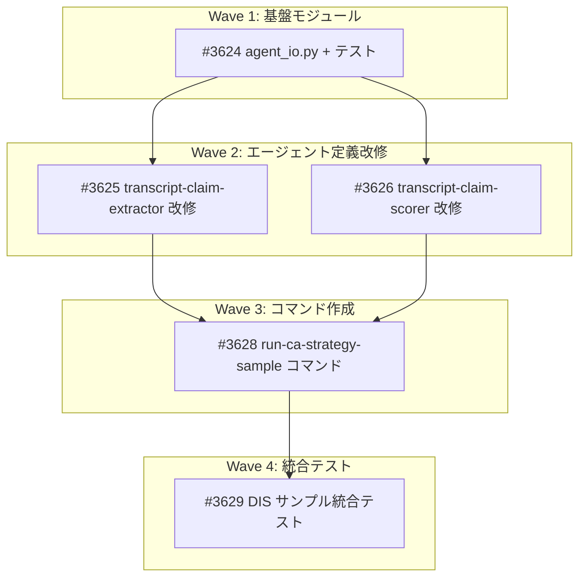

# CA Strategy パイプライン: LLM処理のエージェント化

**作成日**: 2026-02-23
**ステータス**: 完了
**タイプ**: workflow
**GitHub Project**: [#54](https://github.com/users/YH-05/projects/54)

## 背景と目的

### 背景

ca_strategy パイプラインの Phase 1（主張抽出）と Phase 2（スコアリング）は、`anthropic.Anthropic()` SDK を直接呼び出して LLM 推論を実行している。Claude Code サブスクリプション環境では API キーが不要であり、サブエージェント（Task tool）を使うことで API 呼び出しを Claude Code 自体に委譲できる。既存の `ca-strategy-lead`（Agent Teams 方式）は API 依存のため動作不能であり、よりシンプルなコマンド/スキル方式に置き換える。

### 目的

Phase 1/2 の LLM 処理を Claude Code サブエージェントに移行し、`ANTHROPIC_API_KEY` なしで DIS 1 銘柄のパイプラインが end-to-end で動作することを実証する。

### 成功基準

- [x] `ANTHROPIC_API_KEY` 未設定で Phase 1/2 が完了する
- [x] Phase 1 で 5-15 件の Claim が抽出される（Pydantic バリデーション通過）
- [x] Phase 2 で全 Claim に `final_confidence`（0.1-0.9）が付与される（Pydantic バリデーション通過）

## リサーチ結果

### 既存パターン

- `extractor.py`: `_build_system_prompt()` で `system_prompt_transcript.md` を読み込み、`{{cutoff_date}}` を置換。`_build_extraction_prompt()` で 9 セクション構成のプロンプトを構築
- `scorer.py`: `_build_system_prompt()` はハードコードされた短いテキスト。`_build_scoring_prompt()` で 9 セクション構成のプロンプトを構築（claims + KB1-T + KB2-T + KB3-T + dogma + キャリブレーション + ゲートキーパー + 出力指示）
- 両クラスとも `_llm_utils.py` の `call_llm()` を使用（`anthropic.Anthropic()`, model=`claude-sonnet-4-20250514`, max_tokens=8192, temperature=0）

### 参考実装

| ファイル | 説明 |
|---------|------|
| `src/dev/ca_strategy/extractor.py` | Phase 1 プロンプト構築・パースロジック |
| `src/dev/ca_strategy/scorer.py` | Phase 2 プロンプト構築・パースロジック |
| `src/dev/ca_strategy/types.py` | Claim/ScoredClaim 等の Pydantic モデル |
| `src/dev/ca_strategy/transcript.py` | TranscriptLoader（PoiT フィルタリング） |
| `analyst/transcript_eval/` | KB ファイル群（KB1-T: 9, KB2-T: 12, KB3-T: 5） |

### 技術的考慮事項

- **KB ファイル数**: Phase 1 は 16 ファイル、Phase 2 は 27 ファイルを Read する必要がある。並列 Read で対応
- **コンテキストウィンドウ**: KB 約 50-100KB + トランスクリプト約 200KB + 出力指示 = 約 350KB。200K コンテキストに収まる見込み
- **JSON 出力の揺れ**: confidence 値域（0.0-1.0 vs 10-90）、optional フィールドの省略に対し、寛容なパースロジックで対応

## 実装計画

### アーキテクチャ概要

コマンド（`run-ca-strategy-sample.md`）がオーケストレーターとして全体フローを制御。Python（Bash 経由）で入力準備・出力バリデーション、Task tool でサブエージェント（transcript-claim-extractor, transcript-claim-scorer）を呼び出す。`ca-strategy-lead`（Agent Teams 方式）は使用しない。

**実行フロー**:
```
Step 0: workspace 作成 (Bash)
Step 1: extraction_input.json 生成 (Python)
Step 2: Phase 1 エージェント呼び出し (Task tool)
Step 3: Phase 1 出力バリデーション (Python)
Step 4: Phase 2 エージェント呼び出し (Task tool)
Step 5: Phase 2 出力バリデーション (Python)
```

### ファイルマップ

| 操作 | ファイルパス | 説明 |
|------|------------|------|
| 新規作成 | `src/dev/ca_strategy/agent_io.py` | I/O ヘルパーモジュール（5関数） |
| 新規作成 | `tests/dev/ca_strategy/unit/test_agent_io.py` | agent_io.py の単体テスト |
| 変更 | `.claude/agents/ca-strategy/transcript-claim-extractor.md` | スタンドアロン実行に改修 |
| 変更 | `.claude/agents/ca-strategy/transcript-claim-scorer.md` | スタンドアロン実行に改修 |
| 新規作成 | `.claude/commands/run-ca-strategy-sample.md` | オーケストレーターコマンド |

### リスク評価

| リスク | 影響度 | 対策 |
|--------|--------|------|
| R1: ca-strategy-lead との整合性 | 低 | Agent Teams 方式は API 依存で既に動作不能。上書きによる実害なし |
| R2: KB ファイル数の多さ（最大 27 ファイル） | 高 | 並列 Read 推奨指示。合計 50-100KB 以内のためコンテキスト超過リスク低 |
| R3: JSON 出力の Pydantic 不一致 | 中 | 寛容なパースロジック（confidence 正規化、fallback キー対応、clamping） |
| R4: トランスクリプト量のコンテキスト圧迫 | 中 | 全トランスクリプト一括読み込み。超過時はバッチ分割 fallback |
| R5: エージェント推論の非決定性 | 低 | 構造的な成功基準（件数・値域・スキーマ通過）で判定 |
| R6: DIS 1 銘柄の Phase 3-5 制約 | 低 | DIS テストでは Phase 3-5 スキップ可能 |

## タスク一覧

### Wave 1（基盤モジュール）

- [x] agent_io.py I/O ヘルパーモジュールと単体テストの作成
  - Issue: [#3624](https://github.com/YH-05/finance/issues/3624)
  - ステータス: done
  - 見積もり: 3h

### Wave 2（エージェント定義改修 -- 並行開発可能）

- [x] transcript-claim-extractor エージェント定義をスタンドアロン実行に改修
  - Issue: [#3625](https://github.com/YH-05/finance/issues/3625)
  - ステータス: done
  - 依存: #3624
  - 見積もり: 1.5h

- [x] transcript-claim-scorer エージェント定義をスタンドアロン実行に改修
  - Issue: [#3626](https://github.com/YH-05/finance/issues/3626)
  - ステータス: done
  - 依存: #3624
  - 見積もり: 1.5h

### Wave 3（コマンド作成）

- [x] run-ca-strategy-sample コマンドの作成
  - Issue: [#3628](https://github.com/YH-05/finance/issues/3628)
  - ステータス: done
  - 依存: #3624, #3625, #3626
  - 見積もり: 1h

### Wave 4（統合テスト）

- [x] DIS サンプル統合テスト実行と調整
  - Issue: [#3629](https://github.com/YH-05/finance/issues/3629)
  - ステータス: done
  - 依存: #3628
  - 見積もり: 2h

## 依存関係図



## ユーザー決定事項

| 決定項目 | 選択 |
|---------|------|
| アーキテクチャ | スキル/コマンド方式（ca-strategy-lead は使わない） |
| スコープ | DIS サンプルのみ |
| データ受け渡し | ファイルベース。エージェントにはファイルパスのみ渡す |
| プロンプト構築 | エージェントが直接 KB を Read tool で読み込み |
| Phase 3-5 | DIS 1 銘柄テストではスキップ可能 |

---

**最終更新**: 2026-02-23
**完了日**: 2026-02-23
