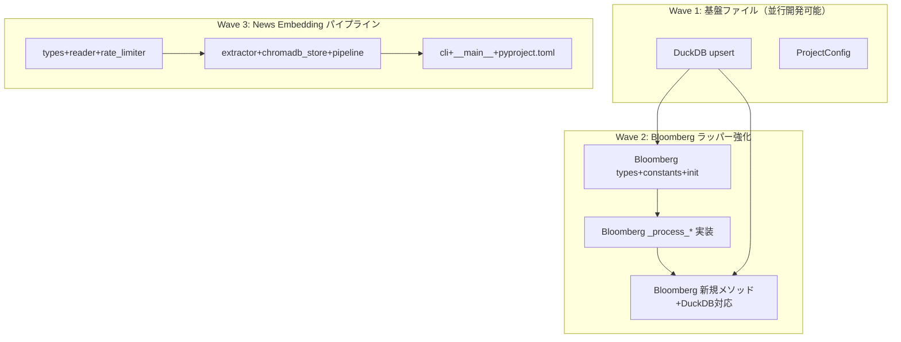

# Quants → Finance 4コンポーネント移植

**作成日**: 2026-02-23
**ステータス**: 完了
**タイプ**: package
**GitHub Project**: [#55](https://github.com/users/YH-05/projects/55)

## 背景と目的

### 背景

Quants プロジェクトには Finance に欠けている実装が複数存在する。DuckDB upsert ロジック、ProjectConfig パターン、Bloomberg ラッパーの実レスポンス処理、News Embedding パイプラインの4コンポーネントを Finance に移植し、コードベースを統合する。

### 目的

- DuckDBClient に DataFrame 保存機能（replace/append/upsert 3モード）を追加
- frozen dataclass による一括環境変数バリデーション（ProjectConfig）を追加
- Bloomberg fetcher のプレースホルダメソッドを実際の BLPAPI レスポンス処理で置換
- ニュース記事をベクトルDB（ChromaDB）に格納するパイプラインを新規構築

### 成功基準

- [x] 全4コンポーネントの移植が完了し、`make check-all` が成功すること
- [x] 既存テスト（database, market, utils_core）が全て PASS すること
- [x] 既存の DuckDBClient / BloombergFetcher の公開 API に破壊的変更がないこと

## リサーチ結果

### 既存パターン

- structlog ベースの構造化ロギング（全パッケージ共通）
- `__all__` による明示的エクスポート
- 日本語テスト名（`test_正常系_*`, `test_異常系_*`）
- optional dependency ガード（try/except ImportError）
- Python 3.12 型構文（PEP 695）

### 参考実装

| ファイル | 参考にすべき点 |
|---------|---------------|
| `src/database/db/duckdb_client.py` | DuckDB 接続管理パターン（with文）|
| `src/utils_core/settings.py` | `_find_env_file()`, `load_project_env()` の再利用 |
| `src/market/bloomberg/fetcher.py` | 既存の _process_* プレースホルダ構造、例外送出パターン |
| `src/market/errors.py` | Bloomberg 例外階層（ErrorCode enum + サブクラス）|
| `/Users/yukihata/Desktop/Quants/src/database/duckdb_utils.py` | store_to_db() の replace/append/upsert ロジック |
| `/Users/yukihata/Desktop/Quants/src/bloomberg/data_blpapi.py` | BLPAPI レスポンス解析ロジック（1777行）|
| `/Users/yukihata/Desktop/Quants/src/news_embedding/` | パイプライン全体構造 |

### 技術的考慮事項

- store_to_database() を DuckDB に統一（ユーザー決定）
- update_historical_data() は DataFrame 返却のみ、DB 保存は呼び出し元に委譲（ユーザー決定）
- analyze_earnings_bfw() は今回のスコープ外（別 Issue で後日対応）
- chromadb は optional dependency として隔離（>=0.5.0）
- Quants の news_scraper 依存を解消し、RateLimiter を自己完結型で実装

## 実装計画

### アーキテクチャ概要

4コンポーネントを既存の Finance パッケージ構造（database, utils_core, market, 新規 embedding）に配置。structlog / NumPy Docstring / PEP 695 型構文 / 日本語テスト名の既存パターンに統一。

### ファイルマップ

| 操作 | ファイルパス | 説明 |
|------|------------|------|
| 変更 | `src/database/db/duckdb_client.py` | store_df(), get_table_names(), _validate_identifier() 追加 |
| 新規作成 | `src/utils_core/config.py` | ProjectConfig frozen dataclass |
| 変更 | `src/utils_core/__init__.py` | ProjectConfig エクスポート追加 |
| 変更 | `src/market/bloomberg/fetcher.py` | 6つの _process_* 実装 + 新規4メソッド + DuckDB対応 |
| 変更 | `src/market/bloomberg/types.py` | ChunkConfig, EarningsInfo, IdentifierConversionResult 追加 |
| 変更 | `src/market/bloomberg/constants.py` | DEFAULT_CHUNK_SIZE 等定数追加 |
| 変更 | `src/market/bloomberg/__init__.py` | 新規型エクスポート追加 |
| 新規作成 | `src/embedding/` (8ファイル) | News Embedding パイプライン全体 |
| 変更 | `pyproject.toml` | norecursedirs 削除、embedding パッケージ追加、chromadb optional dep |

### リスク評価

| リスク | 影響度 | 対策 |
|--------|--------|------|
| store_to_database() SQLite→DuckDB 破壊的変更 | 中 | 呼び出し箇所を grep で確認 |
| BLPAPI mock Element factory の複雑さ | 高 | conftest.py に集約、Quants から忠実に移植 |
| norecursedirs 削除で CI 失敗 | 中 | 全テストが @patch でモック化済み確認済み |
| chromadb API 互換性 | 中 | optional dep + モックテスト |

## タスク一覧

### Wave 1（並行開発可能）

- [x] DuckDB upsert ロジックの移植（store_df / get_table_names）
  - Issue: [#3631](https://github.com/YH-05/finance/issues/3631)
  - ステータス: done
  - 見積もり: 1.5h

- [x] ProjectConfig frozen dataclass の作成
  - Issue: [#3632](https://github.com/YH-05/finance/issues/3632)
  - ステータス: done
  - 見積もり: 1h

### Wave 2（Wave 1 完了後）

- [x] Bloomberg 型定義・定数・エクスポートの追加
  - Issue: [#3633](https://github.com/YH-05/finance/issues/3633)
  - ステータス: done
  - 依存: Wave 1
  - 見積もり: 0.5h

- [x] Bloomberg _process_* プレースホルダ実装とテスト
  - Issue: [#3634](https://github.com/YH-05/finance/issues/3634)
  - ステータス: done
  - 依存: task-3
  - 見積もり: 2h

- [x] Bloomberg 新規メソッド追加・store_to_database DuckDB対応・norecursedirs 削除
  - Issue: [#3635](https://github.com/YH-05/finance/issues/3635)
  - ステータス: done
  - 依存: task-4
  - 見積もり: 2h

### Wave 3（独立、Wave 1/2 と並行可能）

- [x] News Embedding 型定義・リーダー・レートリミッターの作成
  - Issue: [#3636](https://github.com/YH-05/finance/issues/3636)
  - ステータス: done
  - 見積もり: 1h

- [x] News Embedding エクストラクター・ChromaDB ストア・パイプラインの作成
  - Issue: [#3637](https://github.com/YH-05/finance/issues/3637)
  - ステータス: done
  - 依存: task-6
  - 見積もり: 1.5h

- [x] News Embedding CLI・エントリポイント・pyproject.toml 統合
  - Issue: [#3638](https://github.com/YH-05/finance/issues/3638)
  - ステータス: done
  - 依存: task-7
  - 見積もり: 1h

## 依存関係図

---

**最終更新**: 2026-03-02
