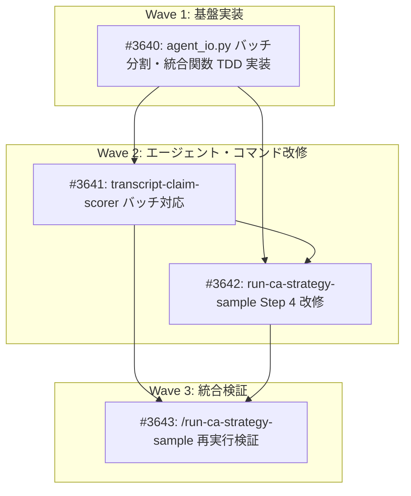

# Phase 2 スコアリング バッチ分割実装

**作成日**: 2026-02-23
**ステータス**: 計画中
**タイプ**: package (from_plan_file)
**GitHub Project**: [#56](https://github.com/users/YH-05/projects/56)

## 背景と目的

### 背景

`transcript-claim-scorer` エージェントが15件のScoredClaimを1回のWrite操作で書き出そうとしたところ、出力トークン上限（32,000トークン）を超えてエラーになった。その後エージェントが自己リカバリーしたが、根本原因（1エージェント呼び出しが全件分の詳細JSONを一度に生成）は解消されていない。

### 目的

バッチ分割（batch_size=5）により、1エージェント呼び出しあたりの出力トークンを32K以内に収め、安定したスコアリング処理を実現する。

### 成功基準

- [ ] `/run-ca-strategy-sample` 再実行で全15件が正常にスコアリングされること
- [ ] 各バッチの出力が32Kトークン以内であること
- [ ] `make check-all` が成功すること

## リサーチ結果

### 既存パターン

- `prepare_*` 関数: `workspace_dir / kb_base_dir / ticker` を受け取り、JSON を書き出して `dict[str, Any]` を返す
- JSON 書き出し: `json.dumps(payload, ensure_ascii=False, indent=2)` + `write_text(encoding='utf-8')`
- テスト命名: `test_正常系_*`, `test_異常系_*`, `test_エッジケース_*`

### 参考実装

| ファイル | 説明 |
|---------|------|
| `src/dev/ca_strategy/agent_io.py` L217-283 | `prepare_scoring_input()` のシグネチャ・JSON書き出しパターン |
| `src/dev/ca_strategy/agent_io.py` L286-360 | `validate_scoring_output()` のJSONパースパターン |
| `tests/dev/ca_strategy/unit/test_agent_io.py` L46-190 | `_make_*` ヘルパーと fixture パターン |

### 技術的考慮事項

- トークン推定: 全15件で約25,000-35,000トークン → batch_size=5 で約8,000-12,000トークン/バッチ（32K に対して60%以上のマージン）
- バッチ入力は `workspace_dir/batch_inputs/` サブディレクトリに配置
- バッチソートは正規表現でバッチ番号を抽出（堅牢な方式）

## 実装計画

### アーキテクチャ概要

`extraction_output.json`（15件）→ `prepare_scoring_batches()`（5件ずつ分割）→ `batch_inputs/scoring_input_batch_{1,2,3}.json` → `transcript-claim-scorer` x3（並列）→ `phase2_output/{ticker}/scored_batch_{1,2,3}.json` → `consolidate_scored_claims()`（正規表現ソート→統合）→ `scoring_output.json`（全15件）

### ファイルマップ

| 操作 | ファイルパス | 説明 |
|------|------------|------|
| 変更 | `src/dev/ca_strategy/agent_io.py` | `prepare_scoring_batches()` + `consolidate_scored_claims()` 追加（+110行） |
| 変更 | `tests/dev/ca_strategy/unit/test_agent_io.py` | テスト2クラス追加（+180行） |
| 変更 | `.claude/agents/ca-strategy/transcript-claim-scorer.md` | バッチ対応4フィールド + 条件分岐追加（+30行） |
| 変更 | `.claude/commands/run-ca-strategy-sample.md` | Step 4 をバッチ対応に改修（+80行） |

### リスク評価

| リスク | 影響度 | 対策 |
|--------|--------|------|
| 後方互換性（全フィールドオプショナル） | 低 | target_claim_ids 未指定時は既存動作を維持 |
| 正規表現パターンの脆さ | 低 | モジュール定数化+テスト |
| Phase 1出力フォーマット依存 | 低 | エラーハンドリングテスト |
| 統合テスト欠如 | 中 | 手動実行（/run-ca-strategy-sample）で検証 |

## タスク一覧

### Wave 1（基盤実装）

- [ ] agent_io.py にバッチ分割・統合関数を TDD で実装
  - Issue: [#3640](https://github.com/YH-05/finance/issues/3640)
  - ステータス: todo
  - 見積もり: 1.5h

### Wave 2（エージェント・コマンド改修）

- [ ] transcript-claim-scorer エージェント定義にバッチ対応フィールドを追加
  - Issue: [#3641](https://github.com/YH-05/finance/issues/3641)
  - ステータス: todo
  - 依存: #3640
  - 見積もり: 0.5h

- [ ] run-ca-strategy-sample コマンドの Step 4 をバッチ対応に改修
  - Issue: [#3642](https://github.com/YH-05/finance/issues/3642)
  - ステータス: todo
  - 依存: #3640, #3641
  - 見積もり: 0.5h

### Wave 3（統合検証）

- [ ] /run-ca-strategy-sample を再実行して全15件スコアリング成功を確認
  - Issue: [#3643](https://github.com/YH-05/finance/issues/3643)
  - ステータス: todo
  - 依存: #3641, #3642
  - 見積もり: 0.5h

## 依存関係図

---

**最終更新**: 2026-02-23
