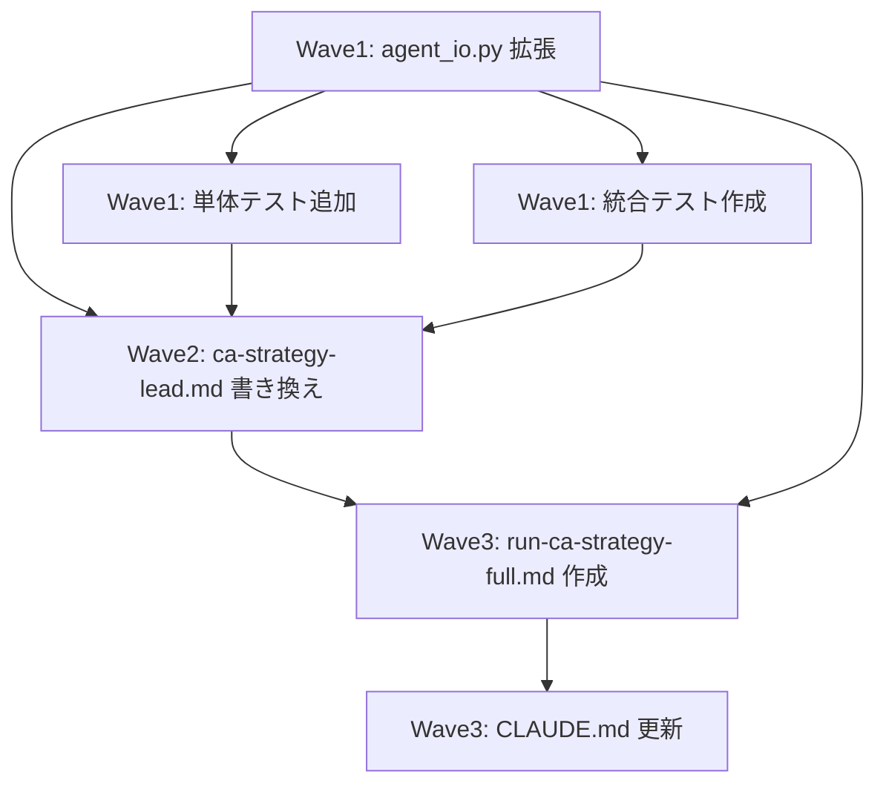

# ca-strategy チャンク並列エージェント方式

**作成日**: 2026-02-24
**ステータス**: 計画中
**タイプ**: workflow
**GitHub Project**: [#59](https://github.com/users/YH-05/projects/59)

## 背景と目的

### 背景

現行の `ca-strategy-lead` は全銘柄（395銘柄）を1つの Agent Teams セッションで処理しており、Phase 1-2（主張抽出・スコアリング）のスループットに制約がある。また LLM 呼び出しを Python SDK（ClaimExtractor/ClaimScorer）経由で行っているが、`/run-ca-strategy-sample` と同じエージェント方式（`transcript-claim-extractor` / `transcript-claim-scorer`）に統一する必要がある。

### 目的

1. LLM 呼び出しを Python SDK から `transcript-claim-extractor` / `transcript-claim-scorer` エージェント方式に変更する
2. `universe.json` を 10 銘柄チャンクに分割し、独立した `ca-strategy-lead` を並列起動することで Phase 1-2 を水平スケールさせる
3. 並列実行中の Claude Code subscription レートリミットに対するエラーハンドリングを強化し、部分失敗を許容しながら処理を継続・再開できるようにする

### 成功基準

- [ ] `agent_io.py` の新関数・拡張関数が既存テスト 50 件以上を維持したまま追加される（後方互換）
- [ ] `build_phase2_checkpoint()` が `{ticker: [ScoredClaim.model_dump()]}` 形式で出力し、`Orchestrator.run_from_checkpoint(3)` が正常完了する
- [ ] `ca-strategy-lead`（チャンク版）が 10 銘柄チャンクを処理し、個別銘柄の失敗を `progress.json` の `failed` リストに記録しながら処理継続できる
- [ ] `/run-ca-strategy-full` コマンドが 3 チャンク並列（デフォルト）でレートリミットエラーを指数バックオフリトライで処理し、失敗チャンクを `failed_chunks` に記録して残りを継続できる
- [ ] 統合テスト（3 銘柄 × 2 チャンク、1 銘柄欠損）で `skip_missing=True` の部分成功動作が自動検証される

## リサーチ結果

### 既存パターン

| パターン | 説明 |
|---------|------|
| agent_io.py パラメータ後方互換拡張 | `param: Type \| None = None` でデフォルト値を維持し既存テスト全通過を確認してから新テスト追加する TDD 順序 |
| コマンドからの Python 関数呼び出し | `uv run python -c '...'` + Bash パターン（`run-ca-strategy-sample.md` で確立済み） |
| extractor/scorer スポット Task 呼び出し | 入力 JSON パス・workspace_dir・出力先パス・MUST 事項を明示するテンプレート |
| Orchestrator.run_from_checkpoint(phase=3) | `{ticker: [ScoredClaim.model_dump()]}` 形式の `phase2_scored.json` が必須 |
| test_agent_io.py の TDD テストクラス命名 | `test_正常系_/test_異常系_/test_エッジケース_` + `_write_scored_batch()` ヘルパーパターン |

### 参考実装

| ファイル | 説明 |
|---------|------|
| `.claude/commands/run-ca-strategy-sample.md` | 1 銘柄 6 ステップパイプライン制御パターン（チャンク版の参考実装） |
| `src/dev/ca_strategy/agent_io.py` | 既存 I/O ヘルパー関数群（拡張対象） |
| `src/dev/ca_strategy/orchestrator.py` | `run_from_checkpoint(phase=3)` の引数・動作 |
| `tests/dev/ca_strategy/unit/test_agent_io.py` | TDD テストクラス構造（50 件以上、ヘルパーパターン） |

### 技術的考慮事項

- `transcript-claim-extractor` の入力は `{workspace_dir}/extraction_input.json`（固定パス）→ `prepare_extraction_input()` の `output_dir` パラメータ追加で対応
- `consolidate_scored_claims()` の戻り値型（Path）を維持したまま `output_path` パラメータを追加（後方互換）
- `build_phase2_checkpoint()` は `consolidate_scored_claims()` の出力（`scored_claims` リスト）から `ScoredClaim` を復元し `model_dump()` して書き出す
- `ca-strategy-lead` の `universe_path`/`chunk_workspace_dir` は既存の `workspace_dir` と役割が異なる（命名衝突に注意）
- Task の失敗検知は「出力ファイルが存在しない」または「出力に ERROR/FAILED キーワードを含む」のファイル存在確認ベースで実装（Task 戻り値形式に依存しない堅牢な設計）

## 実装計画

### アーキテクチャ概要

```
universe.json
    → prepare_universe_chunks() → chunk_{n:02d}.json（10 銘柄 × 40 チャンク）
    → ca-strategy-lead（チャンク版）× N 並列（デフォルト 3）
        ├── transcript-loader × 10（Task スポット呼び出し）
        ├── transcript-claim-extractor × 10（Task 並列）
        ├── transcript-claim-scorer × N バッチ（Task 並列）
        ├── consolidate_scored_claims × 10 → phase2_output/{TICKER}/scoring_output.json
        └── checkpoints/progress.json（failed リスト含む）
    → build_phase2_checkpoint(skip_missing=True)
        → checkpoints/phase2_scored.json（{ticker: [ScoredClaim]}形式、missing_tickers 付き）
    → Orchestrator.run_from_checkpoint(phase=3)
        → output/portfolio_weights.json/csv
```

**エラーハンドリング設計**:
- **銘柄レベル（ca-strategy-lead 内）**: 個別 Task 失敗を `failed` リストに記録して他銘柄の処理継続
- **チャンクレベル（run-ca-strategy-full 内）**: 失敗チャンクを指数バックオフリトライ（30→60→120 秒、最大 3 回）後に `failed_chunks` として記録
- **集約レベル（build_phase2_checkpoint）**: `skip_missing=True` で欠損銘柄をスキップして部分成功対応

### ファイルマップ

| Wave | 操作 | ファイルパス | 説明 |
|------|------|------------|------|
| 1 | 変更 | `src/dev/ca_strategy/agent_io.py` | 4 関数拡張（+約 100 行）：`consolidate_scored_claims` に `output_path` 追加、`prepare_extraction_input` に `output_dir` 追加、`prepare_universe_chunks` 新規追加、`build_phase2_checkpoint(skip_missing=True)` 新規追加 |
| 1 | 変更 | `tests/dev/ca_strategy/unit/test_agent_io.py` | 3 テストクラス追加（+約 170 行）：`TestBuildPhase2Checkpoint`（4 ケース）、`TestPrepareUniverseChunks`（3 ケース）、`TestConsolidateScoredClaimsOutputPath`（2 ケース） |
| 1 | 新規作成 | `tests/dev/ca_strategy/integration/test_agent_io_batch.py` | 3 銘柄 × 2 チャンク統合テスト（約 140 行）、1 銘柄欠損で `skip_missing=True` を検証 |
| 2 | 変更 | `.claude/agents/ca-strategy/ca-strategy-lead.md` | 全面書き換え（1230 行 → 約 520 行）：0 チームメイト化、チャンク版処理フロー、銘柄レベルエラーハンドリング |
| 3 | 新規作成 | `.claude/commands/run-ca-strategy-full.md` | マスターオーケストレーターコマンド（約 420 行）：3 チャンク並列デフォルト、指数バックオフリトライ、HF0/HF1/HF2 |
| 3 | 変更 | `CLAUDE.md` | コマンド一覧に `/run-ca-strategy-full` を追加（+1 行） |

### リスク評価

| リスク | 影響度 | 対策 |
|--------|--------|------|
| `build_phase2_checkpoint` の形式不一致 | medium | 統合テストで Orchestrator 互換形式を自動検証。`missing_tickers` は ticker データと別キーで格納 |
| Task 失敗検知の信頼性 | medium | 出力ファイル存在確認ベースの検知で Task 戻り値形式に依存しない堅牢な実装 |
| ca-strategy-lead 書き換え時の見落とし | medium | Wave 1 完全完了後に Wave 2 着手。新旧処理フロー比較表を先に整理 |
| ネストした並列 Task によるレート制限 | medium | `--max-parallel` デフォルト 3、指数バックオフリトライ（最大 3 回） |
| 後方互換破壊 | low | パラメータ `None` デフォルトで維持。TDD で既存テスト全通過を確認してから新テスト追加 |

## タスク一覧

### Wave 1（並行開発可能）

- [ ] [Wave1] agent_io.py 拡張（4 関数：`consolidate_scored_claims` + `prepare_extraction_input` パラメータ追加、`prepare_universe_chunks` + `build_phase2_checkpoint(skip_missing=True)` 新規追加）
  - Issue: [#3650](https://github.com/YH-05/quants/issues/3650)
  - ステータス: todo
  - 見積もり: 1.5 時間

- [ ] [Wave1] test_agent_io.py 単体テスト追加（`TestBuildPhase2Checkpoint` 4 ケース + `TestPrepareUniverseChunks` 3 ケース + `TestConsolidateScoredClaimsOutputPath` 2 ケース）
  - Issue: [#3651](https://github.com/YH-05/quants/issues/3651)
  - ステータス: todo
  - 依存: agent_io.py 拡張
  - 見積もり: 1.5 時間

- [ ] [Wave1] test_agent_io_batch.py 統合テスト作成（3 銘柄 × 2 チャンク、1 銘柄欠損で `skip_missing=True` 検証）
  - Issue: [#3652](https://github.com/YH-05/quants/issues/3652)
  - ステータス: todo
  - 依存: agent_io.py 拡張
  - 見積もり: 1 時間

### Wave 2（Wave 1 完了後）

- [ ] [Wave2] ca-strategy-lead.md 全面書き換え（0 チームメイド化、チャンク版処理フロー 10 銘柄ループ、銘柄レベルエラーハンドリング `failed` リスト記録、`resume_from=2` ロジック）
  - Issue: [#3653](https://github.com/YH-05/quants/issues/3653)
  - ステータス: todo
  - 依存: Wave 1 全タスク
  - 見積もり: 2.5 時間

### Wave 3（Wave 2 完了後）

- [ ] [Wave3] run-ca-strategy-full.md コマンド新規作成（8 ステップ構成：ユニバース分割 → HF0 → 3 並列チャンク起動 → 完了待ち + リトライ → build_phase2_checkpoint → HF1 失敗サマリー → Phase 3-5 → HF2）
  - Issue: [#3654](https://github.com/YH-05/quants/issues/3654)
  - ステータス: todo
  - 依存: Wave 1 + Wave 2
  - 見積もり: 1.5 時間

- [ ] [Wave3] CLAUDE.md 更新（コマンド一覧に `/run-ca-strategy-full` を追加）
  - Issue: [#3655](https://github.com/YH-05/quants/issues/3655)
  - ステータス: todo
  - 依存: run-ca-strategy-full.md 作成
  - 見積もり: 0.5 時間

## 依存関係図



---

**最終更新**: 2026-02-24（GitHub Project #59・Issue #3650-#3655 登録済み）
