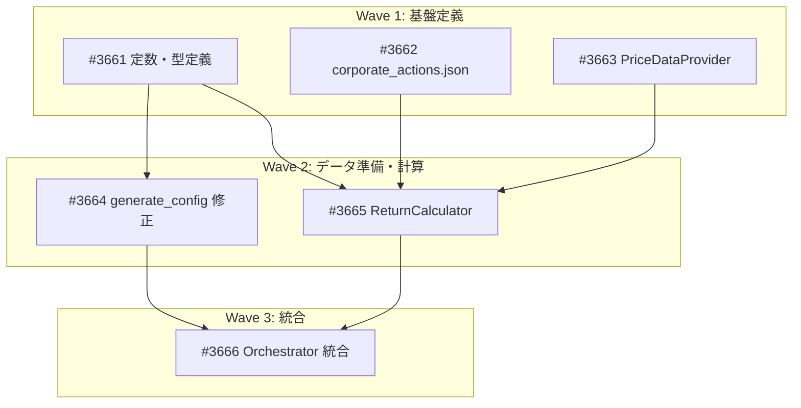

# Project 60: CA Strategy Phase 6 — パフォーマンス評価

> GitHub Project: [#61 CA Strategy Phase 6: パフォーマンス評価](https://github.com/users/YH-05/projects/61)
> 作成日: 2026-02-24

## 概要

CA Strategy の Phase 6（StrategyEvaluator）を完全動作させる。現在は空の pd.Series を渡しており全メトリクスが NaN だが、PriceDataProvider 抽象層と PortfolioReturnCalculator を実装し、実際のリターンデータで Sharpe ratio, Max Drawdown, Beta, Information Ratio, Cumulative Return を計算可能にする。

## 設計方針

| 項目 | 決定内容 |
|------|---------|
| 評価期間 | 2015-12-31 〜 2026-02-28（約10.4年） |
| ベンチマーク | ユニバース全395銘柄の等ウェイトポートフォリオ |
| 消失企業処理 | 上場廃止日にウェイト0%→残存比例再配分 |
| リバランス | イベント駆動のみ（上場廃止時のみ） |
| リターン | プライスリターン（配当除く） |
| データソース | 抽象層のみ実装（PriceDataProvider Protocol） |
| アナリスト相関 | analyst_scores={} のまま（PoC 対象外） |

## Issue 一覧

| # | タイトル | Wave | サイズ | 依存先 |
|---|---------|------|--------|--------|
| #3661 | 定数・型定義の拡張 | 1 | S | — |
| #3662 | corporate_actions.json 作成 | 1 | S | — |
| #3663 | PriceDataProvider Protocol 定義 | 1 | S | — |
| #3664 | generate_config.py 修正 + universe.json 再生成 | 2 | M | #3661 |
| #3665 | PortfolioReturnCalculator 実装 | 2 | L | #3661, #3662, #3663 |
| #3666 | Orchestrator Phase 6 統合 | 3 | M | #3664, #3665 |

## 依存関係

## ファイルマップ

### 新規作成

| ファイル | Issue | 説明 |
|---------|-------|------|
| `src/dev/ca_strategy/price_provider.py` | #3663 | PriceDataProvider Protocol |
| `src/dev/ca_strategy/return_calculator.py` | #3665 | PortfolioReturnCalculator |
| `research/ca_strategy_poc/config/corporate_actions.json` | #3662 | 消失8企業データ |

### 修正

| ファイル | Issue | 変更内容 |
|---------|-------|---------|
| `src/dev/ca_strategy/pit.py` | #3661 | PORTFOLIO_DATE, EVALUATION_END_DATE 追加 |
| `src/dev/ca_strategy/types.py` | #3661 | UniverseTicker.bloomberg_ticker 追加 |
| `src/dev/ca_strategy/generate_config.py` | #3664 | bloomberg_ticker 出力追加 |
| `src/dev/ca_strategy/orchestrator.py` | #3666 | Phase 6 統合 |
| `research/ca_strategy_poc/config/universe.json` | #3664 | 再生成 |

## 設計ドキュメント

- [original-plan.md](./original-plan.md) — 設計課題整理ドキュメント（元ファイル: `docs/plan/2026-02-24_ca-strategy-phase6-design.md`）
