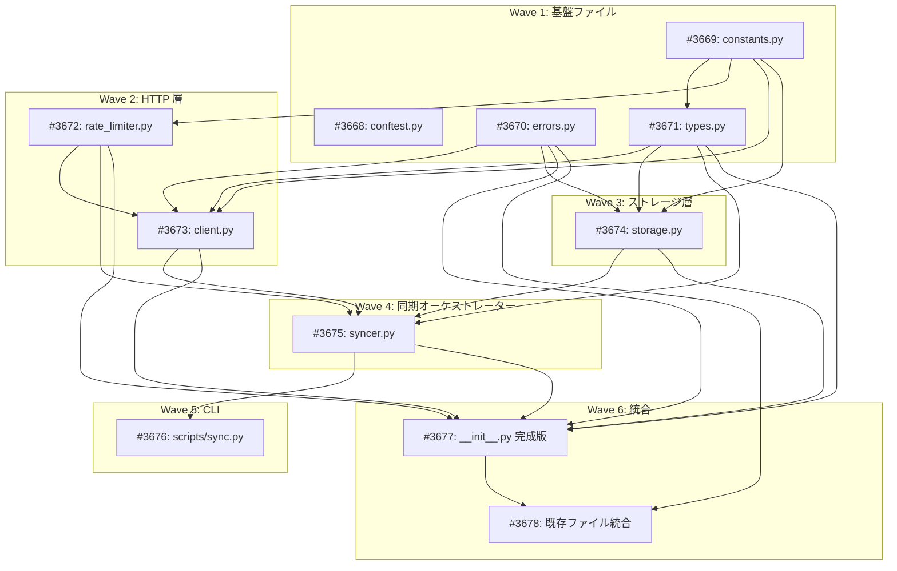

# EDINET DB ライブラリ

**作成日**: 2026-02-25
**ステータス**: 計画中
**タイプ**: package
**GitHub Project**: [#62](https://github.com/users/YH-05/projects/62)

## 背景と目的

### 背景

金融庁 EDINET の有価証券報告書データを構造化・提供する EDINET DB（edinetdb.jp）の REST API を活用し、全上場企業約 3,848 社の財務データをローカル DuckDB に保存するライブラリを `src/market/edinet/` に実装する。

既存の market パッケージ（NASDAQ、ETFCom、FRED 等）のパターンを踏襲し、一貫した設計で統合する。

### 目的

日本の全上場企業の財務データ（24指標×最大6年分）、財務比率、AI分析、有報テキストを手元に持ち、分析に即座にアクセスできる環境を構築する。

### 成功基準

- [ ] 全10 API エンドポイントに対応した EdinetClient が動作すること
- [ ] 8テーブルの DuckDB ストレージが upsert で動作すること
- [ ] 6フェーズ初回同期がレジューム可能で動作すること
- [ ] CLI から同期の開始・再開・状況確認ができること
- [ ] `make check-all` が全パスすること

## リサーチ結果

### 既存パターン

- **サブパッケージ標準構造**: `__init__.py` + `constants.py` + `errors.py` + `types.py` + `client.py`（参照: `src/market/nasdaq/`）
- **DuckDB upsert**: `store_df(df, table, if_exists='upsert', key_columns=[...])`（参照: `src/database/db/duckdb_client.py`）
- **例外階層**: Exception 直接継承 + message + コンテキスト属性（参照: `src/market/nasdaq/errors.py`）
- **CLI スクリプト**: argparse + parse_args()/run_sync() 分離（参照: `src/market/fred/scripts/sync_historical.py`）

### 参考実装

| ファイル | 参考にすべき点 |
|---------|--------------|
| `src/market/nasdaq/constants.py` | typing.Final 定数パターン |
| `src/market/nasdaq/errors.py` | Exception 直接継承の例外階層 |
| `src/market/nasdaq/types.py` | @dataclass(frozen=True) Config パターン |
| `src/database/db/duckdb_client.py` | store_df upsert 機能 |
| `src/database/db/connection.py` | get_db_path() DB パス解決 |
| `src/rss/core/http_client.py` | httpx リトライパターン |
| `src/market/fred/scripts/sync_historical.py` | CLI スクリプトパターン |

### 技術的考慮事項

- **API 制約**: Beta プラン 1,000回/日。初回フルデータ取得に約20日
- **依存**: httpx(>=0.28.1) と duckdb(>=1.0.0) は既に pyproject.toml に含まれる
- **設計変更**: DailyRateLimiter を client.py から rate_limiter.py に分離（テスタビリティ向上）

## 実装計画

### アーキテクチャ概要

```
CLI (scripts/sync.py)
  → EdinetSyncer (6フェーズ同期 + レジューム)
    → EdinetClient (httpx.Client + リトライ + DailyRateLimiter)
      → EDINET DB API
    → EdinetStorage (DuckDBClient.store_df upsert)
      → DuckDB ファイル
```

### ファイルマップ

| 操作 | ファイルパス | 説明 |
|------|------------|------|
| 新規作成 | `src/market/edinet/__init__.py` | 公開 API エクスポート |
| 新規作成 | `src/market/edinet/constants.py` | 定数定義（Final 型） |
| 新規作成 | `src/market/edinet/errors.py` | 例外階層（4サブクラス） |
| 新規作成 | `src/market/edinet/types.py` | データモデル（10型） |
| 新規作成 | `src/market/edinet/rate_limiter.py` | 日次レート制限管理 |
| 新規作成 | `src/market/edinet/client.py` | HTTP クライアント（10 API） |
| 新規作成 | `src/market/edinet/storage.py` | DuckDB ストレージ（8テーブル） |
| 新規作成 | `src/market/edinet/syncer.py` | 6フェーズ同期+レジューム |
| 新規作成 | `src/market/edinet/scripts/sync.py` | CLI ランナー |
| 変更 | `src/market/errors.py` | ErrorCode + re-export 追加 |
| 変更 | `src/market/types.py` | DataSource.EDINET_DB 追加 |
| 変更 | `src/market/__init__.py` | EDINET エクスポート追加 |

### リスク評価

| リスク | 影響度 | 対策 |
|--------|--------|------|
| syncer.py の複雑性（6フェーズ+レジューム） | 高 | SyncProgress で状態モデル化、100社チェックポイント |
| EDINET DB API Beta 制約（1,000回/日） | 中 | DailyRateLimiter 永続化、graceful 停止 |
| types.py と API レスポンスの差異 | 中 | 初期確認 + raw_data フォールバック |
| テストモック肥大化 | 中 | conftest.py でフィクスチャ共通化 |

## タスク一覧

### Wave 1（並行開発可能）

- [ ] テストパッケージ初期化と共通フィクスチャ
  - Issue: [#3668](https://github.com/YH-05/quants/issues/3668)
  - ステータス: todo
  - 見積もり: 1h

- [ ] 定数モジュール（constants.py）+ テスト
  - Issue: [#3669](https://github.com/YH-05/quants/issues/3669)
  - ステータス: todo
  - 見積もり: 1h

- [ ] 例外階層（errors.py）+ テスト
  - Issue: [#3670](https://github.com/YH-05/quants/issues/3670)
  - ステータス: todo
  - 見積もり: 1h

- [ ] データモデル（types.py）+ テスト
  - Issue: [#3671](https://github.com/YH-05/quants/issues/3671)
  - ステータス: todo
  - 依存: #3669
  - 見積もり: 2h

### Wave 2（Wave 1 完了後）

- [ ] 日次レート制限管理（rate_limiter.py）+ テスト
  - Issue: [#3672](https://github.com/YH-05/quants/issues/3672)
  - ステータス: todo
  - 依存: #3669
  - 見積もり: 1.5h

- [ ] HTTP クライアント（client.py）+ テスト
  - Issue: [#3673](https://github.com/YH-05/quants/issues/3673)
  - ステータス: todo
  - 依存: #3669, #3670, #3671, #3672
  - 見積もり: 2.5h

### Wave 3（Wave 1 完了後）

- [ ] DuckDB ストレージ層（storage.py）+ テスト
  - Issue: [#3674](https://github.com/YH-05/quants/issues/3674)
  - ステータス: todo
  - 依存: #3669, #3670, #3671
  - 見積もり: 2h

### Wave 4（Wave 2 + Wave 3 完了後）

- [ ] 同期オーケストレーター（syncer.py）+ テスト
  - Issue: [#3675](https://github.com/YH-05/quants/issues/3675)
  - ステータス: todo
  - 依存: #3669, #3671, #3672, #3673, #3674
  - 見積もり: 3h

### Wave 5（Wave 4 完了後）

- [ ] CLI ランナー（scripts/sync.py）+ テスト
  - Issue: [#3676](https://github.com/YH-05/quants/issues/3676)
  - ステータス: todo
  - 依存: #3669, #3671, #3675
  - 見積もり: 1.5h

### Wave 6（全コンポーネント完成後）

- [ ] __init__.py 完成版
  - Issue: [#3677](https://github.com/YH-05/quants/issues/3677)
  - ステータス: todo
  - 依存: #3670, #3671, #3672, #3673, #3674, #3675
  - 見積もり: 0.5h

- [ ] 既存ファイル統合（market/errors.py, types.py, __init__.py）
  - Issue: [#3678](https://github.com/YH-05/quants/issues/3678)
  - ステータス: todo
  - 依存: #3670, #3677
  - 見積もり: 1h

## 依存関係図



---

**最終更新**: 2026-02-25
