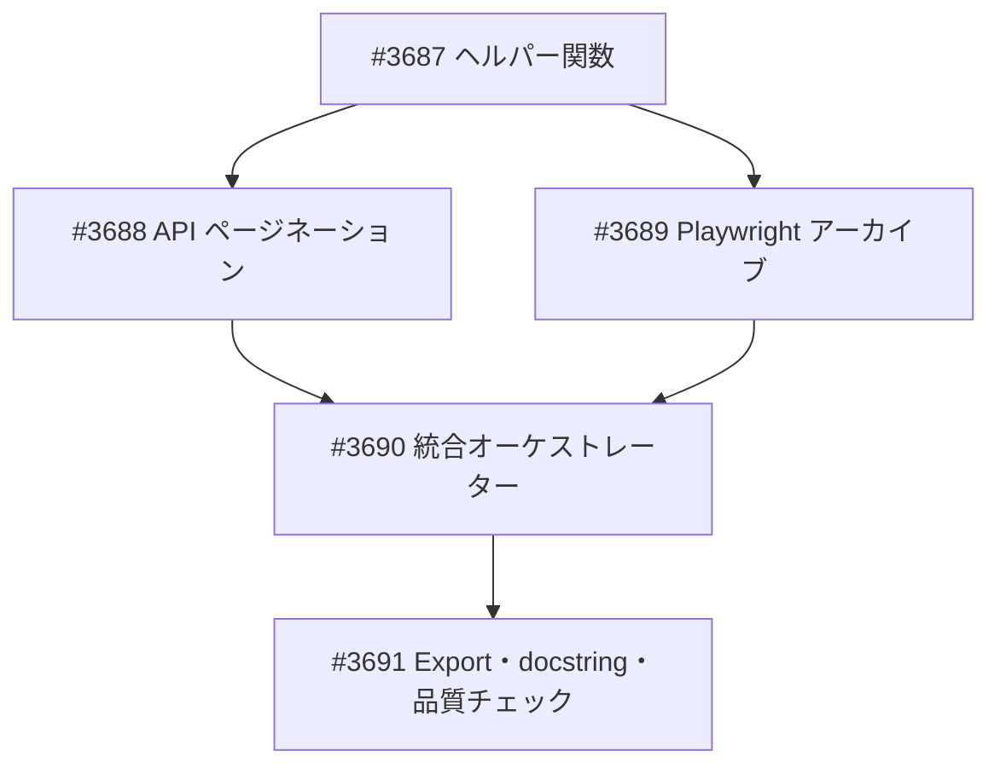

# NASDAQ 過去ニュース記事取得機能

**作成日**: 2026-03-01
**ステータス**: 計画中
**タイプ**: package (news_scraper 機能追加)
**GitHub Project**: [#63](https://github.com/users/YH-05/projects/63)

## 背景と目的

### 背景

現在 `news_scraper` パッケージでは CNBC のみ過去記事取得（`collect_historical_news` + Playwright サイトマップ）に対応している。NASDAQ は RSS（直近のみ）と API（`offset=0` 固定）のため過去記事を遡れない。

### 目的

NASDAQ API の `offset` パラメータを活用したページネーションと、Playwright によるニュースアーカイブページのスクレイピングの2戦略で過去記事取得を実現する。

### 成功基準

- [ ] API ページネーションでティッカー指定の過去記事が取得できる
- [ ] Playwright でカテゴリ指定の過去記事が取得できる
- [ ] CNBC と同じインターフェースの collect_historical_news が動作する
- [ ] make check-all が成功する

## リサーチ結果

### 既存パターン

- CNBC: `collect_historical_news` + Playwright サイトマップ（日単位）
- NASDAQ: `fetch_stock_news_api` (offset=0 固定)、`collect_nasdaq_news` (RSS + API)

### 参考実装

| ファイル | 説明 |
|---------|------|
| `src/news_scraper/cnbc.py:682` | `collect_historical_news` — Playwright ライフサイクル・ファイル保存パターン |
| `src/news_scraper/nasdaq.py:288` | `fetch_article_content` — 本文取得（trafilatura + BS4） |
| `src/news_scraper/async_core.py` | `RateLimiter`, `gather_with_errors` — async 並列制御 |
| `src/news_scraper/types.py` | `ScraperConfig`, `Article`, `get_delay`, `NASDAQ_CATEGORIES` |

### 技術的考慮事項

- NASDAQ ボット検知（403）→ 既存 `BotDetectionError` + Playwright User-Agent + config.delay
- API レートリミット（429）→ get_delay + ジッター + Retry-After ヘッダー
- "Load More" ボタンのセレクタ変更リスク → 複数フォールバックセレクタ
- Playwright 未インストール環境 → lazy import + use_playwright=False でスキップ

## 実装計画

### アーキテクチャ概要

| 戦略 | 方式 | 対象 |
|------|------|------|
| A. API ページネーション | offset を増やして API を順次呼び出し | ティッカー指定 |
| B. Playwright アーカイブ | ニュースアーカイブページをスクレイピング | カテゴリ指定 |

### ファイルマップ

| 操作 | ファイルパス | 説明 |
|------|------------|------|
| 変更 | `src/news_scraper/nasdaq.py` | 6関数 + 2ヘルパー追加 |
| 変更 | `src/news_scraper/__init__.py` | 4 export 追加 |
| 変更 | `src/news_scraper/types.py` | docstring 更新のみ |
| 変更 | `tests/news_scraper/unit/test_nasdaq.py` | ~20 テスト追加 |

### リスク評価

| リスク | 影響度 | 対策 |
|--------|--------|------|
| NASDAQ ボット検知（403） | 中 | 既存 BotDetectionError + Playwright UA + config.delay |
| "Load More" ボタンのセレクタ変更 | 中 | 複数フォールバックセレクタ + ログ警告 |
| API レートリミット（429） | 低 | get_delay + ジッター + Retry-After |
| totalrecords の不正確さ | 低 | 空 rows チェックも終了条件に含める |
| Playwright 未インストール | 低 | lazy import + use_playwright=False |

## タスク一覧

### Wave 1（依存なし）

- [ ] ヘルパー関数の実装
  - Issue: [#3687](https://github.com/YH-05/quants/issues/3687)
  - ステータス: todo

### Wave 2（Wave 1 完了後、Wave 3 と並列可能）

- [ ] API ページネーションの実装
  - Issue: [#3688](https://github.com/YH-05/quants/issues/3688)
  - ステータス: todo
  - 依存: #3687

### Wave 3（Wave 1 完了後、Wave 2 と並列可能）

- [ ] Playwright アーカイブの実装
  - Issue: [#3689](https://github.com/YH-05/quants/issues/3689)
  - ステータス: todo
  - 依存: #3687

### Wave 4（Wave 2, 3 完了後）

- [ ] 統合オーケストレーターの実装
  - Issue: [#3690](https://github.com/YH-05/quants/issues/3690)
  - ステータス: todo
  - 依存: #3688, #3689

### Wave 5（Wave 4 完了後）

- [ ] Export 追加・docstring 更新・品質チェック
  - Issue: [#3691](https://github.com/YH-05/quants/issues/3691)
  - ステータス: todo
  - 依存: #3690

## 依存関係図

---

**最終更新**: 2026-03-01
