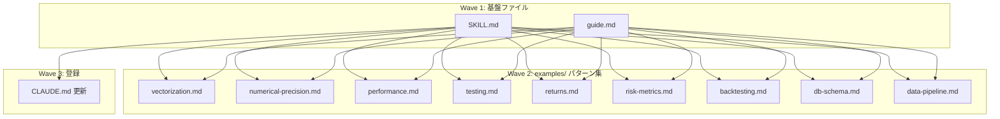

# quant-computing スキル拡張

**作成日**: 2026-03-02
**ステータス**: 計画中
**タイプ**: skill
**GitHub Project**: [#65](https://github.com/users/YH-05/projects/65)

## 背景と目的

### 背景

既存コードベースには数値計算・DB設計・データパイプラインに関する暗黙知が散在している（`strategy/risk/calculator.py`、`factor/core/normalizer.py`、`database/db/`、`market/yfinance/fetcher.py` 等）。元の計画（4領域: 数値精度・ベクトル化・高速化・テスト）に加え、ヒアリングと既存コード調査により5つの追加ギャップ（DBスキーマ設計・リターン計算標準化・リスクフリーレート・バックテスト・データパイプライン）が判明した。

### 目的

`quant-computing` スキルを9領域（数値精度・ベクトル化・高速化・テスト・リターン計算標準・リスク指標・バックテスト・DBスキーマ・データパイプライン）をカバーする包括的ナレッジベースとして新規作成する。

### 成功基準

- [ ] 11ファイル（SKILL.md + guide.md + examples/ 9ファイル）が全て作成されている
- [ ] CLAUDE.md のスキル一覧テーブルに quant-computing が登録されている
- [ ] 既存コードとの整合性が検証されている（行番号注釈が正確）

## リサーチ結果

### 既存パターン

- **スキル構造**: coding-standards スキルの構成（SKILL.md + guide.md + examples/）を踏襲
- **リターン計算**: 2つの実装が共存（`analyze/returns/` と `factor/core/`）。年率化に simple（BAD）と compound あり
- **リスク指標**: `_EPSILON = 1e-15` の一貫したゼロ除算防止パターン
- **DB**: SQLite（永続・マイグレーション管理）vs DuckDB（分析・upsert・Parquet連携）
- **数値精度**: `_MAD_SCALE_FACTOR = 1.4826`（normalizer.py line 24）
- **バックテスト**: ca_strategy の Buy-and-Hold ドリフト実装（lines 462-570）

### 参考実装

| ファイル | 参考にすべき点 |
|---------|--------------|
| `.claude/skills/coding-standards/SKILL.md` | SKILL.md の標準構造（392行） |
| `src/strategy/risk/calculator.py` | リスク指標の包括的実装 |
| `src/factor/core/normalizer.py` | MAD スケール、ロバスト Z-score |
| `src/factor/core/return_calculator.py` | リターン計算、CAGR |
| `src/database/db/migrations/runner.py` | マイグレーション管理パターン |
| `src/market/edinet/storage.py` | DuckDB upsert パターン |
| `src/dev/ca_strategy/return_calculator.py` | Buy-and-Hold ドリフト |

### 技術的考慮事項

- 既存コードの修正はスコープ外（ルール記載のみ）
- return_calculator.py line 177 の simple 年率化は BAD パターンとして記載（修正は別 Issue）
- FRED データ取得コードは market/fred/ を参照と記載のみ

## 実装計画

### アーキテクチャ概要

`.claude/skills/quant-computing/` 配下に coding-standards スキルと同一構成で9領域のナレッジベースを新規作成。`allowed-tools: Read` のみ（参照専用）。実装は `skill-creator` サブエージェントに委譲。

### ファイルマップ

| 操作 | ファイルパス | 説明 |
|------|------------|------|
| 新規作成 | `.claude/skills/quant-computing/SKILL.md` | スキルエントリポイント（250-300行） |
| 新規作成 | `.claude/skills/quant-computing/guide.md` | 詳細ガイド 11セクション（350-400行） |
| 新規作成 | `.claude/skills/quant-computing/examples/vectorization.md` | ベクトル化パターン（200-250行） |
| 新規作成 | `.claude/skills/quant-computing/examples/numerical-precision.md` | 数値精度パターン（200-250行） |
| 新規作成 | `.claude/skills/quant-computing/examples/performance.md` | パフォーマンス最適化（200-250行） |
| 新規作成 | `.claude/skills/quant-computing/examples/testing.md` | 数値計算テスト（200-250行） |
| 新規作成 | `.claude/skills/quant-computing/examples/returns.md` | リターン計算標準（200-250行） |
| 新規作成 | `.claude/skills/quant-computing/examples/risk-metrics.md` | リスク指標（200-250行） |
| 新規作成 | `.claude/skills/quant-computing/examples/backtesting.md` | バックテスト（250-300行） |
| 新規作成 | `.claude/skills/quant-computing/examples/db-schema.md` | DBスキーマ設計（250-300行） |
| 新規作成 | `.claude/skills/quant-computing/examples/data-pipeline.md` | データパイプライン（250-300行） |
| 変更 | `CLAUDE.md` | スキル一覧テーブルに1行追加 |

### リスク評価

| リスク | 影響度 | 対策 |
|--------|--------|------|
| 9ファイルの整合性確保 | 中 | skill-creator に research-findings.json の行番号注釈を入力として渡す |
| BADパターン記載 vs 未修正コード | 低 | スキル内で修正は別 Issue と明記 |
| 11ファイル新規作成の規模 | 中 | Wave 2 は並列作成可能な設計 |

## タスク一覧

### Wave 1（並行開発可能）

- [ ] SKILL.md の作成
  - Issue: [#3694](https://github.com/YH-05/quants/issues/3694)
  - ステータス: todo
  - 見積もり: 0.4h

- [ ] guide.md の作成
  - Issue: [#3695](https://github.com/YH-05/quants/issues/3695)
  - ステータス: todo
  - 見積もり: 0.4h

### Wave 2（Wave 1 完了後、9ファイル並列可能）

- [ ] examples/vectorization.md の作成
  - Issue: [#3696](https://github.com/YH-05/quants/issues/3696)
  - ステータス: todo
  - 依存: task-1, task-2
  - 見積もり: 0.2h

- [ ] examples/numerical-precision.md の作成
  - Issue: [#3697](https://github.com/YH-05/quants/issues/3697)
  - ステータス: todo
  - 依存: task-1, task-2
  - 見積もり: 0.2h

- [ ] examples/performance.md の作成
  - Issue: [#3698](https://github.com/YH-05/quants/issues/3698)
  - ステータス: todo
  - 依存: task-1, task-2
  - 見積もり: 0.2h

- [ ] examples/testing.md の作成
  - Issue: [#3699](https://github.com/YH-05/quants/issues/3699)
  - ステータス: todo
  - 依存: task-1, task-2
  - 見積もり: 0.2h

- [ ] examples/returns.md の作成
  - Issue: [#3700](https://github.com/YH-05/quants/issues/3700)
  - ステータス: todo
  - 依存: task-1, task-2
  - 見積もり: 0.2h

- [ ] examples/risk-metrics.md の作成
  - Issue: [#3701](https://github.com/YH-05/quants/issues/3701)
  - ステータス: todo
  - 依存: task-1, task-2
  - 見積もり: 0.2h

- [ ] examples/backtesting.md の作成
  - Issue: [#3702](https://github.com/YH-05/quants/issues/3702)
  - ステータス: todo
  - 依存: task-1, task-2
  - 見積もり: 0.3h

- [ ] examples/db-schema.md の作成
  - Issue: [#3703](https://github.com/YH-05/quants/issues/3703)
  - ステータス: todo
  - 依存: task-1, task-2
  - 見積もり: 0.3h

- [ ] examples/data-pipeline.md の作成
  - Issue: [#3704](https://github.com/YH-05/quants/issues/3704)
  - ステータス: todo
  - 依存: task-1, task-2
  - 見積もり: 0.3h

### Wave 3（全ファイル完成後）

- [ ] CLAUDE.md へのスキル登録
  - Issue: [#3705](https://github.com/YH-05/quants/issues/3705)
  - ステータス: todo
  - 依存: task-1
  - 見積もり: 0.1h

## 依存関係図

---

**最終更新**: 2026-03-02
