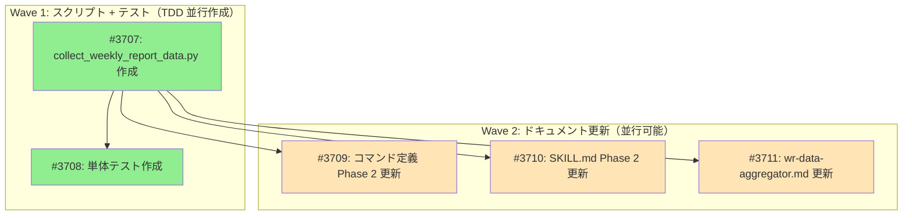

# generate-market-report スクリプト不整合修正

**作成日**: 2026-03-02
**ステータス**: 計画中
**タイプ**: general
**GitHub Project**: [#66](https://github.com/users/YH-05/projects/66)

## 背景と目的

### 背景

`/generate-market-report --weekly` の Phase 2（市場データ収集）で使用する Python スクリプトが、下流の `wr-data-aggregator` エージェントが期待するデータ形式と不整合を起こしている。具体的には以下の5つの問題がある:

1. **SKILL.md とコマンド定義の矛盾**: SKILL.md は `collect_market_performance.py` を参照、コマンドは `weekly_comment_data.py` を使用
2. **フィールド名の不一致**: スクリプトは `latest_close` を出力、wr-data-aggregator は `price` を期待
3. **フィールドの欠損**: `ytd_return`, `change`, `market_cap`, `weight`, `top_holdings` が未出力
4. **リターン値の単位不統一**: `PerformanceAnalyzer` はパーセント形式（2.5 = 2.5%）、wr-data-aggregator は小数形式（0.025）を期待
5. **金利・為替・イベントデータの未統合**: `interest_rates.json`, `currencies.json`, `upcoming_events.json` が Phase 2 で未生成

### 目的

既存スクリプトの責務を変えず、wr-data-aggregator の期待に完全適合する専用スクリプト `collect_weekly_report_data.py` を新規作成する。

### 成功基準

- [ ] `collect_weekly_report_data.py` が wr-data-aggregator 互換の JSON を正しく出力する
- [ ] 全 7 ファイル（indices/mag7/sectors/interest_rates/currencies/upcoming_events/metadata）が生成される
- [ ] `return_pct` がパーセント形式から小数形式に正しく変換される
- [ ] `make check-all` が成功する
- [ ] 単体テストが全パスする

## リサーチ結果

### 既存パターン

- **CLI 構造**: `create_parser()` + `main()` + `save_json()`（参照: `scripts/weekly_comment_data.py`）
- **4Agent アダプター**: `_convert_to_result()` で DataFrame → dataclass 変換（参照: `performance_agent.py`）
- **テストパターン**: `tests/scripts/` 直下フラット配置、`MagicMock` + 日本語テスト名（参照: `test_collect_currency_rates.py`）

### 参考実装

| ファイル | 説明 |
|---------|------|
| `scripts/weekly_comment_data.py` | CLI 構造・エラーハンドリングパターン |
| `scripts/collect_market_performance.py` | 4Agent 利用・金利/為替/イベント収集パターン |
| `src/analyze/reporting/performance.py:325-374` | `get_group_performance_with_prices()` の戻り値構造 |
| `src/analyze/reporting/performance_agent.py:93-187` | アダプターパターン（`_convert_to_result()`） |
| `src/analyze/config/loader.py:102-126` | `get_symbol_group()` による名前マッピング |
| `tests/scripts/test_collect_currency_rates.py` | テストのモックパターン |

### 技術的考慮事項

- `return_pct` は `* 100` 済みパーセント形式。`/100` 変換が必須。`round(value, 6)` で精度制御。
- `symbols.yaml` の `indices.us`（8銘柄）を使用。`weekly_comment_data.py` のハードコード（4銘柄）とは異なる。
- SOX は `indices.json` と `mag7.json` の両方に含める。
- `market_cap`/`weight`/`top_holdings` は yfinance `.info` から取得。レート制限リスクあり。
- テストファイルは `tests/scripts/` 直下にフラット配置（既存パターン準拠）。

## 実装計画

### アーキテクチャ概要

既存の `weekly_comment_data.py` と `collect_market_performance.py` を温存し、新規スクリプト `collect_weekly_report_data.py` を作成。`PerformanceAnalyzer.get_group_performance_with_prices()` を直接使用し、アダプター関数で wr-data-aggregator 互換形式に変換。

### ファイルマップ

| 操作 | ファイルパス | 説明 |
|------|------------|------|
| 新規作成 | `scripts/collect_weekly_report_data.py` | wr-data-aggregator 互換データ収集スクリプト（約350行） |
| 新規作成 | `tests/scripts/test_collect_weekly_report_data.py` | 単体テスト（約450行） |
| 変更 | `.claude/commands/generate-market-report.md` | Phase 2 スクリプト参照とスキーマ例更新 |
| 変更 | `.claude/skills/generate-market-report/SKILL.md` | Phase 2 記述とスクリプト一覧更新 |
| 変更 | `.claude/agents/wr-data-aggregator.md` | 入力ファイル一覧に3ファイル追加 |

### リスク評価

| リスク | 影響度 | 対策 |
|--------|--------|------|
| yfinance .info レート制限（18回呼び出し） | 中 | リトライ+フォールバック(null)+0.5秒スリープ |
| symbols.yaml と wr-data-aggregator の primary 期待不一致 | 中 | wr-data-aggregator のデフォルト値補完で対応 |
| return_pct 浮動小数点精度 | 低 | round(value, 6) + テスト検証 |

## タスク一覧

### Wave 1（TDD 並行作成可能）

- [ ] collect_weekly_report_data.py データ収集スクリプトの新規作成
  - Issue: [#3707](https://github.com/YH-05/finance/issues/3707)
  - ステータス: todo
  - 見積もり: 1.5h

- [ ] collect_weekly_report_data.py の単体テスト作成
  - Issue: [#3708](https://github.com/YH-05/finance/issues/3708)
  - ステータス: todo
  - 依存: #3707
  - 見積もり: 1.5h

### Wave 2（Wave 1 完了後、並行可能）

- [ ] generate-market-report コマンド定義の Phase 2 更新
  - Issue: [#3709](https://github.com/YH-05/finance/issues/3709)
  - ステータス: todo
  - 依存: #3707
  - 見積もり: 0.5h

- [ ] generate-market-report SKILL.md の Phase 2 記述更新
  - Issue: [#3710](https://github.com/YH-05/finance/issues/3710)
  - ステータス: todo
  - 依存: #3707
  - 見積もり: 0.5h

- [ ] wr-data-aggregator エージェント定義の入力ファイル一覧更新
  - Issue: [#3711](https://github.com/YH-05/finance/issues/3711)
  - ステータス: todo
  - 依存: #3707
  - 見積もり: 0.5h

## 依存関係図

---

**最終更新**: 2026-03-02
