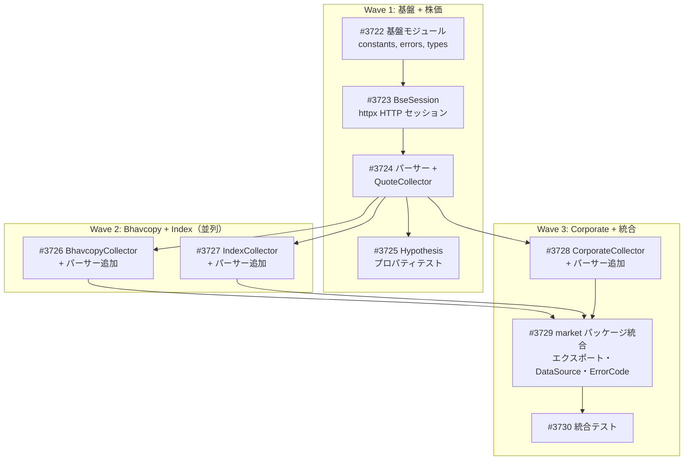

# BSE（ボンベイ証券取引所）データ取得モジュール

**作成日**: 2026-03-06
**ステータス**: 計画中
**タイプ**: package
**GitHub Project**: [#69](https://github.com/users/YH-05/projects/69)

## 背景と目的

### 背景

インド株式市場（BSE）のデータを `src/market/bse/` として追加する。BSE は公式の公開 REST API を提供していないが、`bseindia.com` のウェブサイト内部 API（JSON/CSV）が事実上のデータソースとして利用可能。NASDAQ / EDINET サブモジュールと同じ標準パターンに準拠して構築する。

### 目的

- ヒストリカル株価（OHLCV）、Bhavcopy（日次全銘柄集約データ）、企業情報・財務データ、インデックスデータ（SENSEX 等）を取得するモジュールを構築する
- 既存の market パッケージ標準パターン（DataCollector ABC、セッション DI、エラー階層）に完全準拠する

### 成功基準

- [ ] 全 4 コレクター（Quote, Bhavcopy, Index, Corporate）が動作すること
- [ ] `make check-all` が成功すること
- [ ] 単体テストカバレッジ 80% 以上
- [ ] Infosys（scrip_code=500209）でヒストリカルデータ取得が確認できること

## リサーチ結果

### 既存パターン

- **サブモジュール標準構成**: `__init__.py`, `constants.py`, `errors.py`, `types.py`, `session.py`, `parser.py`, `collector.py`
- **Exception 直接継承エラー階層**: NASDAQ/EDINET 共通パターン（4クラス構成）
- **frozen dataclass Config**: `@dataclass(frozen=True)` + `__post_init__` バリデーション
- **DataCollector ABC 準拠**: `fetch()` + `validate()` + `collect()` テンプレートメソッド
- **SQLiteCache 再利用**: `generate_cache_key()` + `get/set/delete`

### 参考実装

| ファイル | 説明 |
|---------|------|
| `src/market/nasdaq/session.py` | polite_delay, SSRF 防止, リトライ, UA ローテーション |
| `src/market/nasdaq/collector.py` | DataCollector ABC 準拠、セッション DI |
| `src/market/nasdaq/constants.py` | typing.Final 定数、ALLOWED_HOSTS |
| `src/market/nasdaq/errors.py` | Exception 直接継承 4 クラス階層 |
| `src/market/nasdaq/types.py` | frozen dataclass Config |
| `src/market/nasdaq/parser.py` | _create_cleaner ファクトリ |
| `src/market/edinet/client.py` | httpx ベースクライアント |
| `src/market/base_collector.py` | DataCollector ABC |

### 技術的考慮事項

- HTTP クライアント: **httpx**（EDINET パターン、TLS 偽装不要）
- レートリミッター: **polite_delay のみ**（NASDAQ パターン、1/RPS 秒の固定ディレイ）
- コレクター構成: **collectors/ サブディレクトリ**（4コレクター分離）
- BSE 内部 API はドキュメントなし、URL パターン・レスポンス構造が予告なく変更される可能性あり

## 実装計画

### アーキテクチャ概要

`src/market/bse/` に httpx ベースの BseSession を中核とし、4種のコレクター（Quote, Bhavcopy, Index, Corporate）を `collectors/` サブディレクトリに配置。DataCollector ABC 準拠（CorporateCollector を除く）。

### ファイルマップ

| 操作 | ファイルパス | 説明 |
|------|------------|------|
| 新規作成 | `src/market/bse/constants.py` | URL, ヘッダー, UA, カラムマップ |
| 新規作成 | `src/market/bse/errors.py` | エラー階層 5 クラス |
| 新規作成 | `src/market/bse/types.py` | Config, Enum, データクラス |
| 新規作成 | `src/market/bse/session.py` | httpx BseSession |
| 新規作成 | `src/market/bse/parsers.py` | エンドポイント別パーサー |
| 新規作成 | `src/market/bse/collectors/quote.py` | QuoteCollector (ABC) |
| 新規作成 | `src/market/bse/collectors/bhavcopy.py` | BhavcopyCollector (ABC) |
| 新規作成 | `src/market/bse/collectors/index.py` | IndexCollector (ABC) |
| 新規作成 | `src/market/bse/collectors/corporate.py` | CorporateCollector (非ABC) |
| 変更 | `src/market/errors.py` | BSE エラー再エクスポート + ErrorCode 追加 |
| 変更 | `src/market/types.py` | DataSource.BSE 追加 |
| 変更 | `src/market/__init__.py` | BSE 再エクスポート |

### リスク評価

| リスク | 影響度 | 対策 |
|--------|--------|------|
| BSE 内部 API 無ドキュメント | 高 | validate() で構造変更検出、OSS 参照 |
| httpx ボット検知ブロック | 中 | UA ローテーション、curl_cffi 切替可能設計 |
| parsers.py 肥大化 | 中 | 500 行超でサブパッケージ分割検討 |
| 統合テスト不安定 | 中 | integration マーカー分離、モック充実 |

## タスク一覧

### Wave 1（基盤 + 株価）

- [ ] [Wave1] BSE 基盤モジュールの作成（constants, errors, types）
  - Issue: [#3722](https://github.com/YH-05/finance/issues/3722)
  - ステータス: todo
  - 見積もり: 2h

- [ ] [Wave1] BseSession（httpx ベース HTTP セッション）の作成
  - Issue: [#3723](https://github.com/YH-05/finance/issues/3723)
  - ステータス: todo
  - 依存: #3722
  - 見積もり: 2h

- [ ] [Wave1] パーサー + QuoteCollector の作成
  - Issue: [#3724](https://github.com/YH-05/finance/issues/3724)
  - ステータス: todo
  - 依存: #3722, #3723
  - 見積もり: 2h

- [ ] [Wave1] パーサー Hypothesis プロパティテストの作成
  - Issue: [#3725](https://github.com/YH-05/finance/issues/3725)
  - ステータス: todo
  - 依存: #3724
  - 見積もり: 1h

### Wave 2（Bhavcopy + Index、並列実行可能）

- [ ] [Wave2] BhavcopyCollector + パーサー追加の作成
  - Issue: [#3726](https://github.com/YH-05/finance/issues/3726)
  - ステータス: todo
  - 依存: #3723, #3724
  - 見積もり: 2h

- [ ] [Wave2] IndexCollector + パーサー追加の作成
  - Issue: [#3727](https://github.com/YH-05/finance/issues/3727)
  - ステータス: todo
  - 依存: #3723, #3724
  - 見積もり: 1.5h

### Wave 3（Corporate + 統合）

- [ ] [Wave3] CorporateCollector + パーサー追加の作成
  - Issue: [#3728](https://github.com/YH-05/finance/issues/3728)
  - ステータス: todo
  - 依存: #3723, #3724
  - 見積もり: 2.5h

- [ ] [Wave3] market パッケージ統合
  - Issue: [#3729](https://github.com/YH-05/finance/issues/3729)
  - ステータス: todo
  - 依存: #3726, #3727, #3728
  - 見積もり: 1.5h

- [ ] [Wave3] BSE 統合テストの作成
  - Issue: [#3730](https://github.com/YH-05/finance/issues/3730)
  - ステータス: todo
  - 依存: #3729
  - 見積もり: 1.5h

## 依存関係図

---

**最終更新**: 2026-03-06
