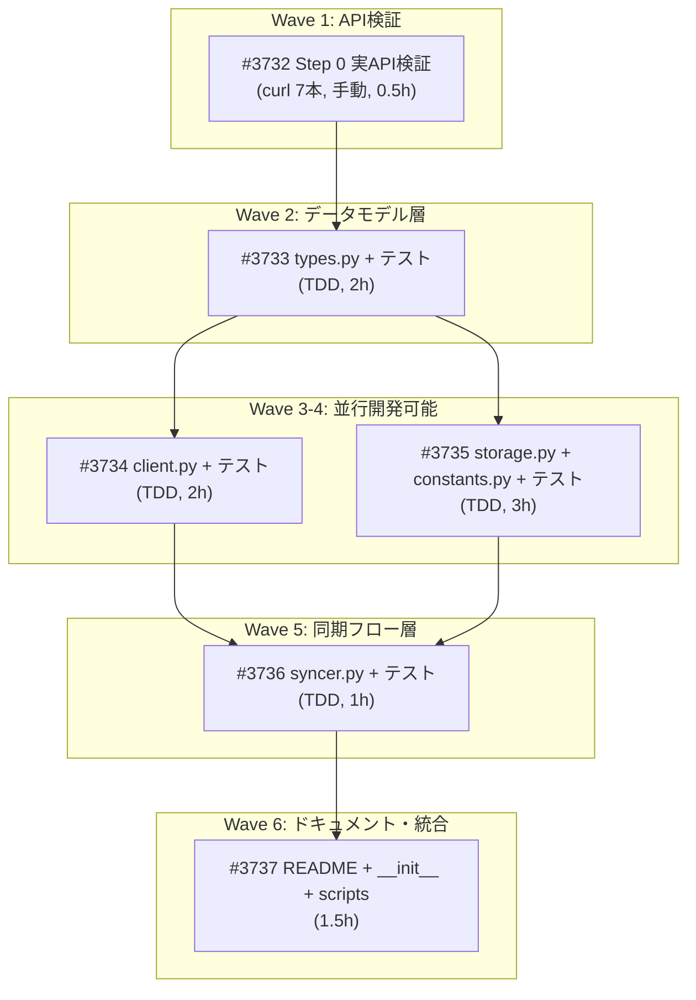

# EDINET DB モジュール: 公式API仕様への完全アライメント

**作成日**: 2026-03-06
**ステータス**: 計画中
**タイプ**: package
**GitHub Project**: [#70](https://github.com/users/YH-05/projects/70)

## 背景と目的

### 背景

edinetdb.jp の提供データが大幅に拡充された。公式ドキュメント検証の結果、現行コードと公式APIに重大な差分が存在する:

- **FinancialRecord**: 24フィールド → 55+ フィールド（PL/BS/CF詳細項目追加）
- **RatioRecord**: 13フィールド → 25+ フィールド（成長率、生産性指標等）
- **フィールド名不一致**: `operating_cf` → `cf_operating` 等
- **全フィールドOptional化**: 公式仕様「値が存在する場合のみ返却」
- **型変更**: `fiscal_year: str` → `int`、財務値 `BIGINT` → `DOUBLE`
- **`period_type` 削除**: 公式レスポンスに存在しない

### 目的

既存の `src/market/edinet/` パッケージを公式 edinetdb.jp API 仕様に完全アライメントし、拡充されたデータを正しく取得・保存できるようにする。

### 成功基準

- [ ] FinancialRecord が 55+ フィールドに対応し、全フィールドが Optional 化されていること
- [ ] RatioRecord が 28 フィールドに対応していること
- [ ] client.py が未知フィールドを無視し、APIレスポンス変更に耐性を持つこと
- [ ] storage.py が新DDLでテーブルを管理し、既存データをマイグレーションできること
- [ ] 全テストが通過し、`make check-all` が成功すること

## リサーチ結果

### 既存パターン

- **frozen dataclass + Optional化**: 既存パターン維持、`float | None = None` に変更
- **DuckDBClient.store_df upsert**: DELETE+INSERT方式、key_columns 変更不要
- **_TABLE_DDL + ensure_tables()**: マイグレーション機構の追加が必要
- **dataclasses.asdict() パイプライン**: DDLカラム名との一致が前提
- **チェックポイント + resume**: 6フェーズ同期フロー

### 参考実装

| ファイル | 説明 |
|---------|------|
| `src/market/edinet/types.py` | frozen dataclass パターン |
| `src/database/db/duckdb_client.py` | store_df upsert パターン |
| `src/market/edinet/storage.py` | _TABLE_DDL + ensure_tables() パターン |
| `src/market/edinet/client.py` | _RetryableError + 指数バックオフ + jitter |

### 技術的考慮事項

- 外部消費者なし（errors.py の再エクスポートのみ、データ型は内部完結）
- マイグレーション戦略: DROP+RECREATE（型変更・リネーム対応）
- EarningsRecord + get_status() は Step 0（API検証）の結果次第で条件付き追加

## 実装計画

### アーキテクチャ概要

既存パッケージの全面更新。Step 0（API検証）→ types.py → client.py → storage.py → syncer.py → docs の順序で、TDDアプローチで実装。1PR一括方式。

### ファイルマップ

| 操作 | ファイルパス | 説明 | Wave |
|------|------------|------|------|
| 新規 | step0-api-verification.json | curl 7本のAPI検証結果 | 1 |
| 変更 | tests/market/unit/edinet/conftest.py | フィクスチャ全面更新 | 2 |
| 変更 | tests/market/unit/edinet/test_types.py | 型テスト全面更新 | 2 |
| 変更 | src/market/edinet/types.py | データモデル全面更新（24→55+, 13→28） | 2 |
| 変更 | tests/market/unit/edinet/test_client.py | _parse_record テスト追加 | 3 |
| 変更 | src/market/edinet/client.py | _parse_record + アンラップ + 新メソッド | 3 |
| 変更 | tests/market/unit/edinet/test_storage.py | DDL + マイグレーションテスト | 4 |
| 変更 | src/market/edinet/storage.py | DDL書き換え + DROP+RECREATE | 4 |
| 変更 | src/market/edinet/constants.py | TABLE_EARNINGS追加（条件付き） | 4 |
| 変更 | tests/market/unit/edinet/test_syncer.py | mock_client更新 | 5 |
| 変更 | src/market/edinet/syncer.py | earnings Phase追加（条件付き） | 5 |
| 変更 | src/market/edinet/__init__.py | エクスポート更新 | 6 |
| 変更 | src/market/edinet/scripts/sync.py | docstring更新 | 6 |
| 変更 | src/market/edinet/README.md | フィールド一覧全面更新 | 6 |

### リスク評価

| リスク | 影響度 | 対策 |
|--------|--------|------|
| Step 0結果への全依存 | 高 | Wave 1で必ず検証、結果をJSONに記録 |
| マイグレーションデータ損失 | 高 | backup→try/except復元→再sync可能 |
| DDL-dataclassカラム名不一致 | 高 | テストで完全一致検証 |
| カラムリネーム+型変換の複雑性 | 中 | 明示的dict定数 + TRY_CAST |
| 1PR大規模変更 | 中 | Waveごとにコミット |

## タスク一覧

### Wave 1（ルートタスク）

- [ ] Step 0: 実API検証（curl 7本）
  - Issue: [#3732](https://github.com/YH-05/finance/issues/3732)
  - ステータス: todo
  - 見積もり: 0.5h

### Wave 2（Wave 1 完了後）

- [ ] データモデル層: types.py + テスト全面更新
  - Issue: [#3733](https://github.com/YH-05/finance/issues/3733)
  - ステータス: todo
  - 依存: #3732
  - 見積もり: 2h

### Wave 3（Wave 2 完了後、Wave 4 と並行可能）

- [ ] APIクライアント層: client.py + テスト更新
  - Issue: [#3734](https://github.com/YH-05/finance/issues/3734)
  - ステータス: todo
  - 依存: #3733
  - 見積もり: 2h

### Wave 4（Wave 2 完了後、Wave 3 と並行可能）

- [ ] ストレージ層: storage.py + constants.py + テスト更新
  - Issue: [#3735](https://github.com/YH-05/finance/issues/3735)
  - ステータス: todo
  - 依存: #3733
  - 見積もり: 3h

### Wave 5（Wave 3+4 完了後）

- [ ] 同期フロー層: syncer.py + テスト更新
  - Issue: [#3736](https://github.com/YH-05/finance/issues/3736)
  - ステータス: todo
  - 依存: #3734, #3735
  - 見積もり: 1h

### Wave 6（Wave 5 完了後）

- [ ] ドキュメント・エクスポート・PR作成
  - Issue: [#3737](https://github.com/YH-05/finance/issues/3737)
  - ステータス: todo
  - 依存: #3736
  - 見積もり: 1.5h

## 依存関係図

## PR戦略

- **ブランチ**: `feature/edinet-api-alignment`
- **1PR一括**: Waveごとにコミット → 1つのPRにまとめる

## 見積もり

- **合計**: 10時間
- **Wave数**: 6
- **クリティカルパス**: Wave 1 → Wave 2 → Wave 4 → Wave 5 → Wave 6（8h）

---

**最終更新**: 2026-03-06
