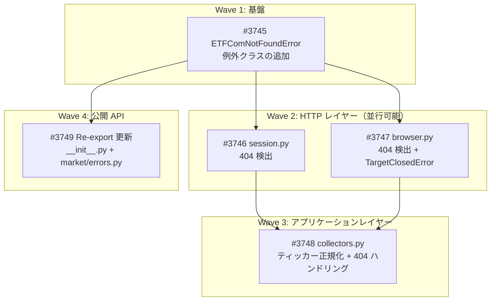

# etfcom 404エラー検出・修正

**作成日**: 2026-03-06
**ステータス**: 計画中
**タイプ**: package_modification
**GitHub Project**: [#72](https://github.com/users/YH-05/projects/72)

## 背景と目的

### 背景

etfcom モジュールの `TickerCollector` を `headless=False` で実行した際、ブラウザ画面に404エラーが表示され、`TargetClosedError` が発生。原因は **HTTP 404レスポンスの未検出** と **サイト構造変更への脆弱性**。

根本原因:
1. `browser.py`: `page.goto()` の戻り値を無視。404ページでも「成功」として扱う
2. `session.py`: `_BLOCKED_STATUS_CODES` が `{403, 429}` のみ。404は検出対象外
3. `collectors.py`: ティッカーの大文字/小文字正規化なし
4. `errors.py`: 404専用の例外クラスが存在しない

### 目的

etfcom モジュール全体で HTTP 404 を適切に検出し、意味のあるエラーメッセージと回復可能なハンドリングを提供する。

### 成功基準

- [ ] 404 レスポンスに対して `ETFComNotFoundError` が即座に raise されること
- [ ] `TargetClosedError` が `ETFComNotFoundError` でラップされること
- [ ] 小文字ティッカー入力が自動的に大文字に正規化されること
- [ ] `FundamentalsCollector` が 404 時に最小レコードで処理を継続すること
- [ ] `make check-all` が全てパスすること

## リサーチ結果

### 既存パターン

- 例外階層: `ETFComError(Exception)` → `ETFComScrapingError`, `ETFComTimeoutError`, `ETFComBlockedError`, `ETFComAPIError`
- `ETFComBlockedError` が `ETFComNotFoundError` のテンプレートとして最適（3パラメータ: message, url, status_code）
- `_request_with_retry()` は `ETFComBlockedError` のみキャッチ → `ETFComNotFoundError` は自然に即座伝播

### 参考実装

| ファイル | 説明 |
|---------|------|
| `src/market/etfcom/errors.py:152-195` | `ETFComBlockedError` — 新クラスのテンプレート |
| `src/market/etfcom/session.py:218-230` | 403/429 検出パターン — 404 検出の追加位置 |
| `src/market/etfcom/browser.py:271-340` | `_navigate()` — `page.goto()` 戻り値キャプチャの追加位置 |
| `tests/market/etfcom/unit/test_errors.py:192-257` | `TestETFComBlockedError` — テストパターン |

### 技術的考慮事項

- 404 は `_BLOCKED_STATUS_CODES` に追加しない（リトライ対象ではない）
- `TargetClosedError` は `type(e).__name__` で判定（playwright はオプショナル依存）
- `_get_html()` の Playwright フォールバックは 404 ではトリガーしない

## 実装計画

### アーキテクチャ概要

既存の etfcom エラー階層に `ETFComNotFoundError` を追加し、HTTP レイヤー（session.py の curl_cffi、browser.py の Playwright）で 404 レスポンスを検出して即座に例外を発生させる。collectors.py ではティッカーの大文字正規化で 404 発生を予防し、FundamentalsCollector では 404 時に最小レコードで継続する。

### ファイルマップ

| 操作 | ファイルパス | 説明 |
|------|------------|------|
| 変更 | `src/market/etfcom/errors.py` | `ETFComNotFoundError` クラス追加 |
| 変更 | `src/market/etfcom/session.py` | `_request()` に 404 チェック追加 |
| 変更 | `src/market/etfcom/browser.py` | `_navigate()` に 404/TargetClosedError 検出追加 |
| 変更 | `src/market/etfcom/collectors.py` | ティッカー正規化 + 404 ハンドリング |
| 変更 | `src/market/etfcom/__init__.py` | Re-export 追加 |
| 変更 | `src/market/errors.py` | Re-export 追加 |
| 変更 | `tests/market/etfcom/unit/test_errors.py` | テスト追加 |
| 変更 | `tests/market/etfcom/unit/test_session.py` | テスト追加 |
| 変更 | `tests/market/etfcom/unit/test_browser.py` | テスト追加 |
| 変更 | `tests/market/etfcom/unit/test_collectors.py` | テスト追加 |

### リスク評価

| リスク | 影響度 | 対策 |
|--------|--------|------|
| TestModuleExports がクラス数5をハードコード | 高 | Wave 1 で 6 に更新 |
| _request_with_retry() の 404 リトライ回避 | 中 | 専用テストで検証 |
| _get_html() での 404 伝播保証 | 中 | except ETFComBlockedError のみキャッチなので自然に貫通 |

## タスク一覧

### Wave 1（基盤）

- [ ] ETFComNotFoundError 例外クラスの追加
  - Issue: [#3745](https://github.com/YH-05/quants/issues/3745)
  - ステータス: todo
  - 見積もり: 15 minutes

### Wave 2（HTTP レイヤー、並行開発可能）

- [ ] session.py での HTTP 404 検出
  - Issue: [#3746](https://github.com/YH-05/quants/issues/3746)
  - ステータス: todo
  - 依存: #3745
  - 見積もり: 15 minutes

- [ ] browser.py での HTTP 404 検出と TargetClosedError ハンドリング
  - Issue: [#3747](https://github.com/YH-05/quants/issues/3747)
  - ステータス: todo
  - 依存: #3745
  - 見積もり: 15 minutes

### Wave 3（アプリケーションレイヤー）

- [ ] collectors.py のティッカー正規化と 404 グレースフルハンドリング
  - Issue: [#3748](https://github.com/YH-05/quants/issues/3748)
  - ステータス: todo
  - 依存: #3746, #3747
  - 見積もり: 20 minutes

### Wave 4（公開 API）

- [ ] ETFComNotFoundError の Re-export 更新
  - Issue: [#3749](https://github.com/YH-05/quants/issues/3749)
  - ステータス: todo
  - 依存: #3745
  - 見積もり: 5 minutes

## 依存関係図

---

**最終更新**: 2026-03-06
