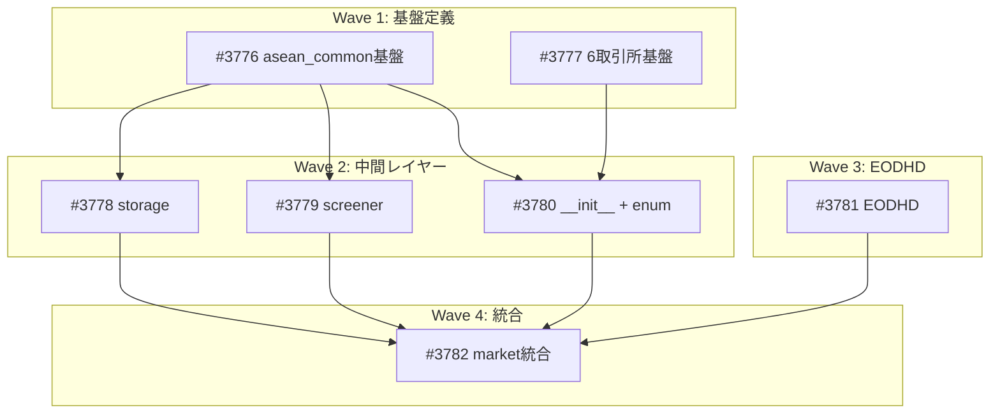

# ASEAN銘柄データ取得基盤

**作成日**: 2026-03-19
**ステータス**: 計画中
**タイプ**: package
**GitHub Project**: [#88](https://github.com/users/YH-05/projects/88)

## 背景と目的

### 背景

2026年3月からASEAN銘柄のカバレッジを仕事で開始。ASEAN主要6市場（SGX, Bursa, SET, IDX, HOSE, PSE）の財務データ・マーケットデータを無料で取得する基盤が必要。2026-03-18の徹底調査でyfinance実機テスト、国別ライブラリ評価、グローバルAPI評価を完了。

### 目的

既存の market パッケージに ASEAN 6市場のデータ取得機能を追加し、全銘柄のティッカーマスタを DuckDB で管理する。

### 成功基準

- [ ] ASEAN 5市場（SGX/Bursa/SET/IDX/HOSE）で yfinance 経由の全データ取得（OHLCV + 財務 + 企業情報 + 配当）が可能
- [ ] 全6市場の全銘柄ティッカーマスタが DuckDB に永続化されている
- [ ] マレーシアの数値コードティッカーが名前検索で特定可能
- [ ] EODHD バックアップのインターフェースが準備されている
- [ ] make check-all が成功する

## リサーチ結果

### 既存パターン

- BSEモジュール（`src/market/bse/`）がテンプレートとして最適
- YFinanceFetcher は ASEAN サフィックスを既にサポート（変更不要）
- SQLiteCache でキャッシュ再利用可能

### 参考実装

| ファイル | 説明 |
|---------|------|
| `src/market/bse/` | 取引所サブパッケージのテンプレート（Session/Collector/Types/Errors） |
| `src/market/yfinance/fetcher.py` | yfinance統合。YFINANCE_SYMBOL_PATTERNはASEANサフィックスをマッチ済み |
| `src/market/edinet_api/` | 最近追加された外部API統合のパターン（Config+Session+Client） |
| `src/market/cache/cache.py` | SQLiteキャッシュ。ASEAN銘柄のキャッシュに再利用 |

### 技術的考慮事項

- マレーシアは数値コードティッカー（例: Maybank=1155.KL）。lookup_ticker()が必要
- PSEはyfinance非対応。ADR経由（PHI, BDOUY, BPHLF）のみ
- vnstock/idx-bei/thaifin はPyPI安定性不明。optional dependency + 実行時チェック
- VNM（サフィックスなし）はVanEck Vietnam ETF。Vinamilk=VNM.VN

## 実装計画

### アーキテクチャ概要

market パッケージ配下に8サブパッケージを新規作成: asean_common（共通基盤）、sgx, bursa, set_exchange, idx, hose, pse（取引所別）、eodhd（バックアップAPI）。

データフロー: tradingview-screener → TickerRecord → AseanTickerStorage(DuckDB) → lookup_ticker()/get_tickers() → YFinanceFetcher(既存) → DataFrame

### リスク評価

| リスク | 影響度 | 対策 |
|--------|--------|------|
| tradingview-screener API安定性 | 中 | optional dependency + try/except |
| スケジュール（80ファイル/1日） | 中 | テンプレート生成 + feature-implementer委譲 |
| DataSource enum追加の影響 | 低 | 追加のみ、既存値変更なし |

## タスク一覧

### Wave 1（並行開発可能）

- [ ] asean_common 基盤定義（constants/types/errors）の作成
  - Issue: [#3776](https://github.com/YH-05/quants/issues/3776)
  - ステータス: todo
  - 見積もり: 0.75h

- [ ] 6取引所サブパッケージ基盤の一括作成
  - Issue: [#3777](https://github.com/YH-05/quants/issues/3777)
  - ステータス: todo
  - 見積もり: 0.75h

### Wave 2（Wave 1 完了後、並行可能）

- [ ] DuckDBストレージ（storage.py）
  - Issue: [#3778](https://github.com/YH-05/quants/issues/3778)
  - ステータス: todo
  - 依存: #3776
  - 見積もり: 1h

- [ ] tradingview-screener統合（screener.py）
  - Issue: [#3779](https://github.com/YH-05/quants/issues/3779)
  - ステータス: todo
  - 依存: #3776
  - 見積もり: 1h

- [ ] 全サブパッケージ __init__.py + DataSource enum拡張
  - Issue: [#3780](https://github.com/YH-05/quants/issues/3780)
  - ステータス: todo
  - 依存: #3776, #3777
  - 見積もり: 0.75h

### Wave 3（独立、いつでも並行可能）

- [ ] EODHD APIインターフェーススケルトン
  - Issue: [#3781](https://github.com/YH-05/quants/issues/3781)
  - ステータス: todo
  - 見積もり: 0.75h

### Wave 4（全タスク完了後）

- [ ] market パッケージ統合 + 品質チェック
  - Issue: [#3782](https://github.com/YH-05/quants/issues/3782)
  - ステータス: todo
  - 依存: #3778, #3779, #3780, #3781
  - 見積もり: 0.75h

## 依存関係図

---

**最終更新**: 2026-03-19
