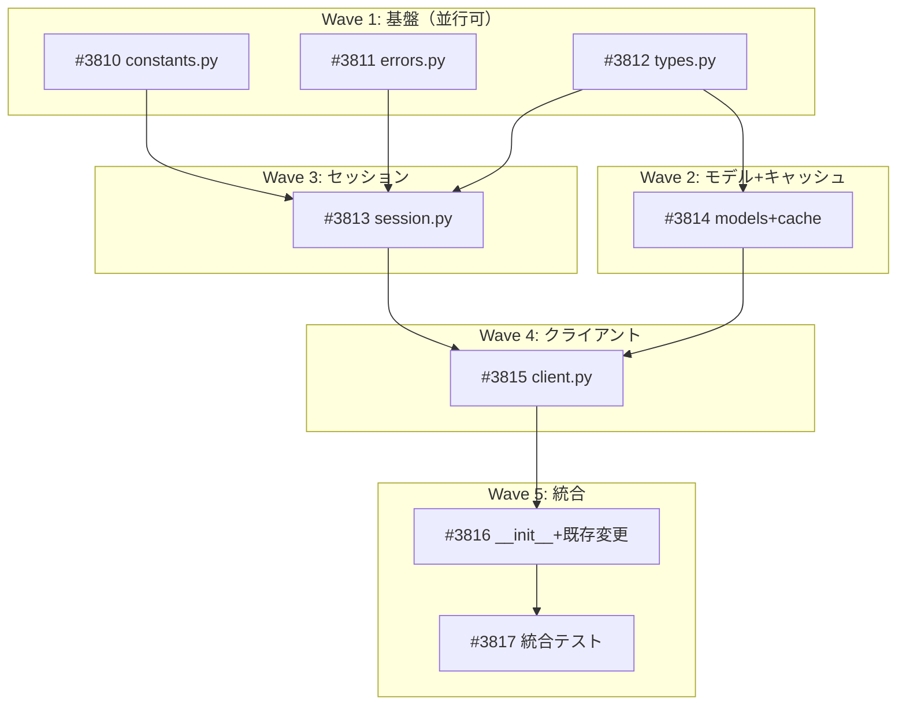

# Polymarket データ取得パッケージ

**作成日**: 2026-03-21
**ステータス**: 計画中
**タイプ**: package
**GitHub Project**: [#93](https://github.com/users/YH-05/projects/93)

## 背景と目的

### 背景

Polymarket API調査（`original-plan.md`）の結果、認証不要で暗示確率時系列・オーダーブック・取引履歴等が取得可能と判明。3 API（Gamma/CLOB/Data）はいずれも JSON REST で同一特性を持つ。既存の JQuants/EODHD パッケージと同一パターンで統合可能。

### 目的

`src/market/polymarket/` サブモジュールとして、Polymarket API からデータを取得するクライアントパッケージを新規作成する。

### 成功基準

- [ ] 8ファイル新規作成 + 3ファイル既存変更が完了していること
- [ ] Gamma/CLOB/Data の 16 エンドポイントが利用可能であること
- [ ] `make check-all` が成功すること
- [ ] ユニットテスト・プロパティテスト・統合テストが全て pass すること

## リサーチ結果

### 既存パターン

JQuants/EODHD パッケージに共通する 9 つのパターンを識別。全て Polymarket に適用可能：
1. サブモジュール標準ファイル構成（7-8ファイル）
2. Exception 直接継承（循環 import 回避）
3. httpx 同期セッション + polite delay + SSRF 防止
4. frozen dataclass Config + __post_init__ バリデーション
5. SQLiteCache + generate_cache_key + エンドポイント別 TTL
6. DataSource enum + MarketDataResult 統合
7. ErrorCode enum 拡張 + errors.py re-export
8. テスト構造: unit/ + property/ + integration/
9. テストフィクスチャ: mock_cache + mock_session

### 参考実装

| ファイル | 参考にすべき点 |
|---------|-------------|
| `src/market/jquants/session.py` | SSRF防止、polite delay、get_with_retry、エラーハンドリング |
| `src/market/jquants/client.py` | 高レベルAPI、キャッシュ統合、_request() パターン |
| `src/market/jquants/cache.py` | TTL定数、get_xxx_cache() |
| `src/market/jquants/types.py` | frozen dataclass Config |
| `src/market/eodhd/errors.py` | Exception直接継承、例外階層 |
| `src/market/types.py` | DataSource enum, MarketDataResult |
| `src/market/schema.py` | Pydantic V2 スタイル |

### 技術的考慮事項

- Polymarket API は非公式のため仕様変更リスクあり → `extra='ignore'` + `Optional` パターンで対応
- レートリミット（~100 req/min）は非公式情報 → 1.5 req/s で安全マージン確保
- models.py は市場パッケージ初の Pydantic レスポンスモデル（全フィールド再現）

## 実装計画

### アーキテクチャ概要

JQuants パターン踏襲。認証不要の 3 API（Gamma/CLOB/Data）を単一クライアントに統合。httpx 同期セッション、SSRF 防止、polite delay、SQLiteCache + エンドポイント別 TTL。

### ファイルマップ

| 操作 | ファイルパス | 説明 |
|------|------------|------|
| 新規作成 | `src/market/polymarket/constants.py` | API URL, ALLOWED_HOSTS, デフォルト値（100行） |
| 新規作成 | `src/market/polymarket/errors.py` | 例外階層 5クラス（220行） |
| 新規作成 | `src/market/polymarket/types.py` | Config, RetryConfig, PriceInterval（180行） |
| 新規作成 | `src/market/polymarket/models.py` | Pydantic V2 レスポンスモデル 6クラス（350行） |
| 新規作成 | `src/market/polymarket/cache.py` | TTL定数 + get_polymarket_cache()（100行） |
| 新規作成 | `src/market/polymarket/session.py` | httpx セッション（400行） |
| 新規作成 | `src/market/polymarket/client.py` | 高レベルAPI 16メソッド（650行） |
| 新規作成 | `src/market/polymarket/__init__.py` | 公開API（80行） |
| 変更 | `src/market/types.py` | DataSource.POLYMARKET 追加（+5行） |
| 変更 | `src/market/errors.py` | ErrorCode 4エントリ + re-export（+30行） |
| 変更 | `src/market/__init__.py` | Polymarket exports 追加（+25行） |

### リスク評価

| リスク | 影響度 | 対策 |
|--------|--------|------|
| API仕様変更 | medium | extra='ignore' + Optional + 統合テスト定期確認 |
| モデル定義精度 | medium | ライブAPI検証 → 調整 |
| レートリミット不確実性 | medium | 1.5 req/s + 429尊重 + jitter |
| スケジュール超過 | medium | Wave分割で段階的品質確認 |

## タスク一覧

### Wave 1（並行開発可能）

- [ ] 定数ファイル（constants.py）の作成 + ユニットテスト
  - Issue: [#3810](https://github.com/YH-05/quants/issues/3810)
  - ステータス: todo
  - 見積もり: 1h

- [ ] 例外階層（errors.py）の作成 + ユニットテスト
  - Issue: [#3811](https://github.com/YH-05/quants/issues/3811)
  - ステータス: todo
  - 見積もり: 1h

- [ ] 型定義（types.py）の作成 + ユニットテスト
  - Issue: [#3812](https://github.com/YH-05/quants/issues/3812)
  - ステータス: todo
  - 見積もり: 1h

### Wave 2（task-3 完了後）

- [ ] レスポンスモデル（models.py）+ キャッシュ（cache.py）+ テスト
  - Issue: [#3814](https://github.com/YH-05/quants/issues/3814)
  - ステータス: todo
  - 依存: #3812
  - 見積もり: 2.5h

### Wave 3（Wave 1 全完了後）

- [ ] HTTPセッション（session.py）の作成 + ユニットテスト
  - Issue: [#3813](https://github.com/YH-05/quants/issues/3813)
  - ステータス: todo
  - 依存: #3810, #3811, #3812
  - 見積もり: 2h

### Wave 4（Wave 2+3 完了後）

- [ ] 高レベルクライアント（client.py）+ ユニットテスト
  - Issue: [#3815](https://github.com/YH-05/quants/issues/3815)
  - ステータス: todo
  - 依存: #3810, #3811, #3812, #3813, #3814
  - 見積もり: 2.5h

### Wave 5（Wave 4 完了後）

- [ ] パッケージ統合（__init__.py + 既存ファイル変更）
  - Issue: [#3816](https://github.com/YH-05/quants/issues/3816)
  - ステータス: todo
  - 依存: #3811, #3814, #3815
  - 見積もり: 1.5h

- [ ] ライブ API 統合テスト
  - Issue: [#3817](https://github.com/YH-05/quants/issues/3817)
  - ステータス: todo
  - 依存: #3816
  - 見積もり: 0.5h

## 依存関係図

---

**最終更新**: 2026-03-21
