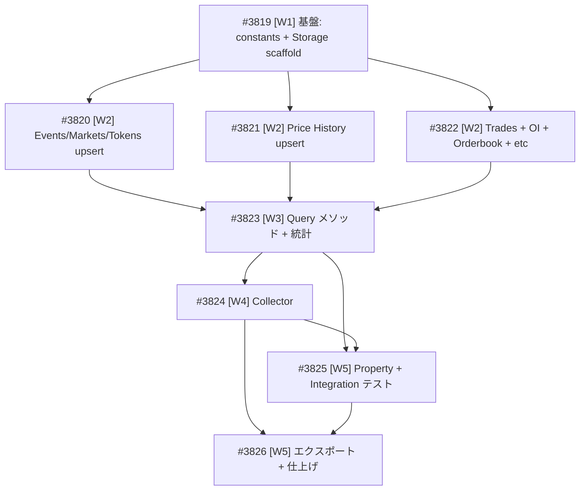

# Polymarket データ長期保存（Storage + Collector）

**作成日**: 2026-03-23
**ステータス**: 計画中
**タイプ**: package
**GitHub Project**: [#95](https://github.com/users/YH-05/projects/95)

## 背景と目的

### 背景

Polymarket APIクライアント（`src/market/polymarket/`）は完成済みだが、データは TTL ベースの SQLiteCache にのみ保存される。分析用途での長期保存ができないため、SQLite に永続保存する Storage 層と定期収集用の Collector を実装する。

**なぜ SQLite か**: NAS 上にデータベースを配置する要件があるため。DuckDB はメモリマップドファイルとファイルロックの制約でネットワークストレージとの互換性に問題がある。

### 目的

- 全16エンドポイントのデータを SQLite に永続保存
- EdinetStorage パターン踏襲（INSERT OR REPLACE upsert）
- PolymarketCollector による一括/個別データ収集の自動化
- pd.DataFrame でのデータクエリインターフェース

### 成功基準

- [ ] 8テーブルの DDL が正常に作成される
- [ ] 全 upsert メソッドが冪等に動作する
- [ ] Collector の collect_all() で全データ一括収集が可能
- [ ] make check-all がパスする

## リサーチ結果

### 既存パターン

- **EdinetStorage DDL dict pattern**: `_TABLE_DDL` dict → `ensure_tables()` 一括作成
- **INSERT OR REPLACE upsert**: `_build_insert_sql()` + `executemany()` でバッチ投入
- **pd.DataFrame query return**: `pd.read_sql_query()` 経由
- **Forward-only migration**: `ALTER TABLE ADD COLUMN` で既存データ非破壊

### 参考実装

| ファイル | 説明 |
|---------|------|
| `src/market/edinet/storage.py` | DDL dict + INSERT OR REPLACE + upsert パターン |
| `src/database/db/sqlite_client.py` | SQLiteClient（execute, execute_many, connection） |
| `src/database/db/connection.py` | get_db_path() パス解決 |
| `src/market/polymarket/client.py` | 16 API メソッド（Collector のデータソース） |
| `src/market/polymarket/models.py` | Pydantic モデル 6 種 |

### 技術的考慮事項

- NAS 上での SQLite WAL モード非互換 → DELETE ジャーナルモード使用
- `PolymarketMarket.tokens` は `list[dict[str, Any]]` で構造が可変 → 安全なチェック
- OI / 注文板 / リーダーボードはスキーマ可変 → JSON 文字列で保持
- API レート制限（1.5 req/s）→ 全データ収集は時間がかかるため進捗ログ出力

## 実装計画

### アーキテクチャ概要

```
PolymarketClient (API) → PolymarketCollector (orchestration) → PolymarketStorage (SQLite) → pd.DataFrame (query)
```

### ファイルマップ

| 操作 | ファイルパス | 説明 |
|------|------------|------|
| 新規作成 | `src/market/polymarket/storage_constants.py` | テーブル名定数、DB名 |
| 新規作成 | `src/market/polymarket/storage.py` | PolymarketStorage クラス |
| 新規作成 | `src/market/polymarket/collector.py` | PolymarketCollector + CollectionResult |
| 変更 | `src/market/polymarket/__init__.py` | エクスポート追加 |
| 新規作成 | `tests/market/polymarket/conftest.py` | SQLite fixture |
| 新規作成 | `tests/market/polymarket/unit/test_storage.py` | Storage 単体テスト |
| 新規作成 | `tests/market/polymarket/unit/test_collector.py` | Collector 単体テスト |
| 新規作成 | `tests/market/polymarket/property/test_storage_property.py` | upsert 冪等性テスト |
| 新規作成 | `tests/market/polymarket/integration/test_storage_integration.py` | E2E テスト |

### リスク評価

| リスク | 影響度 | 対策 |
|--------|--------|------|
| NAS WAL 非互換 | 中 | DELETE ジャーナルモード使用 |
| tokens 構造可変 | 中 | token_id / outcome の安全なチェック |
| OI等スキーマ可変 | 低 | JSON 文字列保持 |
| API レート制限 | 低 | 統合テストは @pytest.mark.integration でマーク |

## タスク一覧

### Wave 1（基盤）

- [ ] 基盤: storage_constants + Storage スキャフォルド + conftest
  - Issue: [#3819](https://github.com/YH-05/quants/issues/3819)
  - ステータス: todo
  - 見積もり: 1-2h

### Wave 2（並行開発可能 - Wave 1 完了後）

- [ ] Events / Markets / Tokens upsert 実装
  - Issue: [#3820](https://github.com/YH-05/quants/issues/3820)
  - ステータス: todo
  - 依存: #3819
  - 見積もり: 1-2h

- [ ] Price History upsert 実装
  - Issue: [#3821](https://github.com/YH-05/quants/issues/3821)
  - ステータス: todo
  - 依存: #3819
  - 見積もり: 0.5-1h

- [ ] Trades + OI + Orderbook + Leaderboard + Holders 実装
  - Issue: [#3822](https://github.com/YH-05/quants/issues/3822)
  - ステータス: todo
  - 依存: #3819
  - 見積もり: 1-2h

### Wave 3（Wave 2 完了後）

- [ ] Query メソッド + 統計
  - Issue: [#3823](https://github.com/YH-05/quants/issues/3823)
  - ステータス: todo
  - 依存: #3820, #3821, #3822
  - 見積もり: 1-2h

### Wave 4（Wave 3 完了後）

- [ ] Collector 実装
  - Issue: [#3824](https://github.com/YH-05/quants/issues/3824)
  - ステータス: todo
  - 依存: #3823
  - 見積もり: 1-2h

### Wave 5（並行開発可能 - Wave 4 完了後）

- [ ] Property テスト + Integration テスト
  - Issue: [#3825](https://github.com/YH-05/quants/issues/3825)
  - ステータス: todo
  - 依存: #3823, #3824
  - 見積もり: 1h

- [ ] エクスポート + 仕上げ
  - Issue: [#3826](https://github.com/YH-05/quants/issues/3826)
  - ステータス: todo
  - 依存: #3824, #3825
  - 見積もり: 0.5h

## 依存関係図



---

**最終更新**: 2026-03-23
