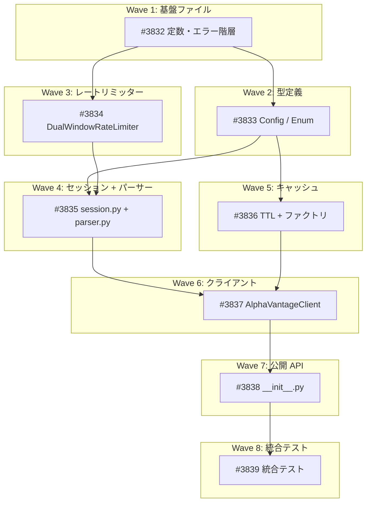

# Alpha Vantage データ収集ライブラリ

**作成日**: 2026-03-23
**ステータス**: 計画中
**タイプ**: package
**GitHub Project**: [#97](https://github.com/users/YH-05/projects/97)

## 背景と目的

### 背景

market パッケージには yfinance, fred, jquants, nasdaq, bse 等 12+ のサブパッケージがあるが、Alpha Vantage は未対応。Alpha Vantage は株式・為替・暗号通貨・経済指標・企業ファンダメンタルズを統一 API で提供しており、既存データソースの補完として有用。

### 目的

market パッケージに Alpha Vantage API のデータ収集サブパッケージ（`src/market/alphavantage/`）を追加する。既存の jquants 標準7ファイル構造に AV 固有の `rate_limiter.py` を加えた8ファイル構成。

### 成功基準

- [ ] 8ファイル構成（constants, errors, types, rate_limiter, session, parser, cache, client）が完成していること
- [ ] 全単体テスト・プロパティテストが通過すること（`make check-all` 成功）
- [ ] 6カテゴリ（時系列、リアルタイム、ファンダメンタルズ、為替、暗号通貨、経済指標）の API メソッドが利用可能であること
- [ ] DualWindowRateLimiter（sync + async）が正しく動作すること

## リサーチ結果

### 既存パターン

- **7ファイル標準構成**: constants + errors + types + session + client + cache + __init__（jquants, bse, nasdaq, edinet_api 共通）
- **Exception 直接継承エラー階層**: 循環インポート回避（jquants, bse, nasdaq 共通）
- **frozen dataclass Config + __post_init__ バリデーション**: jquants, bse 共通
- **httpx セッション + polite delay + SSRF 防止 + retry**: jquants, bse, edinet_api 共通
- **cleaner factory パーサー**: nasdaq 応用

### 参考実装

| ファイル | 参考にすべき点 |
|---------|--------------|
| `src/market/jquants/` | 全7ファイルの主要参照モデル |
| `src/market/nasdaq/parser.py` | cleaner factory パターン → AV 番号プレフィックス正規化に応用 |
| `src/market/cache/cache.py` | SQLiteCache, generate_cache_key, create_persistent_cache API |
| `src/market/edinet/rate_limiter.py` | レートリミッターの配置パターン（設計は異なる） |
| `tests/market/nasdaq/conftest.py` | テスト conftest パターン |

### 技術的考慮事項

- **AV 固有のエラー処理**: HTTP 200 でも JSON ボディ内に `"Error Message"` / `"Note"` / `"Information"` キーでエラーを返す
- **レスポンス構造の不安定さ**: エンドポイントごとに時系列キーが異なる
- **レートリミッター**: 既存の EDINET DailyRateLimiter とは設計が根本的に異なる（スライディングウィンドウ方式）
- **DataSource 統合**: 初回は独自型のみ。将来統合は別 Issue
- **テクニカル指標**: スコープ外

## 実装計画

### アーキテクチャ概要

market パッケージの jquants 標準7ファイル構造 + AV 固有の rate_limiter.py = 8ファイル構成。共通キャッシュ基盤（market.cache）を再利用し、httpx ベースのセッション層で polite delay・SSRF 防止・指数バックオフリトライを実装。

**データフロー**: ユーザーコード → Client.get_xxx() → _get_cached_or_fetch() → [cache hit] 返却 / [cache miss] → Session.get_with_retry() → RateLimiter.acquire() → polite delay → httpx → _handle_response() → parser.parse_xxx() → cache.set → 結果返却

### ファイルマップ

| 操作 | ファイルパス | 説明 |
|------|------------|------|
| 新規作成 | `src/market/alphavantage/constants.py` | 定数定義（BASE_URL, ALLOWED_HOSTS, レート制限デフォルト値等） |
| 新規作成 | `src/market/alphavantage/errors.py` | 5層例外階層（AlphaVantageError ベース） |
| 新規作成 | `src/market/alphavantage/types.py` | Config x3 + Enum x7 |
| 新規作成 | `src/market/alphavantage/rate_limiter.py` | DualWindowRateLimiter（sync + async） |
| 新規作成 | `src/market/alphavantage/session.py` | httpx セッション + HTTP 200 エラー検出 |
| 新規作成 | `src/market/alphavantage/parser.py` | 7 parse 関数 + 3 ヘルパー |
| 新規作成 | `src/market/alphavantage/cache.py` | TTL 定数 + ファクトリ |
| 新規作成 | `src/market/alphavantage/client.py` | 20+ API メソッド |
| 新規作成 | `src/market/alphavantage/__init__.py` | re-export + __all__ |

### リスク評価

| リスク | 影響度 | 対策 |
|--------|--------|------|
| AV レスポンス構造の不安定さ | 高 | ホワイトリスト方式 + 未知キーで明示エラー |
| DualWindowRateLimiter の並行安全性 | 高 | sync 先行 + Hypothesis プロパティテスト |
| HTTP 200 エラーの検出漏れ | 高 | 3キー優先チェック + パース失敗で明示エラー |
| Free tier 制限値の変更リスク | 中 | Config で設定可能、constants.py に集約 |
| 統合テストの CI 実行困難 | 中 | pytest.mark.integration + skipIf |

## タスク一覧

### Wave 1（依存なし）

- [ ] 基盤ファイルの作成（定数・エラー階層・テストパッケージ初期化）
  - Issue: [#3832](https://github.com/YH-05/quants/issues/3832)
  - ステータス: todo
  - 見積もり: 2h

### Wave 2（Wave 1 完了後、Wave 3 と並行可能）

- [ ] 型定義・設定（Config / Enum / テスト conftest）
  - Issue: [#3833](https://github.com/YH-05/quants/issues/3833)
  - ステータス: todo
  - 依存: #3832
  - 見積もり: 2h

### Wave 3（Wave 1 完了後、Wave 2 と並行可能）

- [ ] デュアルウィンドウレートリミッターの実装
  - Issue: [#3834](https://github.com/YH-05/quants/issues/3834)
  - ステータス: todo
  - 依存: #3832
  - 見積もり: 3h

### Wave 4（Wave 2,3 完了後）

- [ ] セッション層とパーサーの実装
  - Issue: [#3835](https://github.com/YH-05/quants/issues/3835)
  - ステータス: todo
  - 依存: #3832, #3833, #3834
  - 見積もり: 4h

### Wave 5（Wave 2 完了後、Wave 4 と並行可能）

- [ ] キャッシュ層の実装（TTL 定数 + ファクトリ）
  - Issue: [#3836](https://github.com/YH-05/quants/issues/3836)
  - ステータス: todo
  - 依存: #3833
  - 見積もり: 1h

### Wave 6（Wave 4,5 完了後）

- [ ] 高レベル API クライアントの実装（20+ メソッド）
  - Issue: [#3837](https://github.com/YH-05/quants/issues/3837)
  - ステータス: todo
  - 依存: #3835, #3836
  - 見積もり: 4h

### Wave 7（Wave 6 完了後）

- [ ] パッケージ公開 API（__init__.py re-export）
  - Issue: [#3838](https://github.com/YH-05/quants/issues/3838)
  - ステータス: todo
  - 依存: #3837
  - 見積もり: 0.5h

### Wave 8（Wave 7 完了後）

- [ ] ライブ API 統合テストの作成
  - Issue: [#3839](https://github.com/YH-05/quants/issues/3839)
  - ステータス: todo
  - 依存: #3838
  - 見積もり: 1.5h

## 依存関係図

---

**最終更新**: 2026-03-23
