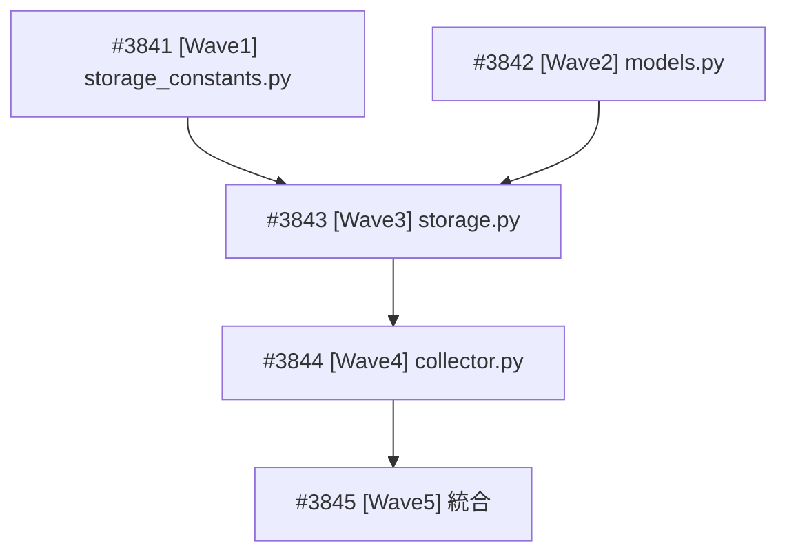

# Alpha Vantage Storage Layer 実装

**作成日**: 2026-03-24
**ステータス**: 計画中
**タイプ**: package
**GitHub Project**: [#98](https://github.com/users/YH-05/projects/98)

## 背景と目的

### 背景

Alpha Vantage APIクライアント（`src/market/alphavantage/`）は API 取得 → パース → TTL キャッシュまで実装済みだが、長期的なデータ蓄積のための永続化層（Storage）が未実装。SQLite ベースの Storage + Collector を追加し、外付けSSD/NAS上での保存・操作に対応する。

### 目的

- SQLite ベースの永続化層（8テーブル）を追加
- API→Storage パイプライン（Collector）を構築
- camelCase→snake_case 変換の自動化
- Earnings データの annual/quarterly 型分離

### 成功基準

- [ ] 8テーブルの DDL 管理・upsert・get が動作する
- [ ] Collector が API 取得→変換→Storage 保存を一括実行できる
- [ ] make check-all が成功する
- [ ] Property テストで upsert 冪等性が検証されている
- [ ] 統合テストで collect→get ラウンドトリップが検証されている

## リサーチ結果

### 既存パターン

12 個の再利用可能パターンを特定。Polymarket/EDINET の Storage/Collector 実装をほぼそのまま踏襲可能。

### 参考実装

| ファイル | 参考にすべき点 |
|---------|--------------|
| `src/market/polymarket/storage.py` | `_build_insert_sql` (lru_cache), `_validate_finite`, factory, get_stats |
| `src/market/polymarket/storage_constants.py` | `Final[str]` + docstring + `__all__` パターン |
| `src/market/polymarket/collector.py` | DI、エラー蓄積、collect_all |
| `src/market/edinet/storage.py` | `_dataclass_to_tuple`, `_migrate_add_missing_columns`, DDL-dataclass 整合性 |
| `src/market/edinet/types.py` | frozen dataclass パターン |

### 技術的考慮事項

- **EarningsRecord 分割**: AnnualEarningsRecord(5フィールド) + QuarterlyEarningsRecord(9フィールド) — テーブルは1つ（av_earnings）
- **camelCase 変換**: 汎用 `_camel_to_snake()` + `_SPECIAL_KEY_MAP` で全キーを変換
- **get_company_overview()**: CompanyOverviewRecord | None を返す（他は DataFrame）

## 実装計画

### アーキテクチャ概要

5層構成: storage_constants.py → models.py(9 Record型) → storage.py → collector.py → __init__.py 更新

### ファイルマップ

| 操作 | ファイルパス | 説明 | Wave |
|------|------------|------|------|
| 新規作成 | `src/market/alphavantage/storage_constants.py` | テーブル名定数 (8個, av_ プレフィックス) | 1 |
| 新規作成 | `tests/market/alphavantage/unit/test_storage_constants.py` | 定数テスト | 1 |
| 新規作成 | `src/market/alphavantage/models.py` | 9 frozen dataclass レコード型 | 2 |
| 新規作成 | `tests/market/alphavantage/unit/test_models.py` | レコード型テスト | 2 |
| 新規作成 | `src/market/alphavantage/storage.py` | AlphaVantageStorage クラス | 3 |
| 変更 | `tests/market/alphavantage/conftest.py` | av_storage fixture 追加 | 3 |
| 新規作成 | `tests/market/alphavantage/unit/test_storage.py` | Storage テスト | 3 |
| 新規作成 | `src/market/alphavantage/collector.py` | AlphaVantageCollector クラス | 4 |
| 新規作成 | `tests/market/alphavantage/unit/test_collector.py` | Collector テスト | 4 |
| 変更 | `src/market/alphavantage/__init__.py` | 公開 API 追加 (14エントリ) | 5 |
| 新規作成 | `tests/market/alphavantage/property/test_storage_property.py` | Hypothesis プロパティテスト | 5 |
| 新規作成 | `tests/market/alphavantage/integration/test_storage_collector_integration.py` | 統合テスト | 5 |

### リスク評価

| リスク | 影響度 | 対策 |
|--------|--------|------|
| CompanyOverview 42フィールドのマッピング網羅性 | 中 | DDL-dataclass 整合性テスト |
| Earnings Record 分割による upsert 複雑化 | 中 | 混在 upsert テスト |
| __init__.py import 追加 | 低 | Wave 5 で最後に実施 |

## タスク一覧

### Wave 1（並行開発可能）

- [ ] storage_constants.py — テーブル名定数・DB設定定数の定義
  - Issue: [#3841](https://github.com/YH-05/quants/issues/3841)
  - ステータス: todo
  - 見積もり: 0.5h

### Wave 2（Wave 1 と並行開発可能）

- [ ] models.py — 9つの frozen dataclass レコード型の定義
  - Issue: [#3842](https://github.com/YH-05/quants/issues/3842)
  - ステータス: todo
  - 見積もり: 0.75h

### Wave 3（Wave 1+2 完了後）

- [ ] storage.py — AlphaVantageStorage クラス（DDL管理・upsert・get・マイグレーション）
  - Issue: [#3843](https://github.com/YH-05/quants/issues/3843)
  - ステータス: todo
  - 依存: Wave 1, Wave 2
  - 見積もり: 1.5-2h

### Wave 4（Wave 3 完了後）

- [ ] collector.py — AlphaVantageCollector クラス（API→Storage パイプライン）
  - Issue: [#3844](https://github.com/YH-05/quants/issues/3844)
  - ステータス: todo
  - 依存: Wave 3
  - 見積もり: 1.5-2h

### Wave 5（Wave 4 完了後）

- [ ] __init__.py 更新 + プロパティテスト + 統合テスト
  - Issue: [#3845](https://github.com/YH-05/quants/issues/3845)
  - ステータス: todo
  - 依存: Wave 4
  - 見積もり: 1-1.5h

## 依存関係図

---

**最終更新**: 2026-03-24
