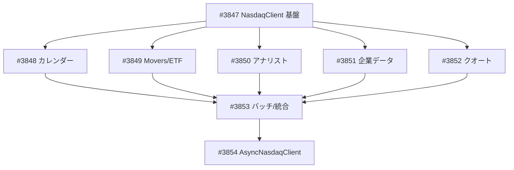

# market.nasdaq パッケージ拡張 — NasdaqClient 新設

**作成日**: 2026-03-24
**ステータス**: 計画中
**タイプ**: package
**GitHub Project**: [#100](https://github.com/users/YH-05/projects/100)

## 背景と目的

### 背景

NASDAQ API (`api.nasdaq.com`) は無料・認証不要で30+のエンドポイントを提供するが、現在の `market.nasdaq` パッケージは Stock Screener (`/screener/stocks`) のみ実装済み。日次データ蓄積やユニバース管理、アナリストデータ追跡のため、カレンダー・Market Movers・ETFスクリーナー・アナリスト・需給データ等のエンドポイントを追加する。

### 目的

既存 `market.nasdaq` パッケージに **NasdaqClient** クラスを新設し、15エンドポイントに対応する。AlphaVantageClient パターンの `_fetch_and_parse()` DRY ヘルパーで各メソッドを3-5行に圧縮する。また **AsyncNasdaqClient** を `asyncio.to_thread()` ベースの薄いラッパーとして提供する。

### 成功基準

- [ ] 15 エンドポイントの全メソッドが実装・テスト済み
- [ ] AsyncNasdaqClient が全メソッドの async 版を提供
- [ ] `make check-all` が全パス
- [ ] 既存の ScreenerCollector / session.py / parser.py / types.py に影響なし

## リサーチ結果

### 既存パターン

- **AlphaVantageClient._get_cached_or_fetch()**: ジェネリック DRY ヘルパー。NasdaqClient の `_fetch_and_parse()` が直接踏襲
- **パッケージ別 cache.py**: TTL 定数 + ファクトリ関数パターン（alphavantage/cache.py, fred/cache.py）
- **parser.py のクリーナー関数**: `_is_missing()`, `_create_cleaner()`, `clean_price()` 等が再利用可能
- **MagicMock(spec=NasdaqSession) DI テストパターン**: 既存テストの構造をそのまま踏襲

### 参考実装

| ファイル | 説明 |
|---------|------|
| `src/market/alphavantage/client.py` | `_get_cached_or_fetch()` DRY ヘルパーの参照元 |
| `src/market/alphavantage/cache.py` | TTL定数 + `get_*_cache()` ファクトリ関数パターン |
| `src/market/nasdaq/parser.py` | クリーナー関数の再利用元 |
| `src/market/nasdaq/collector.py` | Session DI + コンテキストマネージャの参照パターン |
| `tests/market/alphavantage/unit/test_client.py` | cache hit/miss テストパターン |

### 技術的考慮事項

- 全新エンドポイントが `api.nasdaq.com` ドメインのため `ALLOWED_HOSTS` 変更不要
- NASDAQ API の共通 JSON エンベロープ `{"data": {...}, "status": {"rCode": 200}}`
- `NasdaqSession.get_with_retry()` の `**kwargs` が `get()` に伝播 → Referer オーバーライド可能
- 戻り値は frozen dataclass リスト（ユーザー決定）
- FetchOptions は独自定義（`NasdaqFetchOptions` in `client_types.py`）

## 実装計画

### アーキテクチャ概要

既存パッケージに NasdaqClient（同期）+ AsyncNasdaqClient（async ラッパー）を追加。`_fetch_and_parse()` DRY ヘルパーで cache check → fetch → unwrap → parse → cache store を一元管理。既存の NasdaqSession / NasdaqConfig / RetryConfig / エラー階層を再利用。

### ファイルマップ

| 操作 | ファイルパス | 説明 |
|------|------------|------|
| 変更 | `src/market/nasdaq/constants.py` | +10 URL定数（NASDAQ_API_BASE + 各エンドポイント） |
| 新規 | `src/market/nasdaq/client_cache.py` | TTL定数9個 + `get_nasdaq_cache()` |
| 新規 | `src/market/nasdaq/client_types.py` | NasdaqFetchOptions + 18レコード型 |
| 新規 | `src/market/nasdaq/client_parsers.py` | `unwrap_envelope()` + 15パーサー関数 |
| 新規 | `src/market/nasdaq/client.py` | NasdaqClient（15メソッド + バッチヘルパー） |
| 新規 | `src/market/nasdaq/async_client.py` | AsyncNasdaqClient（async ラッパー） |
| 変更 | `src/market/nasdaq/__init__.py` | 全新型・クラスのエクスポート |
| 新規 | `tests/` 13ファイル | 単体テスト + プロパティテスト |

### リスク評価

| リスク | 影響度 | 対策 |
|--------|--------|------|
| ボットブロッキング | 高 | NasdaqSession の curl_cffi + polite_delay 適用済み |
| API レスポンス形式変更 | 高 | 防御的パース + Hypothesis プロパティテスト |
| async 対応の工数増加 | 中 | `asyncio.to_thread()` 薄いラッパーで最小化 |
| 型定義の肥大化 | 中 | 段階的実装、必須フィールドから開始 |
| モック精度 | 中 | 実 API レスポンスをサンプルとして保存 |

## タスク一覧

### Wave 1（基盤）

- [ ] NasdaqClient 基盤 — 定数・キャッシュ・型・パーサー・クライアントスケルトン
  - Issue: [#3847](https://github.com/YH-05/quants/issues/3847)
  - ステータス: todo
  - 見積もり: 8h

### Wave 2-6（エンドポイント実装 — 並行開発可能）

- [ ] カレンダーエンドポイント — earnings / dividends / splits / IPO
  - Issue: [#3848](https://github.com/YH-05/quants/issues/3848)
  - ステータス: todo
  - 依存: #3847
  - 見積もり: 6h

- [ ] Market Movers / ETF スクリーナー — movers / etf
  - Issue: [#3849](https://github.com/YH-05/quants/issues/3849)
  - ステータス: todo
  - 依存: #3847
  - 見積もり: 4h

- [ ] アナリストデータ — forecast / ratings / target price / earnings date
  - Issue: [#3850](https://github.com/YH-05/quants/issues/3850)
  - ステータス: todo
  - 依存: #3847
  - 見積もり: 6h

- [ ] 企業データ — insider trades / institutional holdings / financials
  - Issue: [#3851](https://github.com/YH-05/quants/issues/3851)
  - ステータス: todo
  - 依存: #3847
  - 見積もり: 5h

- [ ] クオートデータ — short interest / dividend history
  - Issue: [#3852](https://github.com/YH-05/quants/issues/3852)
  - ステータス: todo
  - 依存: #3847
  - 見積もり: 3h

### Wave 7（統合）

- [ ] バッチ処理・統合・テスト補完
  - Issue: [#3853](https://github.com/YH-05/quants/issues/3853)
  - ステータス: todo
  - 依存: #3848, #3849, #3850, #3851, #3852
  - 見積もり: 5h

### Wave 8（Async）

- [ ] AsyncNasdaqClient — 非同期ラッパー実装
  - Issue: [#3854](https://github.com/YH-05/quants/issues/3854)
  - ステータス: todo
  - 依存: #3853
  - 見積もり: 4h

## 依存関係図

---

**最終更新**: 2026-03-24
